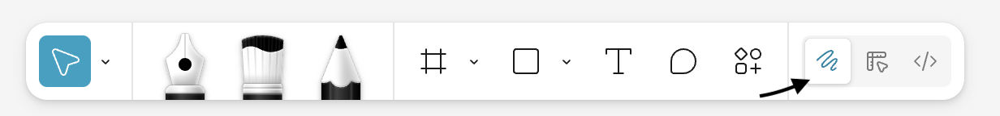
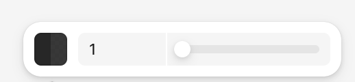
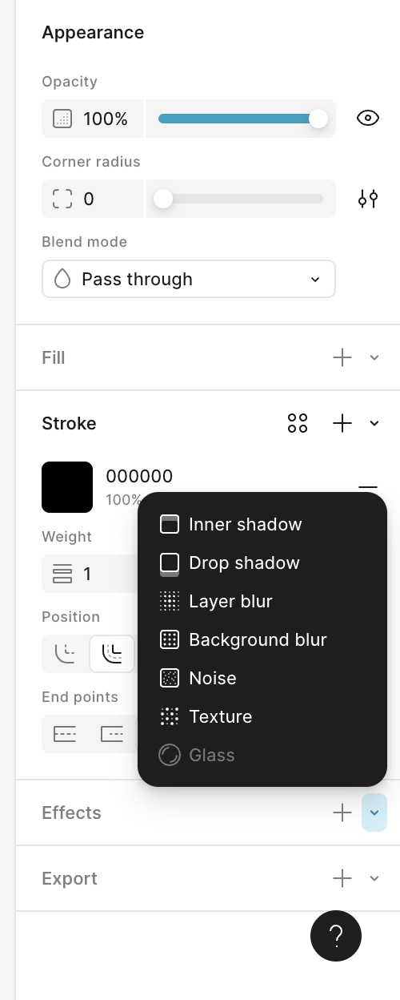

## Crafting Realistic Black and White Images in Figma ##

Whether you are an experienced artist adept at rendering complex hand-drawn illustrations or someone just starting out drawing, you have likely thought about trying your hand at digital illustration. Perhaps you have even heard of popular design tools like Adobe Illustrator, Canva, and Sketch. While all of these softwares have their benefits, I am here to talk to you about **Figma**, and more specifically the ease with which you can craft realistic black and white images and illustrations within its built-in environments.

The benefits of drawing in a monochromatic or *grayscale* palette are extensive. By sticking with black and white, form, **contrast**, and fundamental elements like ***line*** and ***shape*** are emphasized. I mean, black and white illustrations and drawings are a timeless medium, just consider the following images:

. 

>* Figures 1, 2, and 3 from left to right: "Cave of Altamira," "Where the Sidewalk Ends," "Hands."

Depending on your artistic expertise, creating images like these will not be something you will be able to do instantly. However, getting started drawing in Figma is now easier than ever with the introduction of **Figma Draw**, a dedicated workspace in Figma purely for expressive vector illustration and visual design.

## Prequisites ##
In addition to Figma, you will need to utilize the [MonoMagic]("https://www.figma.com/community/plugin/1301603282794767236/monomagic-desaturate-frames-vectors") plugin to achieve an authentic Grayscale. I recommend saving or bookmarking this software prior to beginning.

## Getting Started with Figma Draw ##

To open up Figma Draw:
1. Open up a dedicated Figma workspace.
2. Then select the Draw icon located in the toolbar on the bottom of the screen.  
(*Note: Figma Draw may not be availabe on all mobile devices.*)

##

> Figure 4: The squiqqly icon opens Figma Draw.
## Choosing a Drawing Tool ##
There are three drawing apparatuses available in Figma Draw, other than the shape tool, for creating vector based drawings. All are accessible via the toolbar.

1. ### The pen ###
    - Great for clear, concise lines.
    - Easily bendable.
2. ### The pencil ###
    - Great for freehand drawing.
    - Great for unstructured, organic shapes,
3. ### The brush ###
    - Only available in Figma draw mode.
    - Great for hand painted textures and varying line weights.

## Let's Draw! ##
Now let's get started! I recommend beginning with the pencil tool and finishing with the brush to add texture and gradation. First:

1. Select the pencil tool.
2. Adjust properties in the design panel. Including:
  - The Color (for our purpose, leave.)
  - The stroke style, including solid, line, or dashed.
  - The weight or thickness
3. Draw to your heart's content!   

> Figure 5: Color, stroke style, and weight slider represented in the toolbar.

Now that you have finished creating a pencil-drawn image you're happy with, let's add on with the brush tool.

The brush tool is slightly more complex than the pencil. Have fun experimenting with the 25 brush types and the various effects available on the right hand side.

> Figure 6: Some of the effects available in Figma Draw.

## Deleting Drawings in Figma ##
As mentioned previously, Figma is a *vector* based design software. As such, there is no eraser tool. To delete unwanted vectors you must

1. Hover over the unwanted lines.
2. **Select** the image you'd like to delete.
3. Press the delete or backspace key on your keyboard.

## Using MonoMagic to grayscale your drawing ##

While it is possible to apply a grayscale mask in Figma using the saturation slider, to convert your image itself to grayscale will require a third party plugin. I recommend *MonoMagic* for its easy to use interface and seamless interaction with Figma.

1. Hover over the open in button on the [Monomagic](https://www.figma.com/community/plugin/1301603282794767236/monomagic-desaturate-frames-vectors) page.
2. Open the plugin in the environment we've been working in.
3. Authentically desaturate your image using the true color conversion bar.

## Export Your Image ##

Once you're satifisfied with your image, it's time to export it! Exporting images in Figma is incredibly easy. 

1. Navigate to the right side of the page.
2. Select the desired file type (PNG, JPEG, SVG, PDF.)
3. Hit "Export Untitled."

Now you have your first fully grayscaled digital image in Figma! It's fairly intuitive, with lots of room to make adjustments based on your creative process. Just remember, as in hand-drawn illustration, practice makes perfect.

