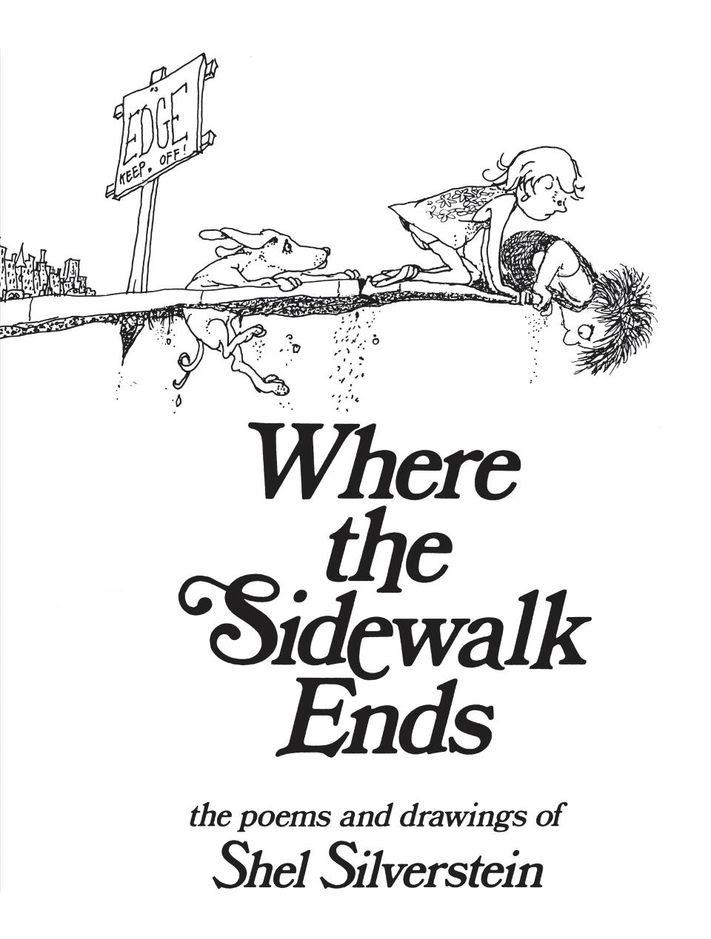
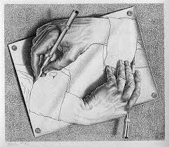

## Crafting Realistic Black and White Images in Figma ##

Whether you are an experienced artist adept at rendering complex hand-drawn illustrations or someone just starting out drawing, you have likely thought about trying your hand at digital illustration. Perhaps you have even heard of popular design tools like Adobe Illustrator, Canva, and Sketch. While all of these softwares have their benefits, I am here to talk to you about **Figma**, and more specifically the ease with which you can craft realistic black and white images and illustrations within its built-in environments.

The benefits of drawing in a monochromatic or *grayscale* palette are extensive. By sticking with black and white, form, **contrast**, and fundamental elements like ***line*** and ***shape*** are emphasized. I mean, black and white illustrations and drawings are a timeless medium, just consider the following images:

. 

Depending on your artistic expertise, creating images like these will not be something you will be able to do instantly, but getting started drawing in Figma is now easier than ever with the introduction of **Figma Draw**, a dedicated workspace in Figma purely for expressive vector illustration and visual design.

## Prequisites
To open up Figma Draw, first navigate to a dedicated workspace 
