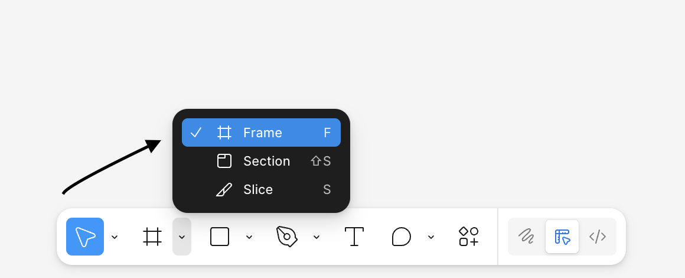

# Importing and Editing Images in Figma ##

Whether you are an illustrator, photographer, graphic designer, or just looking to create a meme, the benefits of working with an image in Figma are immense. Because imported or [Raster Images](https://shorthand.com/the-craft/raster-images/index.html) are treated as an ***Image Fill***, editable properties like color, exposure, and contrast and layer effects like blurs and drop shadows are easily manipulated. Raster images are also easily cropped and resized and can capture many photorealistic details that *Vector Based* images won't.

Perhaps most importantly, by importing images you enable the collaborative capabilities of Figma, allowing for up to **500** collabarators to make real-time edits and offer up suggestions, streamlining both brainstorming and ideation.

Overall, the process is quite simple and requires only a few easy steps.

### Prerequisites ###
You will need an image to import. Currently, Figma supports **JPG, PNG, GIF, WEBP,** and **HEIC** formats.
> Note: Different image formats are ideal for different image types. Read more about which format might be right for yours [here](https://developer.mozilla.org/en-US/docs/Web/Media/Guides/Formats/Image_types).

### Create A Frame ##
1. Open a new Figma workspace.
2. Navigate to the toolbar located at the bottom of the page.
3. Select the Frame Tool, located in the second dropdown menu from the left.

> *Figure 1: The **Frame Tool** is the primary container for design elements in Figma.*
4. Resize your frame by dragging its corners.

### Filling Your Frame ###
1. Navigate to the properties panel located on the right-hand side.
2. Click the "FFFFFF" button located underneath the "Fill" property.

> *Figure 2: The frame defaults to **"FFFFFF,"** which is a solid white fill.
3. Navigate to the image icon.
4. Click "Upload from Computer."
5. Import your Image.  
#
And it's easy as that! Your image is now a fully editabe fill object in Figma. Don't hesitate to play around with the dimensions and other properties.

Here are some *quick tips* on editing your image.

#### Adjusting Image Properties ####
1. Select the "Image" button located underneath the "Fill" property.
2. Draft the sliders to adjust the image properties to your liking.
    - Each property alters your image differently.
    - Dragging the saturation all the way down wil create a black and white image.
3. Experiment with the different properties available!

#### Scaling Your Image ####
As previously discussed, you can scale your image by dragging the corner of your frame. However, there are other methods available to scaling images in Figma.
1. Press the **"K"** hot key to access the scaling tool.

>*Figure 3: The Anchor point is only relevant with vector based shapes.*
2. Adjust Height and Width to your liking.
3. Scale your image proportionally.
4. Switch back to the move tool by selecting the **"M"** hotkey.
> Note: Adjusting your image too dramatically may alter the image quality.

#### Rotating Your Image ####
1. Select your image fill image
2. Navigate to the the rotation field in the design panel, which should have an angle icon next to it.
3. Enter your desired degree value.

