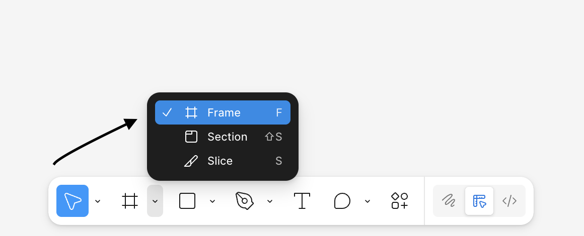

# Importing Hand-Drawn Images in Figma 
In this set of instructions, I will guide you through the process of importing hand-drawn images into Figma and adjusting and scaling the image to match your work. Whether you are an illustrator, photographer, graphic designer or just looking to create a meme, the benefits of working in Figma are immense, and the process requires only a few short steps.

## *Raster* vs. *Vector* Images
We are going to import your drawing as a [Raster Image](https://shorthand.com/the-craft/raster-images/index.html), which are comprised of pixels and are treated as an ***Image Fill*** in Figma. This allows for editable properties like color, exposure, contrast, and layer effects like blurs and drop shadows to be easily manipulated. 

It is also possible to work with your image as a *Vector*, the other dominant image type. These are formed by mathematical equations denoting fixed points on a grid and carry many benefits, but they often fail to capture the same photorealistic details that *Raster Images* do.

## Prerequisites 
- An image to import.
  - Currently, Figma supports **JPG, PNG, GIF, WEBP,** and **HEIC** formats.
  - Different image formats are ideal for different image types. Read more about which format might be right for yours [here](https://developer.mozilla.org/en-US/docs/Web/Media/Guides/Formats/Image_types).
      > Note: JPG files often take up less size, but may provide less detail than other image formats.

## 1. Creating a Frame 
Frames are the primary container for design elements such as shapes, texts, and **images** in Figma. To create a frame, first:
1. Open a new Figma workspace.
2. Navigate to the toolbar located at the bottom of the page.
3. Select the **Frame** Tool, located in the second dropdown menu from the left.

  

  > *Figure 1: The dropdown menu contains three options.*
4. Resize your frame by dragging its corners.

### 1.1 Filling Your *frame* 
1. Navigate to the properties panel located on the right-hand side.
2. Click the "**FFFFFF**" button located underneath the "Fill" property.

  

  > *Figure 2: The frame defaults to **"FFFFFF,"** which is a solid white fill.*
3. Navigate to the **image icon**.
4. Click **Upload from Computer**.
5. Import your Image.

## 2. Editing Your Image
And it's easy as that! Your image is now a fully editabe fill object in Figma. Don't hesitate to play around with the dimensions and other properties.

Here are some *quick tips* on editing your image.

### 2.1 Adjusting **image properties**
1. Select the **Image** button located underneath the **Fill** property.
2. Move the sliders to adjust the image properties to your liking.
    - Each property alters your image differently.
    - Dragging the saturation all the way down wil create a black and white image.
3. Experiment with the different properties available!

### 2.2 Scaling Your Image 
As previously discussed, you can scale your image by dragging the corner of your frame. However, there are other methods available to scaling images in Figma.
1. Press the **"K"** hot key to access the scaling tool.

  

  >*Figure 3: The Anchor point is only relevant with vector based shapes.*

2. Adjust Height and Width to your liking.
3. Scale your image proportionally.
4. Switch back to the move tool by selecting the **"M"** hotkey.
      > Note: Scaling your image too dramatically may alter the image quality.

### 2.3 Rotating Your Image 
1. Select your image.
2. Navigate to the the rotation field in the design panel, which should have an angle icon next to it.

  
    
  >*Figure 4: Rotation controls located in the design panel.*
3. Enter your desired degree value.

## Congratulations!
Your image is now fully imported into Figma! Hopefully it closely resembles the scale and look of your original drawing. There are many adjustable properties I did not mention, don't hesitate to play around further in the toolbar as you see fit.

