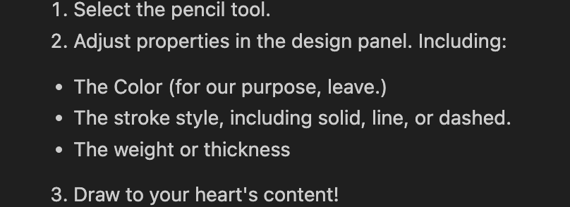

# Procedure Assignment Reflection

Write a short analysis (~500 words) in which you explain what you did to meet the assignment's criteria. Use the criteria as headings to structure your reflection.

## How do your procedures address the needs of a "reading to learn to do audience"? Provide some specific examples that connect back to Redish's noted features of such an audience.

Figma is not the easiest or most intuitive program to use, especially if you have no prior experience with vector based drawing or other design software. That's why, with my targeted audience being beginners, I 1) tried to pick both relatively easy goals 2) tried to be as comprehensive as possible, even with fairly self-explanatory tasks.

The hope is that the user gleaned enough knowledge from these tasks to understand what both a raster and vector image are and the difference between them,  some of the basic layouts and features I.e. the properties panel, toolbar, and drawing methods, and also how to achieve the goal of each procedure. With these skills and knowledge in place, they will hopefully be encouraged to use Figma in other capacities like web, product or graphic design, especially with all the features of Figma that are embedded within the screenshots and intentionally not addressed.

## How do your procedures follow the WTGA Staging, Coaching, and Alerting stylistic conventions? Provide some specific examples that connect back to the criteria from Hart-Davidson.

I tried to follow Hart-Davidson's criteria closely. Find an example of each move below.

*Staging*
- "In addition to Figma, you will need to utilize the [MonoMagic]("https://www.figma.com/community/plugin/1301603282794767236/monomagic-desaturate-frames-vectors") plugin to achieve an authentic Grayscale. I recommend saving or bookmarking this software prior to beginning."

This statement contains the success condition, achieving an authentic grayscale, orients readers to a task (using MonoMagic) vital to achieving the success condition, and suggests a prereqesuite (bookmarking or saving MonoMagic) that will greatly enhance the reader's experience in achieving the task.

*Coaching*

2. Adjust Height and Width to your liking.
3. Scale your image proportionally.
4. Switch back to the move tool by selecting the **"M"** hotkey.

Here I used imperative verbs to make sure steps are being completed in order, and also use markdown to highlight an important clarifying detail.

*Alerting*
(Note: Figma Draw may not be availabe on all mobile devices.)

Here I employed a visually distinctive element to showcare a possible error. Users will now know they may have to complete the rest of the 

## How do your procedures follow your task orientation work? In other words, based on your audience and their goals, discuss how you oriented your SCA moves to the tasks.

Narrowing my audience down to a beginner level and focusing on the publishing industry helped me a lot with task orientation. I assumed the reader was somewhat artistically motivated, and as such much of the orientation, especially the staging moves and motivation, is directed at readers who might be interested in having their hand-drawn work render digitally. Moreover, someone who takes pride in their hand-drawn work.

Additionally I assumed the reader had very little to no prior knowledge in Figma, and tried to separate out my tasks as much as possible accordingly.

## How did you apply a basic docs-as-code editorial workflow to your assignment? Please provide specific cases with screenshots and/or links that can support your claims.

I tried to make meaningful commits early and often, made sure I was working on the right branch for each procedure, renamed and duplicated the folder as instructed, and made sure to not merge my procedures with the main branch. Find a few screenshots of relevant docs-as-code editorial workflow techniques below.

## How did you apply a consistent use of the Markdown language throughout your project? Please provide specific cases with screenshots and/or links that can support your claims.

Bolded or italicized when technology is introduced for first time.

Block quotes for image labeling and alerting.

Level 1 header and further headers are smaller.

Coaching stages are typically ordered lists, sometimes with unordered lists underneath.

Table used comparing image tracing plug-ins.

