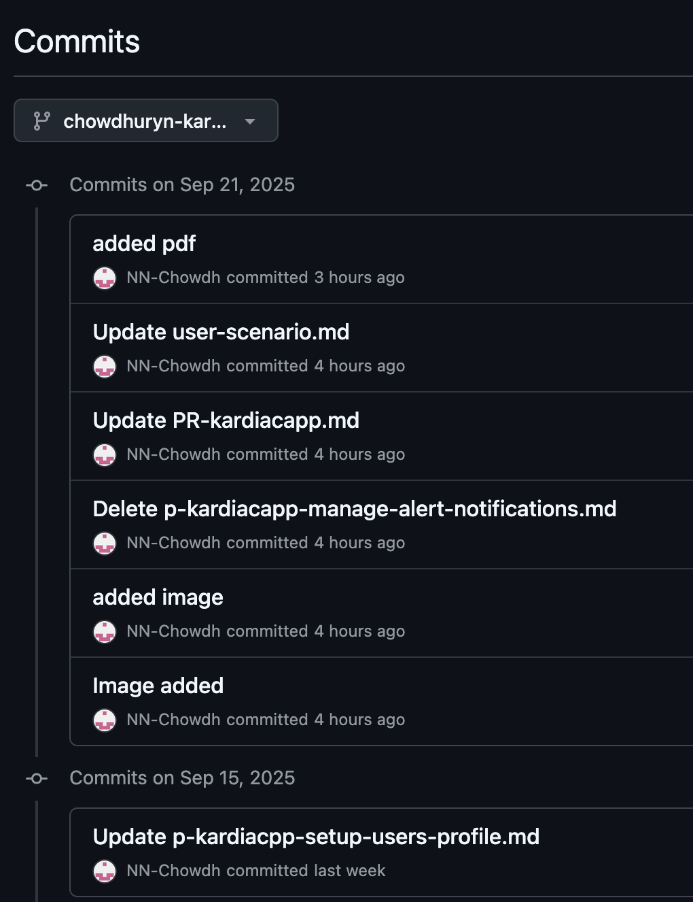
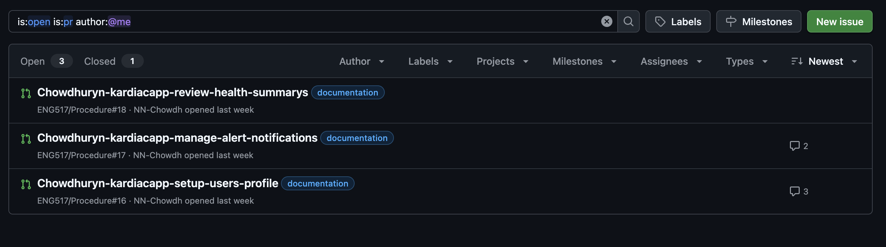

# Procedure Assignment Reflection

## How do your procedures incorporate the 4 components of procedures and follow the WTGA Staging, Coaching, and Alerting conventions? Provide some specific examples that connect back to the criteria from our readings.

I tried to incorporate van der Meij and Gellevij's four components throughout each document.

- For **goals**, I start with explicit purpose statements like "You can set up a Kardia app profile to monitor your heart rhythm and share data with your healthcare provider."
- For **prerequisite states**, I created dedicated sections that list required conditions. For instance: my telehealth procedure specifies "Kardia app installed and actively used for at least 2-3 weeks."
- For **unwanted states**, I included troubleshooting boxes addressing common issues like not receiving verification emails.
- **Actions and reactions** show up in numbered sequences that include both user actions and expected outcomes: "Check your email for a verification message" followed by "What you should see: Account successfully created confirmation message."

Following WTGA conventions, I used **staging** by providing context before major sections like explaining "Your Kardia app profile stores your medical information and helps provide accurate heart rhythm analysis" before the setup steps, **coaching** through step-by-step instructions with imperative sentences like "Open the Kardia app" and "Tap Create New Account," and **alerting** through timing warnings like "wait 20-25 seconds for ECG data to fully load" and highlighted boxes for important cautions.

## How do your procedures follow your task orientation work? In other words, based on your audience and their goals, discuss how you oriented your SCA moves to the tasks.

My procedures organize SCA moves around realistic user goals rather than app features. **Staging** moves establish context connecting to my audience's needs. For example: Mr. Rahman's scenario drove user motivation statements in my "About ECG App Profile" section explaining why setup matters for accurate analysis. **Coaching** moves use task-oriented steps with imperative verbs: "Open," "Tap," "Enter" rather than feature descriptions. Each step includes one clear action appropriate for my audience's skill level, with feedback loops like confirmation messages. For Mrs. Lopez's scenario, I organized steps around her workflow: accessing history, generating reports, then preparing for appointments. **Alerting** moves address various safety concerns: timing warnings like "wait 20-25 seconds for ECG data to fully load," privacy notes warning "never enter information in unofficial apps or websites," troubleshooting alerts for common problems like not receiving verification emails, and medical safety notes like "your heart monitor app is helpful but it's not the same as seeing a doctor."

## How did you apply a basic docs-as-code editorial workflow to your assignment? Please provide specific cases with screenshots and/or links that can support your claims.

For a basic docs-as-code editorial workflow, I created separate branches for each of the three procedures (setup user profile, manage alert notification, and review health summary), which allowed me to work on each task independently without affecting the main branch.

I also made meaningful commits after each major edit or content addition- for example: commiting after adding the pdf in the doc file or after incorporating images.

To complete the workflow, I created pull requests for each procedure branch. This keeps everything organized and ready for review before merging back to main.

## How did you apply a consistent use of the Markdown language throughout your project? Please provide specific cases with screenshots and/or links that can support your claims.

Throughout my three Kardia App procedures, I applied standardized Markdown formatting. I used `##` for major section headings like "Prerequisites" and "Creating your account" across all documents. For step-by-step instructions, I formatted numbered lists with bold action words using `1. **Open** the Kardia app` syntax, making it easy for users to identify required actions.

I also wrote menu items in backticks like `Create New Account` and `History` tab, which helps users identify exactly what to interact with in the app. 

For important alerts and warnings, I used consistent blockquote formatting with `> **Alert:**` followed by the warning text, creating visually distinct sections.

For images, I switched from basic Markdown syntax to HTML tags like `` to control sizing and maintain consistency across all procedures. I also used consistent link formatting with descriptive text for external resources and internal references.
