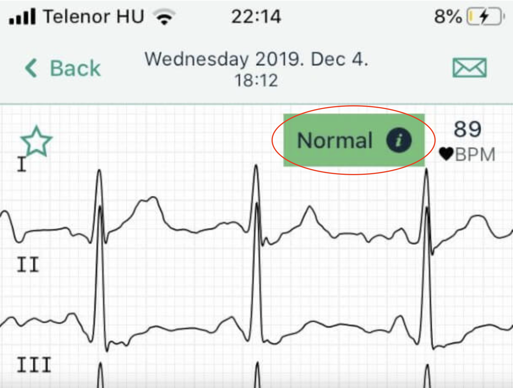

# Managing Kardia ECG App Alerts 

<!-- Consider feedback from the health summary procedure and apply here. -->

Your Kardia ECG app not only records your heart rhythms but also generates alerts that guide your next steps. These alerts can confirm normal readings, flag rhythm concerns that may need medical review, or warn about technical issues like sync errors.

## The goal of this guide is to help you |

By the end of this guide, you will be empowered to effectively manage your Kardia ECG app alerts and take appropriate action, ensuring you maintain proactive control over your heart health. Specifically, this guide will enable you to:

- Interpret instant analysis results and understand what different alerts mean, so you can confidently differentiate between normal readings, potential concerns, and technical issues.
- Review your alert history and troubleshoot common issues such as sync errors, allowing you to maintain accurate records and ensure your data is always ready for review by your healthcare provider.
- Decide when to manage alerts within the app and when to contact your doctor or seek emergency care, equipping you with the knowledge to make timely and informed decisions about your heart health.

## About ECG Instant Analysis |

When you complete an ECG recording, the Kardia app provides instant analysis of your heart rhythm. These results help you monitor your heart health and identify when additional medical attention may be needed.

## Prerequisites |

**Before you begin**

Ensure you meet the following requirements:

### Required |
 
  - You must have an active Kardia app account with recorded ECG data and receive ECG analysis results and alerts to use these instructions.
  - Access into your healthcare provider's contact information.
  - A stable internet connection to ensure your recordings sync correctly.

 ## Accessing your ECG history |

1. Open the Kardia app.
2. Tap `History` section from the main menu.
3. Review previous ECG recordings and their instant analysis results to familiarize yourself with your heart rhythm patterns.

  

4. Tap any recording to see details.

      > **Alert:** It may take 10–15 seconds for all ECG data to fully load. Wait until the list is complete before reviewing results to avoid missing recent recordings.

## Types of alerts you might see |

Understanding these distinct alert types is crucial for effectively managing them within the app and knowing when to escalate to your healthcare provider.

- **Normal Readings:** Your ECG did not show signs of irregular rhythm. 

  

- **Readings that need attention:** The app detected possible irregularities such as [**atrial fibrillation**](#) or [**unclassified rhythms**](#).

  

- **Sync or Technical Errors:** Notifications indicating a recording did not upload or sync properly.

## Managing alerts within the app |

1. Open the Alerts tab.
2. Tap on any alert to view details.
3. Mark as reviewed by tapping the checkmark or `Dismiss` button.

      > **Tip:** Dismissed alerts remain in your history but won't show as active notifications.

## Troubleshooting sync errors |

**If you see sync error alerts**

  1. Check your internet connection (e.g., ensure Wi-Fi is connected or mobile data is active and functional).
  2. Close and reopen the Kardia app.
  3. Locate the failed recording in your history and tap it, then select `Retry Upload`.
  4. Restart your phone if the error continues.

**If sync problems persist**

  - Log out and log back into your account.
  - Contact Kardia support through the app's Help section.

## When to call your doctor |

**Contact your doctor if:**

  - Any irregular readings.
  - Multiple unusual readings in a row.
  - Readings you don't understand.
  - If you feel worried about any result.

**Get emergency help if you have:**

  - Chest pain.
  - Trouble breathing.
  - Feeling dizzy or faint.

> [**Important Note**](#)
>
> Your heart monitor app is helpful but it's not the same as seeing a doctor. If you feel sick or worried, get medical help even if the app says everything looks normal.

## Next steps |

Now you can better understand what your heart monitor app is telling you and know when to contact your healthcare provider about any concerns.