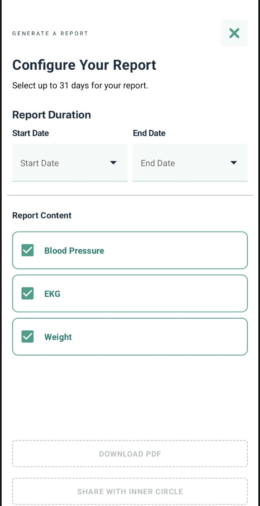
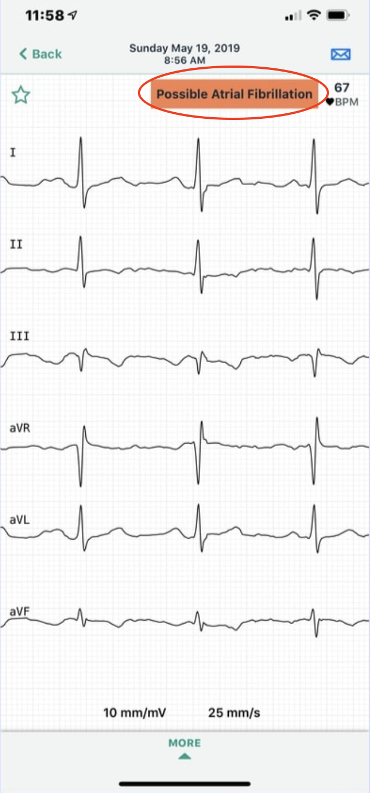
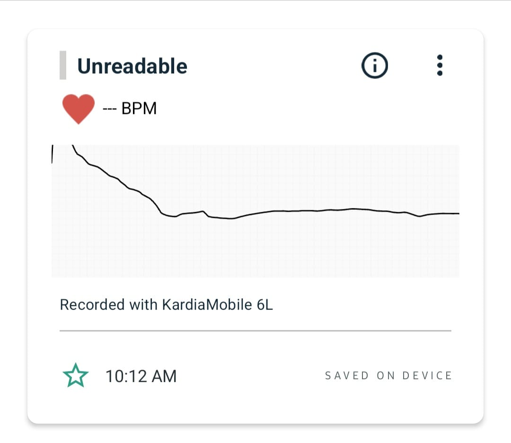

# Understanding Your Kardia ECG Analysis Results

Your Kardia app provides instant analysis of your ECG recordings to help you monitor your heart health. 

This guide shows you how to access your ECG history, interpret different analysis results, troubleshoot recording issues, and determine when to contact your healthcare provider.

## Prerequisites

**Before you begin**

Ensure you meet the following requirements:

### Required
 
  - **Kardia App:** Installed with an active account and at least one completed ECG recording to generate alerts and analysis results. 
  - **Internet Connection:** A stable internet connection to ensure recordings sync correctly.
  - **Healthcare Provider Contact:** Access to your healthcare provider's contact information for follow-up on concerning alerts.

 ## Accessing Your ECG History

1. Open the Kardia app.
2. Tap `History` section from the dashboard. Your list of past ECG recordings appears.

    > **Alert:** It may take 10–15 seconds for all ECG data to fully load. Wait until the list is complete before reviewing results to avoid missing recent recordings.

3. Scroll through your list of ECG recordings to view dates, times, and analysis results.
4. Tap any recording to view full details.
    > **Results:** The detailed recording screen displays the ECG waveform, heart rate, and complete analysis.

  

## Understanding Your Analysis Results

After each 30-second recording, the Kardia app provides instant analysis. Understanding these alert types helps you manage them effectively and know when to contact your healthcare provider.

- **Normal Readings:** Your ECG shows a regular heart rhythm with a heart rate between 50-100 beats per minute and no irregular beats detected. 

  > **Note:** A normal result does not guarantee you are not experiencing other heart conditions. Contact your doctor if you have symptoms even with normal readings.

  

- **Artial Fibrillation Detected:** The app detected an irregular heart rhythm consistent with atrial fibrillation. This is not a diagnosis but a potential finding that requires medical review.

    > **Action Required:** Contact your doctor to review this recording. Do not change your medication without consulting your physician.

  

- **Bradycardia:** Your ECG shows normal rhythm but with a heart rate between 40-50 beats per minute, which is slower than the typical range.

- **Tachycardia:** Your ECG shows normal rhythm but with a heart rate between 100-140 beats per minute, which is faster than the typical range.

- **Unclassified:** The app could not classify your recording into the categories above. This may occur with heart rates below 40 or above 140 beats per minute, or with certain heart rhythm patterns.

    > **Action Recommended:** Review this recording with your doctor or request a clinician review through the app.

- **Unreadable:** The recording quality was too poor for accurate analysis due to interference, movement, or poor electrode contact.

  

See the Troubleshooting section below for tips on improving recording quality.

## Troubleshooting Recording Issues

If you frequently receive unreadable results, try these steps:

1. Clean the electrodes with an alcohol-based sanitizer before each recording.
2. Apply a water-based lotion to dry hands before recording.
3. Rest your forearms and hands on a flat surface during recording.
4. Ensure your phone is not charging and headphones are disconnected.
5. Remain still during the entire 30-second recording.

## When to Contact Your Doctor or Seek Emergency Help

**Contact your doctor if you see:**

- Atrial fibrillation detected on any recording.
- Multiple unclassified readings in a row.
- Any results you don't understand or that concern you.
- Changes in your typical pattern of results.
- Symptoms that worry you, regardless of the analysis result.

**Seek emergency medical help immediately if you experience:**

- Chest pain or pressure.
- Severe shortness of breath.
- Dizziness, lightheadedness, or fainting.
- Rapid or irregular heartbeat with symptoms.

> **Important Note**
>
> The Kardia app is a monitoring tool, not a substitute for medical care. If you feel unwell, seek medical attention even if your ECG shows normal results. The app cannot detect all heart conditions or provide a complete diagnosis.

## Next steps

You now understand how to access your ECG history, interpret analysis results, and troubleshoot common issues. Continue taking regular recordings as recommended by your doctor, and share any concerning results with your healthcare provider promptly.