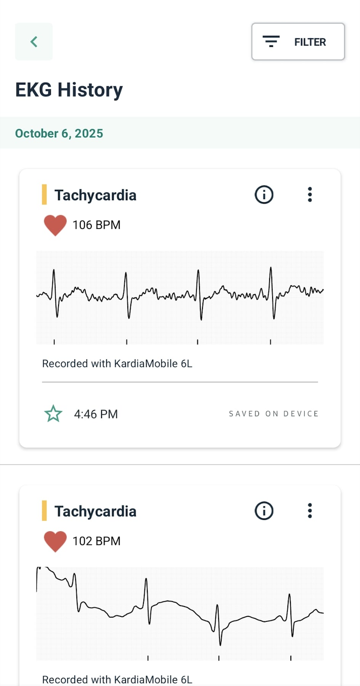
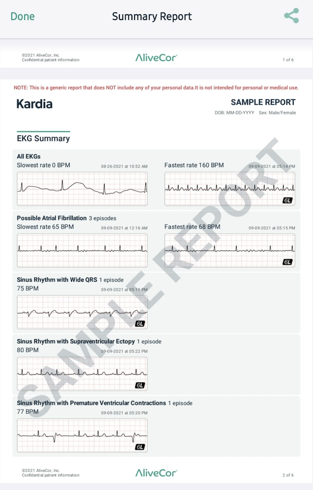

# Preparing Your Kardia Data for Telehealth Appointments

Preparing your Kardia ECG data before your telehealth appointment ensures your doctor has comprehensive information about your heart health trends. Well-organized data helps your healthcare provider make informed decisions about your treatment and provides a complete picture of your heart rhythm patterns over time.

This guide shows you how to access your Health Summary, generate comprehensive reports, and verify your data is ready to share with your healthcare provider.

## Prerequisites 

**Before you begin**

Ensure you meet the following requirements and have the recommended items readily available:

### Required 

- **Kardia App:** Installed and actively used to collect ECG data for at least 2-3 weeks before your telehealth appointment.

- **Kardia Device:** Your physical Kardia device should be nearby for reference.

- **Battery:** Sufficient battery life on your mobile device to complete the process.

- **Internet:** A reliable internet connection for data synchronization.

- **Accounts & Credentials:** [Username and password](https://app.alivecor.com/login) for both your Kardia app account and patient portal connected to your healthcare provider.

### Recommended 

- **KardiaCare Subscription:** A [KardiaCare subscription](https://kardia.com/products/kardiacare?srsltid=AfmBOooIw1_2WPVplJJrWiOK3uvpJ_29bq-NRNDbwXgdv5BCPvI1xCrQ) provides access to detailed reports and comprehensive trend analysis.

- **Medical Information:** Your current medication list and recent doctor's notes, as these can provide valuable context during your telehealth appointment.

## Accessing your Kardia health summary 
 
1. Open the Kardia app.
2. Tap the `History` tab at the bottom of the screen.
3. Tap the calendar icon to view `Health Summary`. The Health Summary loads with trend graphs.

    > **Alert:** Wait 20-25 seconds for ECG data to fully load. Moving forward too quickly may result in incomplete monitoring history.

4. Verify the date range covers your recent monitoring period.

    > **Result:** Your dashboard displays ECG trend graphs and recent readings organized by date.

  

    
  
### Troubleshooting navigation

If you can't find the Health Summary:

  - Ensure you have a KardiaCare subscription for advanced analytics.
  - Check the `Reports` section in your profile settings.
  - Update your Kardia app to the latest version.

## Generating Kardia reports for your doctor

1. From the main dashboard, tap the `Reports` section in your Kardia app.
2. Select the date range specified by your doctor (last 30 days, 90 days, etc.).
3. Choose `Comprehensive Report` which includes ECG strips, analysis, and trends.
4. Tap `Download PDF` or `Share Report`.
5. Email the report to yourself and your doctor, or save to share via patient portal.
6. Verify the PDF opens correctly and displays all your ECG recordings.

Example of a generated report:

  

> **Privacy and Data Security**
>
> Your ECG recordings, analysis results, and health data are encrypted and stored securely in your Kardia account. This information is only shared with healthcare providers you specifically authorize. Keep your account secure by never sharing your login credentials with others.

## Next steps

During your telehealth appointment, be prepared to:
- Share your screen showing Kardia data.
- Demonstrate taking an ECG if requested.
- Discuss any patterns or concerns you've identified in your recordings.

## Additional resources

- [Kardia User Guide](https://kardia.com/assets/old/app-user-manuals/00LB17.15-en.pdf) - Comprehensive app documentation.
- [Understanding ECG Results](https://alivecor.com/products) - Educational materials.
- [KardiaCare Support](https://alivecor.zendesk.com/hc/en-us/requests/new) - Technical assistance.
- [Telehealth Best Practices](https://telehealth.hhs.gov/patients/why-use-telehealth) - Patient resources and preparation tips.