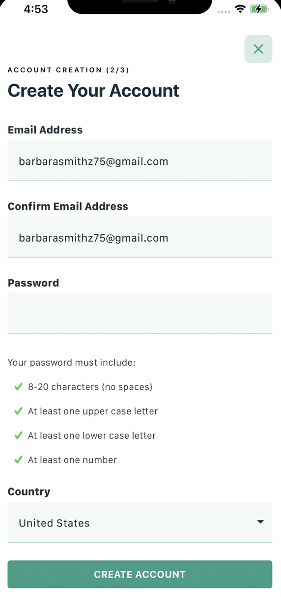

# Setting up Your Kardia ECG App Profile

<!-- See feedback in health summary's branch—consider and apply where appropriate in this file as well. -->

You can set up a Kardia app profile to monitor your heart rhythm and share data with your healthcare provider.

> **Who can use this App?**
>
> Anyone with a cardiac condition who has been prescribed ECG monitoring can create a Kardia app profile. You must have a smartphone with the Kardia app installed and access to your medical information to complete the setup process.

## About ECG App Profile

Your Kardia app profile securely stores your medical information, which is critical for accurate heart rhythm analysis. This profile links your ECG readings with your personal health history, enabling effective communication with your healthcare team and ensuring your monitoring is personalized.

## Prerequisites

**Before you begin**
 
You must have the Kardia app installed on your smartphone:
 - [Download for Android](https://play.google.com/store/apps/details?id=com.alivecor.kardia).
 - [Download for iOS](https://apps.apple.com/us/app/kardia/id441136284).
 
 You'll also need:
 - An active email address ([Create Gmail account](https://accounts.google.com/signup) if needed).
 - Your medical information (medication, conditions, emergency contact).

 ## Creating your account

1. Open the Kardia app on your smartphone.
2. Tap `Create New Account` on the welcome screen.
3. EEnter your email address and create a strong password (at least 8 characters, ideally including a mix of uppercase and lowercase letters, numbers, and symbols).
4. Tap `Create Account`.
  <!-- I'm doubtful that you would need to supply this particular screenshot, since it's very common. -->
  

5. Check your email for a verification message and tap the verification link.
  <!-- Suggestions:
    - This is where you should supply a screenshot, since it is an important success condition.
    - I modified the indentation work, since it helps connote a relationship with step 5.
  -->
  - **Expected Confirmation:** You should see sn `Account successfully created` confirmation message.

    > **Troubleshooting account creation**
    >
    > If you don't receive the verification email:
    > - Check your spam or junk folder.
    > - Verify you entered the correct email address.
    > - Request a new verification email from the app.

## Completing your profile setup

After creating your account, ensure your profile is fully set up with essential medical details for accurate ECG analysis and consistent monitoring.
  1.  Navigate to the `Profile` section within the app.
  2.  Add your medical information, including health history and current medications.
  3.  Go to the `Settings` section.
  4.  Set up any desired daily reminders for ECG readings.

**Expected Outcome:** Your profile should now display all entered medical information and activated reminders, ensuring personalized and accurate monitoring.

> **Important Privacy Note**
>
> Your medical information is encrypted and only shared with healthcare providers you authorize. Never enter information in unofficial apps or websites.

## Next steps

With your profile complete, you can start taking daily ECG readings and sharing data with your healthcare provider through the app.

## Additional resources

- [Kardia User Guide](https://kardia.com/assets/old/app-user-manuals/00LB17.15-en.pdf) - Comprehensive app documentation
- [Understanding ECG Results](https://alivecor.com/products) - Educational materials
- [Contact Support](https://alivecor.zendesk.com/hc/en-us/requests/new) - Technical assistance