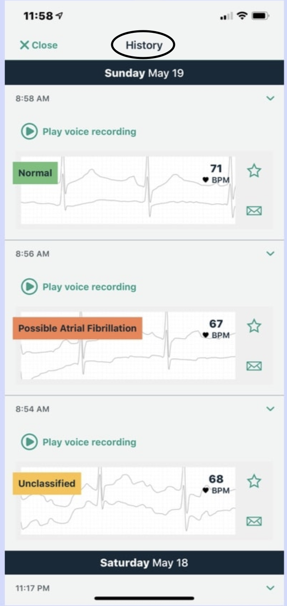
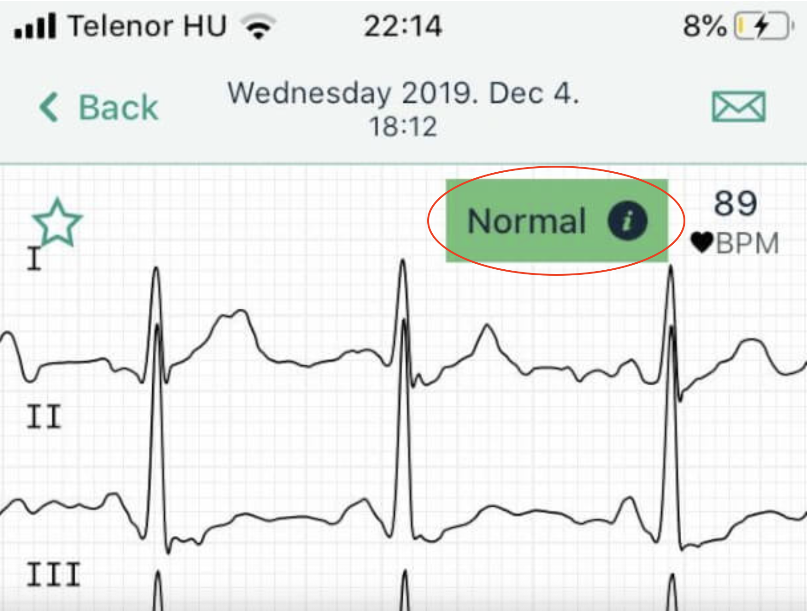
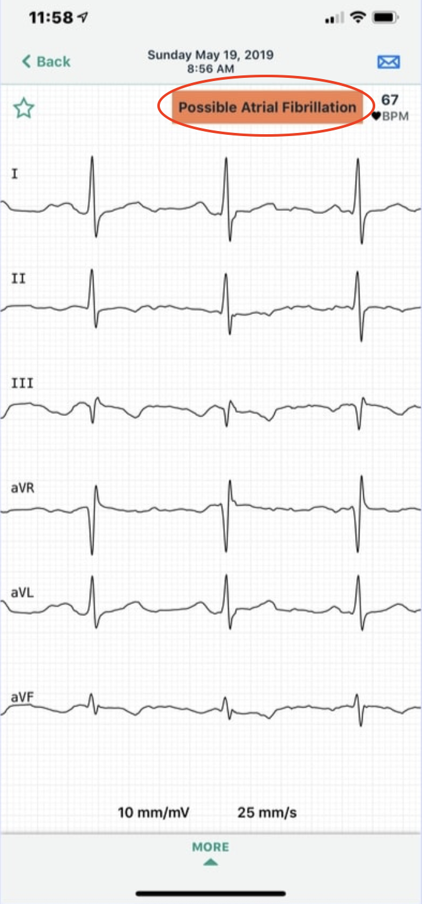
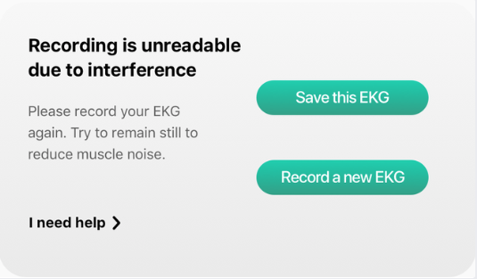

# Managing Kardia ECG App Alerts and Notifications

Your Kardia ECG app not only records your heart rhythms but also generates alerts and notifications that guide your next steps. These alerts can confirm normal readings, flag rhythm concerns that may need medical review, or warn about technical issues like sync errors.

## The goal of this guide is to help you:

- Interpret instant analysis results and understand what different alerts mean.
- Review your alert history and troubleshoot common issues such as sync errors.
- Decide when to manage alerts within the app and when to contact your doctor or seek emergency care.

> **Who can use this guide?**
>
> Anyone with an active Kardia app account who receives ECG analysis results and notifications can use these instructions. You should already have at least one recorded ECG to access your analysis history and manage alerts.

## About ECG Instant Analysis

When you complete an ECG recording, the Kardia app provides instant analysis of your heart rhythm. These results help you monitor your heart health and identify when additional medical attention may be needed.

## Prerequisites

**Before you begin**
 
You must have -
  - An active Kardia app account with recorded ECG data.
  - Access into your healthcare provider's contact information.
  - A stable internet connection to ensure your recordings sync correctly.

 ## Accessing your ECG history

1. **Open** the Kardia app on your smartphone
2. **Tap** `History` section from the main menu
3. **Review** previous ECG recordings with the results

  

4. **Tap** any recording to see details

      > **Alert:** It may take 10–15 seconds for all ECG data to fully load. Wait until the list is complete before reviewing results to avoid missing recent recordings.

## Types of alerts you might see

- **Normal Readings-** Your ECG did not show signs of irregular rhythm. 

  

- **Readings that need attention-** The app detected possible irregularities such as [**atrial fibrillation**](#) or [**unclassified rhythms**](#).

  

- **Sync or Technical Errors-** Notifications indicating a recording did not upload or sync properly.

  

## When to call your doctor

**Contact your doctor if -**

  - Any irregular readings
  - Multiple unusual readings in a row
  - Readings you don't understand
  - If you feel worried about any result

**Get emergency help if you have -**

  - Chest pain
  - Trouble breathing
  - Feeling dizzy or faint

> [**Important Note**](#)
>
> Your heart monitor app is helpful but it's not the same as seeing a doctor. If you feel sick or worried, get medical help even if the app says everything looks normal.

## Next steps

Now you can better understand what your heart monitor app is telling you and know when to contact your healthcare provider about any concerns.