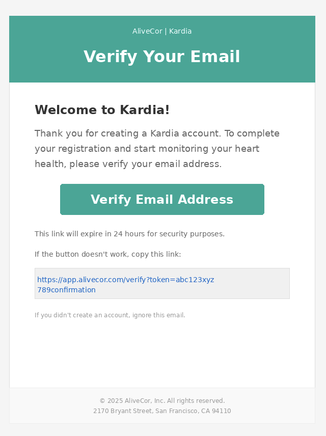

# Setting up Your Kardia ECG App Profile

Your Kardia app profile stores your medical information and helps provide accurate heart rhythm analysis. This guide shows you how to create your account, verify your email, and complete your profile with essential health information.

## Prerequisites

**Before you begin**

Ensure you meet the following requirements.

### Required
 
- **Kardia App:** Downloaded and installed on your smartphone.
  - [Download for Android](https://play.google.com/store/apps/details?id=com.alivecor.kardia).
  - [Download for iOS](https://apps.apple.com/us/app/kardia/id441136284).

- **Email Address:** An active email address for account verification. [Create a Gmail account](https://accounts.google.com/signup) if you don't have one.

- **Internet Connection:** A stable internet connection to complete account creation and verification.

### Recommended

- **Medical Information:** Your current medications, diagnosed conditions, and emergency contact information readily available for profile completion.

## Creating your account

1. Open the Kardia app on your smartphone.
2. Tap `Create New Account` on the welcome screen.
3. Enter your email address and create a strong password (at least 8 characters, ideally including a mix of uppercase and lowercase letters, numbers, and symbols).
4. Tap `Create Account`.
5. Check your email for a verification message and tap the verification link.

  > **Result:** The app displays an "Account successfully created" confirmation message and opens your profile dashboard.

  

**Troubleshooting account creation**

If you don't receive the verification email:
- Check your spam folder.
- Verify you entered the correct email address.
- Return to the app and tap `Resend Verification Email`.

## Completing your profile information

After verifying your account, add your personal and medical information to enable accurate ECG analysis.

1. From the app dashboard, tap the Profile icon at the bottom right.
2. Tap `About You`.
3. Enter your personal information-
    - Full Name 
    - Date of Birth 
    - Gender
    - Height and Weight
4. Scroll down and tap `Health Details`.
5. Add your medical information, including health history and current medications.
6. Scroll down and tap `Connect New Device` and select your Kardia device model from list. 
7. Tap the `Manage Reminders` section and set up any desired daily reminders for ECG readings (optional).
8. Tap `Save` to complete your profile.
    > **Result:** Your profile is now complete with a checkmark displayed next to "Profile Setup."

> **Privacy and Data Security**
> 
> Your medical information is encrypted and stored securely in your Kardia account. This information is only shared with healthcare providers you specifically authorize. Keep your account secure by never sharing your login credentials.

## Next steps

With your profile complete, you can start taking daily ECG readings and sharing data with your healthcare provider through the app.

## Additional resources

- [Kardia User Guide](https://kardia.com/assets/old/app-user-manuals/00LB17.15-en.pdf) - Comprehensive app documentation
- [Understanding ECG Results](https://alivecor.com/products) - Educational materials
- [Contact Support](https://alivecor.zendesk.com/hc/en-us/requests/new) - Technical assistance