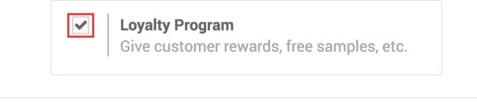
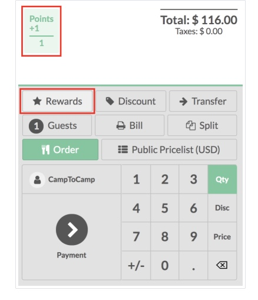

# Applying Promotions, Discounts, and Offers in Odoo POS System

## What’s This For?
Loyalty programs, promotional offers, and discounts encourage customers to keep returning to your shop or restaurant.  

By the end of this article, you’ll know how to apply discounts, set up loyalty points for redemption, and apply promotions fairly in Odoo POS.

---

## Before You Begin
Ensure the following steps are completed before you proceed to apply discounts:

### Availability of Customer Records
- Customers are registered and their records are readily accessible.  
⚠️ **Warning:** Discounts can be applied only if a customer record is tagged to a check.  

### Active Loyalty Programs in Odoo POS
- The loyalty programs must be enabled to be applied on the orders.  
  - 📝 **Note:** To activate loyalty programs, go to **Point of Sale → Configuration**.  
  - Tick the **Loyalty Program** checkbox under **Pricing**.  

*Fig 6. Activate Loyalty Program*  

- The following loyalty programs are available in Odoo POS:  
  - **Points-Based:** Customers get a point for each purchase.  
  - **Discount-Based:** Customers receive discounts when they’ve reached a purchase limit.  
  - **Rewards:** Customers can accumulate points and get rewarded based on the points they’ve collected.  
  - **Tiered Loyalty:** Customers are split into Bronze, Gold, and Platinum tiers based on their purchase history and rewarded accordingly.  

### User Roles with Access Permissions
- **POS Manager**  
- **Supervisor**  
- **Front-Desk Staff**  

---

## How to Apply Discounts/Loyalty Programs?

### Step 1: Start a POS Session
- Launch **Odoo**.  
- Go to **Point of Sale**.  
- Choose a store (e.g., Retail or Restaurant).  
- Click **Open Register**.  

💡 **Tip:** Ensure the right store, location, and user role is selected.  
⚠️ **Warning:** Discounts or loyalty programs cannot be applied without an active POS session.  

### Step 2: Add Products to Cart
- Select product category.  
- Add products to the cart.  
- Adjust the quantities, modifiers, and add-ons.  

⚠️ **Warning:** Ensure a product does not have $0 price before adding to the cart.  

### Step 3: Link Customer to Order
- Click **Customer** on the Order screen.  
- Select an existing customer record or create a new one.  

📝 **Note:** This step is required for applying loyalty programs only, not discounts.  

### Step 4: Apply Discounts/Loyalty Programs
- Click **Discount** on the Order screen to apply a discount, or click **Rewards** to apply loyalty programs. The order price is instantly updated.  

*Fig 7. Apply Loyalty Points*  

⚠️ **Warning:** Discounts and loyalty programs cannot be applied together on the same order.  

---

### Step 5: Complete the Payment
- Click **Payment**.  
- Select payment method: **Cash, Card, or Other**.  
- Click **Validate** after choosing the payment method. The order is complete.  

---

## Additional Resources
- [Odoo POS Loyalty and Discounts](https://www.odoo.com/documentation/18.0/applications/sales/point_of_sale/pricing/loyalty.html)  
- [Odoo POS Tutorials](https://www.odoo.com/slides/point-of-sale-28)  
- [Odoo POS User Docs](https://www.odoo.com/documentation/19.0/applications/sales/point_of_sale.html )  
- [Contact Odoo POS Support](https://www.odoo.com/help) 