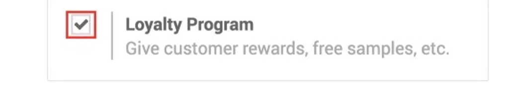

# Applying Discount on Products in Odoo POS System

This article teaches you how to apply discounts and offers on products in the Odoo POS system.

## Prerequisites
Before you proceed to apply discounts on a product, make sure:
- You are logged into the latest version of the Odoo application on your device.
- You have permission to apply discounts and offers on orders.
- The **Loyalty Program** setting in the Odoo dashboard is enabled so discounts will work correctly.

---

## 1. Start a POS Session
1.1 Click **New Session** to open your POS session.  
> **Note:** You can open only one POS session per browser at a time.

---

## 2. Enable the Loyalty Program
2.1 Click **Point of Sale** from the Odoo dashboard.  
2.2 Click **Configuration**.  
2.3 Turn on the **Loyalty Program** option under Pricing.  
> **Note:** Discounts can only be applied if this setting is enabled.

*Figure 15. The Loyalty Program setting selected to apply discounts* 

---

## 3. Choose Your Store
3.1 Click **Point of Sale** from the Odoo dashboard.  
3.2 Review the list of stores shown on the screen.  
> **Note:** Each store works independently, so discounts apply only to the store you select.  

3.3 Select the store where you will make the sale.  
**Example:** Select **Restaurant** if you are processing orders at the restaurant location.

---

## 4. Start a New Order
4.1 Click **New Order**.  
4.2 Select a product category to view its items.  
**Example:** Select **Foods** to see all food items.  
4.3 Scroll through the screen to find the item you want.  
> **Note:** If you cannot find an item, click **Search Products** at the top.  

4.4 Select the product the customer wants.  
**Example:** Bacon Burger

4.5 Click **Add**. The item appears in the cart.

---

## 5. Add a Customer
5.1 Click **Customer** in the keypad area.  
> **Note:** Adding a customer is required before applying discounts. This ensures that only customers with loyalty benefits receive discounts.  

5.2 Click **Create** to add a new customer if needed. **Example:** If a returning customer changed their phone number or email address, update it here.  
**Note:** You can update or delete customer information from this screen.  

5.3 Enter the customer's details.  
5.4 Click **Save**. The customer’s name now appears in the cart.

---

## 6. Apply a Discount to a Product
6.1 Select the item in the cart that needs a discount.  
> **Note:** Make sure you select the correct item before applying the discount.  

6.2 Click the **Discount** button on the keypad.  
**Note:** If the **Discount** button does not appear in the keypad, ensure the Loyalty Program setting is turned on.

**Figure 16.** The Discount button in the keypad used to apply discounts on products in the cart.  
*Figure 16. The Discount button in the keypad which is used to apply discount on products in cart.*

6.3 Enter the discount amount using the keypad.  
**Example:** Enter **10** if you want to apply a **10 percent** discount.  
6.4 Click the **%** key to apply the percentage discount. The product price updates automatically as per the discount percentage applied.  
> **Tip:** Use the **Global Discount** option if the customer has a coupon that applies to the entire order.

---

## Additional Resources
Refer to [Global Discounts](https://www.odoo.com/documentation/19.0/applications/sales/point_of_sale/pricing/discounts.html?highlight=discounts#) for more information on applying order-level discounts in the POS interface.

Please find my procedure [here](./assets/docs/Procedure%20Final.pdf).