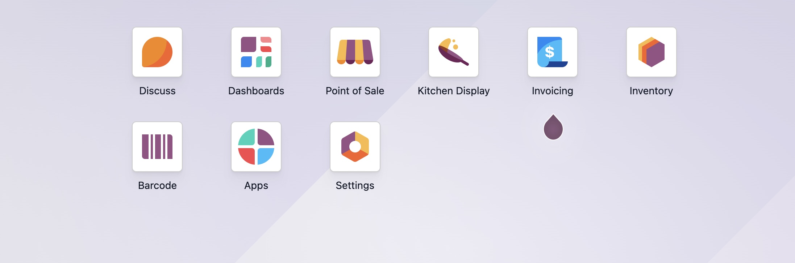

# Performing a Sale in Odoo POS System
This article teaches you how to perform a sale and process payments in the Odoo POS system.

##Prerequisites

Before you proceed to perform a sale, make sure:

- You are logged into the latest version of the Odoo application on an Android, iOS, or Windows device.
- You have the necessary user permissions to perform sales and handle payments.
- The products you want to sell are created and available in the POS system.  

---

## 1. Start a POS Session

### 1.1 Click **New Session** to activate your POS session.

> **Note:** You can log in from different user accounts, but you can open only one session per browser.

---

## 2. Choose Your Store

### 2.1 Click **Point of Sale** from the Odoo dashboard.

*Fig 1. Odoo dashboard showing the POS application*

### 2.2 Review the list of stores displayed on the screen.

> **Note:** Each store functions as a separate business unit in the POS system.

*Figure 2. List of stores displayed in the POS application*

### 2.3 Select the store where you will make the sale. **Example:** Select **Restaurant** if that is where you work.

---

## 3. Set Up Cash Register at the Store

### 3.1 Click **Open Register** for the selected store.

![Figure 3. The Open Register option displayed in the selected store] (./assets/images/Figure 3.jpeg)

### 3.2 Once inside the store, click the Money icon in the Opening Control window.

### 3.3 Enter the number of notes and coins you have. **Example:** Enter **10** under **$200** for ten 200-dollar notes and **10** under **$1** for ten 1-dollar coins.

![Figure 4. The Coins/Notes pop-up where the opening cash amount is configured] (./assets/images/Figure 4.jpeg)

### 3.4 Click **Confirm** to save the amount.

> **Tip:** Always verify your opening cash carefully so end-of-day calculations stay accurate.

### 3.5 Click **Open Register** again to complete the register setup.

---

## 4. Start a New Order

### 4.1 Click **New Order**.

> **Note:** *Dine-In* is selected by default. Tap **Dine-In** to switch to *Takeaway* if the customer prefers.

### 4.2 Select a product category to view its items.

**Example:** Select **Foods** to view all food items.

![Figure 5. The order screen displaying product categories and products] (./assets/images/Figure 5.jpeg)

### 4.3 Scroll through the order screen to select the item you want.

> **Note:** If you do not see the item on the screen, click **Search Products** at the top.

### 4.4 Select the item the customer wants to order.

**Example:** Bacon Burger.  
If sides or add-ons are available, a pop-up appears.

![Figure 6. The sides/add-ons pop-up appearing when the product is selected] (./assets/images/Figure 6.jpeg)

### 4.5 Select the sides or add-ons.

**Example:** Fries.

### 4.6 Click **Add**.  

![Figure 7. The Bacon Burger with Fries appears in the cart] (./assets/images/Figure7.jpeg)

---

### Optional Steps

### 4.7 To change quantity, select the item in the cart.

### 4.8 Click **Qty** and enter the new quantity using the keypad.

**Example:** Increase the quantity from 1 to 2 if the customer wants two bacon burgers.

### 4.9 Click **Price** and enter a custom price if required.

> **Warning:** Item price cannot be zero or negative.

---

## 5. Add a Customer

### 5.1 Click **Customer** in the keypad area.

> **Tip:** If it is a returning customer, their name may appear automatically.

### 5.2 Click **Create** to add a new customer.

> **Tip:** You can update or delete existing customer details if needed.

*Figure 8. The pop-up where customer information can be added*

![Figure 8. The pop-up where customer information can be added] (./assets/images/Figure8.jpeg)

### 5.3 Enter the customer details.

### 5.4 Click **Save**.  
The customer’s name appears in the cart.  
**Example:** Brandon Freeman.

---

## 6. Complete the Payment

### 6.1 Click **Payment**.

![Figure 9. Payment methods displayed along with the order total] (./assets/images/Figure9.jpeg)

### 6.2 Select the customer’s preferred payment method.

**Example:** Choose **Cash** if the customer wants to pay with cash.

> **Tip:** The system automatically supports split payments.

### 6.3 Enter the amount the customer wants to pay.

**Example:**  
If the total is **$21** and the customer pays **$10** in cash and **$11** by card:

- Enter **10** under **Cash** — the remaining balance appears.
- Select **Card** and enter **11**.

### 6.4 Click **Validate**.  
The system confirms the payment and displays the invoice.

![Figure 10.Payment successful alert after completing the payment ] (./assets/images/Figure10.jpeg)

---

## 7. Print or Send the Receipt

### 7.1 Click **Print Full Receipt** to print the invoice.

### 7.2 For a digital copy, enter the customer’s email address or let them scan the QR code.

### 7.3 If this is your last order of the day, click **Close Register**.

---

## Additional Resources

Refer to POS tutorials for more information on:

- Product creation  
- Invoicing  
- Cash handling in the Odoo POS system

