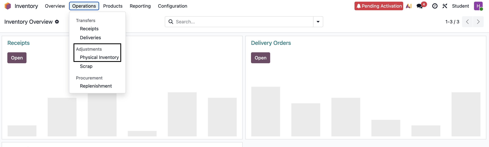

# Updating Inventory in Odoo POS System

## What is this for?
This article explains how to update inventory in the Odoo POS system. Inventory updates help the POS system stay up to date with product quantities on the shelves.  

By the end of this article, you’ll know how to adjust product stock levels, track stock movements, and ensure inventory accuracy in Odoo POS.

---

## Before You Begin
Ensure the following steps are completed before updating the inventory:

### Make Product Available in Odoo
- For each unit of the product available in the stock, create an equivalent in Odoo POS.  
- The product must be created with accurate **prices, taxes, categories, and quantities**.  
- Tick the **Point of Sale** checkbox at the top of the product.  

⚠️ **Warning:** Mismatch between physical product counts and instances of the product in the system may lead to oversold products, unreported stock-outs, and incorrect reporting.  

### User Roles with Access Permissions
- **Inventory Manager**  
- **Supervisor**  
- **POS Manager**  

---

## How to Update Inventory?

### Step 1: Go to Inventory Module
- Launch **Odoo**.  
- Select the **Inventory** module.  

⚠️ **Warning:** Ensure you are logged into the right store.  

### Step 2: Create Inventory Adjustments
- Go to **Operations → Physical Inventory → Adjustments → Physical Inventory**.  

*Fig 5. Select Adjustments in Inventory Module*  

- The Inventory Adjustments page lists all products that are currently in stock.  
- Click **New**.  
- Select a product under the **Product** column.  
- Set the value of the product in the **Counted Quantity** column.  
- Click **Apply** on the far right of the page to create an adjustment.  

### Step 3: Validate Adjustment
- Check the **Counted Quantity**, **On Hand Quantity**, and **Difference** amounts.  

📌 **Note:**  
- If the Counted Quantity is greater than the On Hand Quantity, the value in the Difference column is **green**.  
- If the Counted Quantity is less than the On Hand Quantity, the value in the Difference column is **red**.  
- If the quantities match and have not been changed, no value appears in the Difference column.  

### Step 4: View Adjustment History
- Click **History** to view the adjustment history.  
- The user who performed the count is listed in parentheses in the **Reference** field, while the user who applied the count is listed in **Done By**.  

📌 **Note:** If the POS system is offline, the changes are cached and synced with the server later.  

⚠️ **Warning:** Sync failure may result in count mismatch, resulting in cashiers selling items that are not in stock.  

---

## Additional Resources
- [Odoo POS Inventory Adjustments](https://www.odoo.com/documentation/18.0/applications/inventory_and_mrp/inventory/warehouses_storage/inventory_management/count_products.html?highlight=inventory%20adjustments)  
- [Odoo POS Tutorials](
https://www.odoo.com/slides/point-of-sale-28
)  
- [Odoo POS User Docs](https://www.odoo.com/documentation/19.0/applications/sales/point_of_sale.html)  
- [Contact Odoo POS Support](https://www.odoo.com/help) 