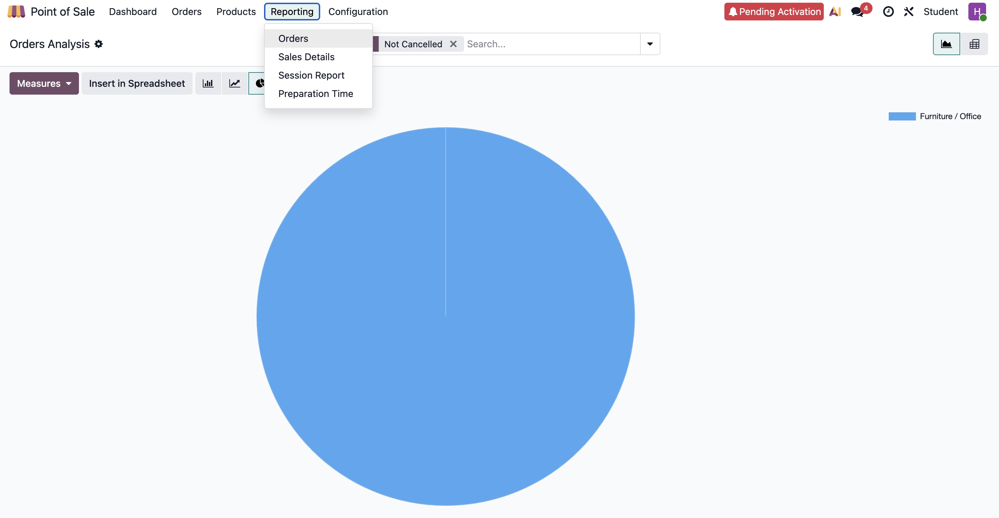

# Generating a Report in Odoo POS System

## What is this for?
This article explains how to generate a report in the Odoo POS system. By the end of this article, you’ll know how to create reports, customize, and export them to further analyze and gain insights from the statistics.

---

## Before you Begin
Ensure you are aware of the following details before generating a report:

### Understand Report Types
Odoo POS system has the following reports:  
- **Orders Analysis Report** - Provides detailed information on orders created during a session.  
- **Sales Details Report** - Summarizes sales transactions.  
- **Session Report** - Provides detailed information on all activities within a POS session.  
- **Preparation Time Report** - Provides information on the time taken to prepare each order.  

### Data Availability
- 📌 **Note:** An active POS session must be available to generate a report.  

### Product Configuration Accuracy
- Verify if the products are configured with accurate **prices, taxes, and categories**.  
- If refunds and returns are processed during a session, ensure that the details are captured accurately.  

### User Roles with Access Permissions
- **POS Manager**  
- **Business Analyst**  
- **Supervisor**  

---

## How to Generate a Report?

### Step 1: Select Report Type
- Launch **Odoo**.  
- Go to **Point of Sale**.  
  - 📌 **Note:** Reports can be generated only when there is an ongoing session.  
  - If there is no active session, start one and then proceed.  
- Click **Reporting**.  
- Select the appropriate type of report you want to generate from the available options. 

*Fig 4. Select Reporting*

### Step 2: Provide Input to Generate Report

#### **For Sales Details Report**
- Select the **start and end date** in the calendar.  
  - 📌 **Note:** The current date is selected by default.  
- Click **Apply**. A summary of the transactions performed on the selected date appears.  
- Click **Print**. The report is printed and downloaded as a `.pdf` file.  

#### **For Session Report**
- Select the **POS session** from the prompt.  
- Click **Print**. The report is printed and downloaded as a `.pdf` file.  
  - 📌 **Note:** If no transactions were performed during a session, the *No Data to Display* message appears.  
  - Input need not be provided to generate **Order Details** and **Preparation Time** reports.  

### Step 3: Customize Reports
- Click **Measures** to customize the generated report.  
- Click **Ascending** or **Descending** to group the values in the report.  

### Step 4: Export and Visualize Reports
- Click **Insert in Spreadsheet** to export the report to a worksheet in your system.  
- Click **Bar Chart**, **Pie Chart**, or **Line Chart** to visualize the report.  

---

## Additional Resources
- [Odoo POS Reporting](https://www.odoo.com/documentation/18.0/applications/sales/point_of_sale/reporting.html)  
- [Odoo POS Tutorials](https://www.odoo.com/slides/point-of-sale-28)  
- [Odoo POS User Docs](https://www.odoo.com/documentation/19.0/applications/sales/point_of_sale.html)  
- [Contact Odoo POS Support](https://www.odoo.com/help)  

- Find my procedure [here](./assets/docs/Procedure.pdf)