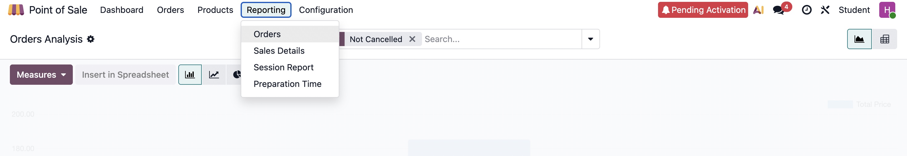

## Generating Reports in Odoo POS System

This article teaches you how to generate, customize, and export reports in the Odoo POS system.

## Prerequisites

Before you generate a report, make sure:

- You are logged in to the latest version of the Odoo POS application on your Android, iOS, or Windows device.
- You have the necessary permissions to view and generate reports.
- A POS session is already open, as Odoo generates reports only for active or completed sessions.

---

## 1. Start a POS Session

1.1 Click **New Session** to open your POS session.

> **Note:** You can generate reports only when at least one POS session is active or has recorded transactions.

---

## 2. Select Report Type

2.1 Click **POS** from the Odoo dashboard.

2.2 Click **Reporting** on the POS dashboard.

*Figure 11. Reporting screen displaying the available reports.*

2.3 Review the list of available reports:

- **Orders** – Shows details of every order created during the session.  
- **Sales Details** – Shows item-wise sales information for the selected date.  
- **Session Report** – Summarizes all actions performed in an active POS session.  
- **Preparation Time** – Shows the time taken to prepare each order placed during the active POS session.

2.4 Select the report you want to generate.  
**Example:** Select **Orders** if you want information about orders created during the session.

---

## 3. Input Values to Generate Each Report

> **Tip:** Each report type can be generated independently.

3.1 Generate **Orders** or **Preparation Time** Report

3.1.1 Select **Orders** or **Preparation Time**.

3.1.2 Click **Print**.

> **Note:** These reports do not require additional input. Odoo automatically uses data from the active session.

---

3.2 Generate **Sales Details** Report

3.2.1 Select the start date and end date using the calendar.

> **Note:** The system automatically selects today’s date by default.

*Figure 12. Calendar screen showing the dates to select for report generation.*

3.2.2 Click **Apply**.  
A summary of transactions for the selected date appears.

3.2.3 Click **Print** to download the report as a PDF file.  
**Example:** Select *January 10 to January 10* to view only today’s sales.

---

3.3 Generate **Session Report**

3.3.1 Select the POS session you want to review from the list.  
**Example:** Select **Session 0125** to view all actions performed during that session.

3.3.2 Click **Print** to download the report as a PDF.

> **Note:** If no sales or activities occurred in the session, the message **No Data to Display** appears.

---

## 4. Customize Reports

4.1 Click **Measures** to adjust the information displayed in your report.  
**Example:** Select **Total Price** to display the total revenue generated from each product category.

4.2 Click **Ascending** or **Descending** to sort the report data.  
**Example:** Sort by **Quantity Sold** in descending order to identify best-selling items quickly.

---

## 5. Export and Visualize Reports

 5.1 Click **Insert in Spreadsheet** to export the report to a worksheet.  
**Example:** Use this option to perform further analysis in Excel or Google Sheets.

 5.2 Click **Bar Chart**, **Pie Chart**, or **Line Chart** to visualize your report.  
**Example:** Select **Pie Chart** to compare product category sales as percentages.

---

## Additional Resources

Refer to [Reporting](https://www.odoo.com/documentation/19.0/applications/essentials/reporting.html) for detailed information on analyzing and visualizing the data of your POS records.

Find my procedure [here](./assets/docs/Procedure%20Final.pdf)