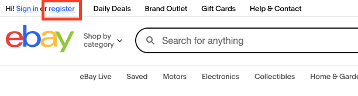
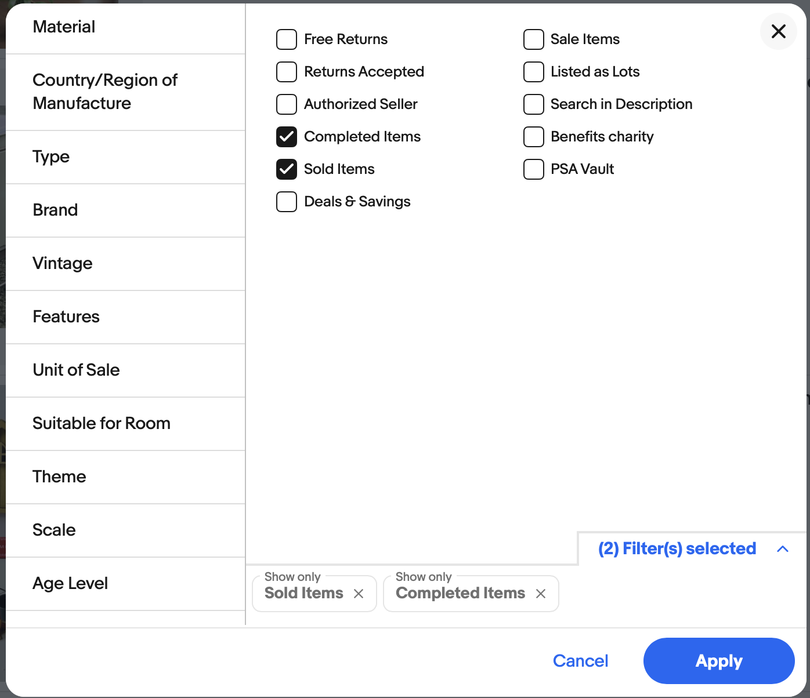
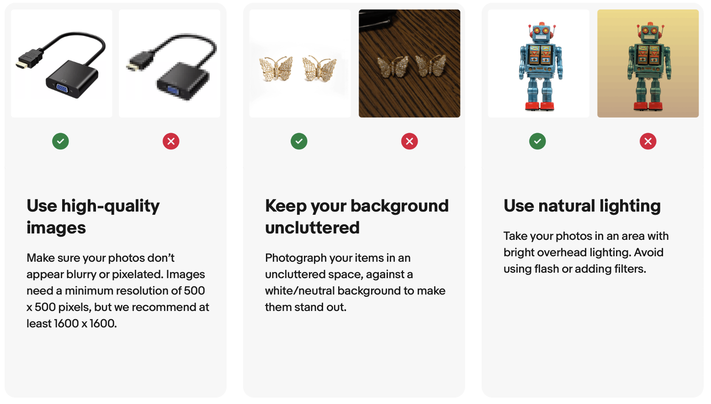
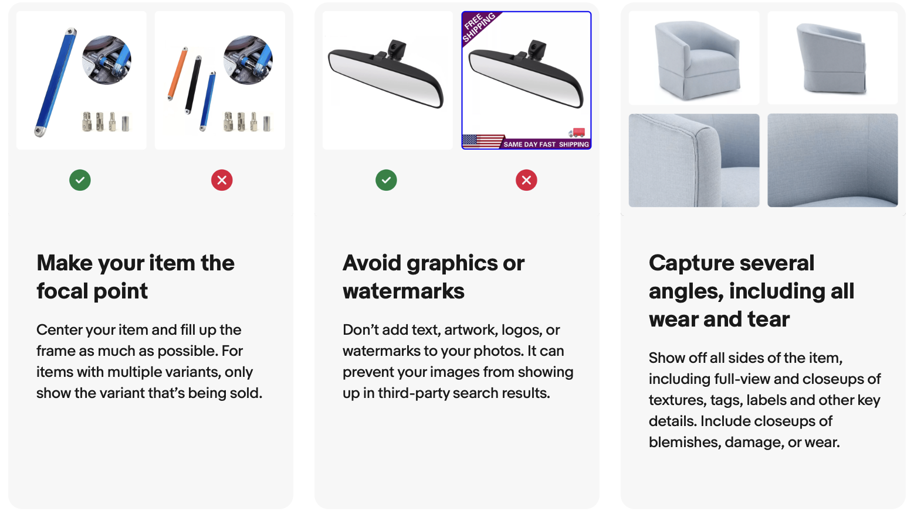
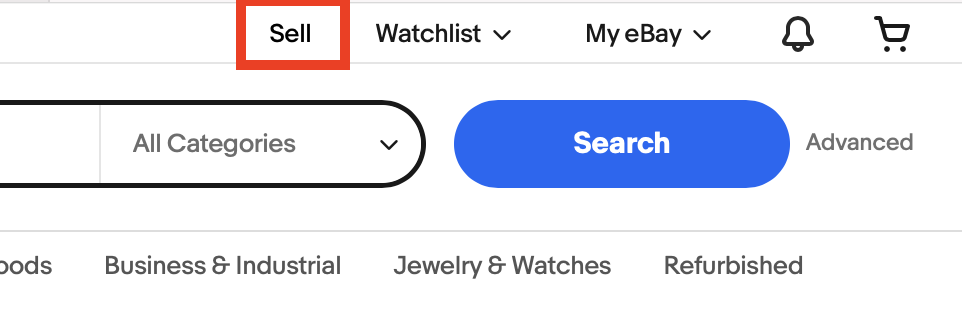
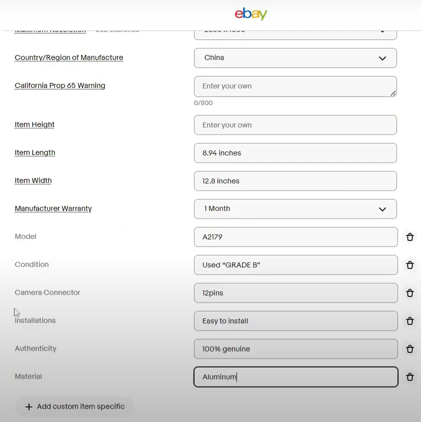
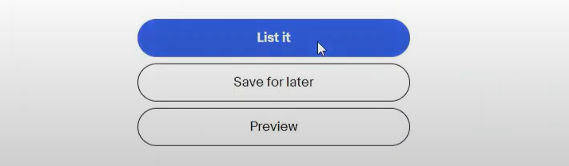

# How to List an Item on eBay

<!-- Staging should include some introductary material that stages the overall goal. -->

This procedure guides new sellers through the major phases of preparing, creating, and publishing an eBay listing. The goal is to help users complete the technical tasks of listing an item while making informed decisions about pricing, format, item quality, and listing visibility.

## Phase 1: Prerequesites
<!-- Perhaps just "Prerequisites" -->

<!-- **1. Create an eBay account**  -->
<!-- > Registered user with an eBay account. -->
- If you already have an eBay account, proceed to Phase 2. If you don't already have an account, follow the steps below.

  1. Go to [ebay.com](https://www.ebay.com).
  <!-- Here's a nice design pattern for steps with images. Consider how to apply throughout your procedures. -->
  2. Click ***register*** in the top left corner.

      

  3. Follow the prompts to register for a personal account.
    - You will need a valid phone number, email address, and payment details (for fees and payouts).
    - If you plan to sell a large number of items, or sell on behalf of a business or nonprofit, register under the ***Business*** tab.

<!-- SUGGESTIONS

- Clearly demarcate major phases. Headings work well. Consider the example structure below.
- I also think the "search" and "decide" steps are pretty difficult for new users, so the procure will require some more drawn out concrete steps for your audience.
- I also recommend a running example to make the procedure more concrete.

## 1. Research Your Item

Short intro here that describes the goal to research and decide.

### 1.1 Search current eBay listings

Enter brief intro and use a running example that grounds the (re)search process.

1. Enter more concrete step
    - **Tip**: Use search filters to sort by sold items to see "completed" (sold) listings.

      

2. ...
3. ...

### 1.2. Decide type of auction

Before you start listing your item, use the above information to decide whether to list your item for a **fixed price** (Buy It Now) or put it up for **auction**.

- **Buy It Now**: Define it here.
- **Auction**: Define it here.

[Enter your procedure, based on a running example.]

-->
## Phase 2: Research and Preparation

Before creating your listing, you must understand your item’s value and how it fits into existing listings.

### 2. Research your item

#### 2.1 Search current and completed listings

1. Enter your item (e.g., *Nike Air Max 270 women’s 8*) in the eBay search bar.  
2. Review active listings to understand:  
   - Average listed prices  
   - Title patterns and keywords  
   - Item categories  
3. Use the search filters to view only **sold** listings—this shows actual market value.

   

**Tip:** Start by selling a few lower-value items to build feedback before listing high-ticket items.

#### 2.2 Decide how you will list the item

Using your research, choose between:

- **Buy It Now (Fixed Price):**  
  Ideal when you know your item’s value or want predictable pricing.

- **Auction:**  
  Good for rare or highly desirable items where bidding competition can increase price.

### 3. Gather item specifications

Collect all relevant details before listing. Concrete details improve search visibility and buyer trust.

- Brand, model, size, color, condition, features  
- Clothing: include measurements, tags, fabric  
- Electronics: test functionality and reset devices as needed  

---

### 4. Take high-quality photos

1. Use natural light and a clean background.  
2. Capture multiple angles (front, back, sides, close-ups).  
3. Photograph any flaws clearly.  
4. If listing a set, photograph items together *and* individually.  
5. Include original packaging when possible.  
6. eBay allows up to 24 free photos.

  

## Creating the Listing

<!-- SUGGESTIONS
  - This is its own file/procedure.
  - Many of your substeps below should use numbered/ordered list items.
  - Clearly and consistently mark notes, tips, warnings, etc.
-->
**1. Log into eBay.**
   - Click ***sell*** in the top right corner. 

**2. Choose a selling format.**
   - Enter your item name in the search bar. eBay may suggest categories and listing templates.
   - Confirm the best category (e.g., Electronics > Cell Phones > Smartphones).

**3. Write the listing title.**
   - Be descriptive but concise. Include brand, model, and size. If there is room, feel free to include some of the item's defining features.
   - Example: *Apple iPhone 13 Pro Max – 256GB – Graphite (Unlocked)*

**4. Select item specifics.**
   - Fill in eBay’s fields (brand, size, color, material, style, UPC, etc.).
   - Accurate details help buyers find your item in search. 

**5. Write the item description.**
   - Include condition (new, gently used, refurbished, etc.).
   - Highlight key features and benefits.
   - Disclose flaws honestly to avoid returns.
   - Optional: Use bullet points for readability.

**6. Upload photos.**
   - Ensure they are clear, high-quality, and distinctly show any imperfections.
   - Make sure the first photo acts as a cover, and clearly shows the full object.

**7. Set the price.**
   - **Auction format:** Choose starting bid, duration (1–10 days), and optional reserve price.
   - **Buy It Now:** Set a fixed price based on research.
     - Consider offering “Best Offer” so buyers can negotiate.

**8. Set shipping options.**
   - Choose shipping service (USPS, UPS, FedEx, etc.).
   - Decide if you’ll offer free shipping or buyer-pays.
   - Use eBay’s shipping calculator to estimate costs.
   - Pack and weigh your item before listing for accuracy.

**9. Choose payment method.**
   - eBay uses *Managed Payments*, so funds go directly to your linked bank account.

**10. Review fees.**
   - eBay takes a small percentage of the item's sale value and a processing fee.
   - If you exceed your free monthly listings, there may be additional fees.

**11. Click *List item* to publish your listing.**

### Your listing is now live on eBay.

## To Manage After Listing

**1. Monitor your listing.**
   - Answer buyer questions promptly.
   - Adjust pricing if needed (you can revise listings).

**2. Once sold:**
   - Package the item securely with padding.
   - Ship within the handling time you specified.
   - Upload tracking info to eBay.

**3. Communicate with the buyer** and send a short note once the item has been shipped.

**4. Leave feedback.**
   - Buyers and sellers leave ratings and comments for each other.
   - Positive feedback builds your credibility as a seller.

**5. Handle returns (if necessary).**
   - If you offer returns, follow eBay’s return process.
   - If the item is not as described, you may need to accept a return regardless.