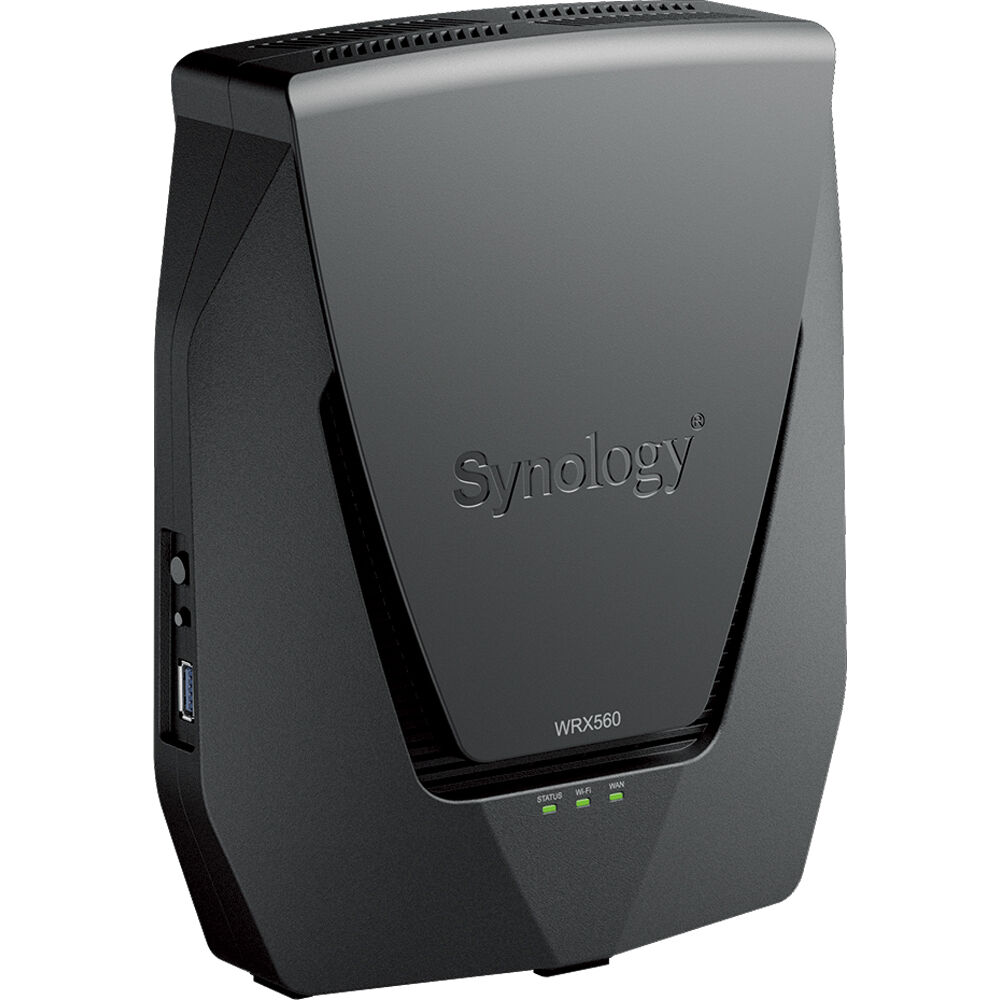
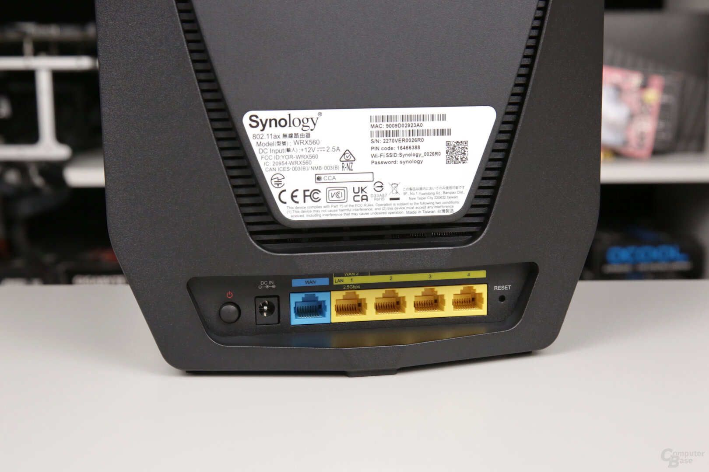

# How to Install a Synology WRX560 Wi-Fi Router

If you just procured a new Synology WRX560 Wi-Fi router and aren't sure how to install it, this guide is for you! We'll go over the prerequisites, terms, and instructions you need for a successful installation. If you've never installed a router before, don't panic; this is a beginner-friendly guide!

The Synology WRX560 router is popular due to its high-speed connectivity, mesh network support, and robust parental controls. Before beginning the installation process, it's important to cover the equipment you'll need to have and the terms you'll need to get familiar with. Let's begin!

## What You'll Need 

- A Synology WRX560 Wi-Fi Router
- An AC Power Adapter
- An RJ-45 LAN Cable
- An ISP Modem
- A working outlet 
- A device for software set-up (phone, laptop, desktop, etc.)

## Terms to Know

- **Hardware**: The physical/tangible part of tech, like routers, modems and cables
- **Software**: The digital/intangible part of tech, like websites and computer programs
- **Router**: Hardware that connects and manages networks to provide an Internet connection 
- **Modem**: Hardware that converts signals between devices to maintain a stable connection
- **Power Adapter Cable**: Hardware that ensures devices get the right kind of electrical power 
- **LAN Cable**: Hardware that virtually connects devices and provides communication between them
- **Indicator**: Small colored lights on a router that 'indicate' the device's operational state
- **Ports**: The parts of a router where additional hardware (like cables) can be plugged in 

## The Instructions

### Installing the Hardware

1. 
2. 
3. 

### Setting Up the Software

1. 
2. 
3. 