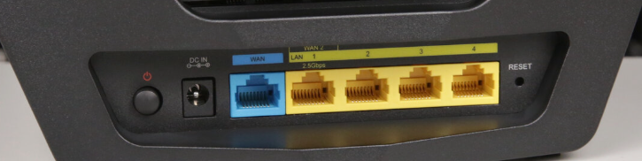
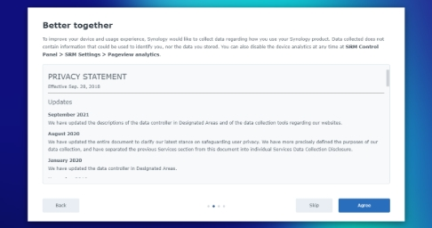

# How to Install a Synology WRX560 Wi-Fi Router

>*Figure 1: A Synology WRX560 router.*

If you just procured a new Synology WRX560 Wi-Fi router and aren't sure how to install it, this guide is for you! We'll go over the prerequisites, terms, and instructions you need for a successful installation. If you've never installed a router before, don't panic; this is a beginner-friendly guide!

The Synology WRX560 router is popular due to its high-speed connectivity, mesh network support, and robust parental controls. Before beginning the installation process, it's important to cover the equipment you'll need to have and the terms you'll need to get familiar with. Let's begin!

## What You'll Need 

- A Synology WRX560 Wi-Fi Router
- An AC Power Adapter
- An RJ-45 LAN Cable
- An ISP Modem
- A working outlet 
- A device for software set-up (phone, laptop, desktop, etc.)

## Terms to Know

- **Hardware**: The physical/tangible part of tech, like routers, modems and cables
- **Software**: The digital/intangible part of tech, like websites and computer programs
- **Router**: Hardware that connects and manages networks to provide an Internet connection 
- **ISP Modem**: Hardware that converts signals between devices to maintain a stable connection
- **Power Adapter Cable**: Hardware that ensures devices get the right kind of electrical power 
- **LAN Cable**: Hardware that virtually connects devices and provides communication between them
- **Indicator**: Small colored lights on a router that 'indicate' the device's operational state
- **Ports**: The parts of a router where additional hardware (like cables) can be plugged in 

## The Instructions

### Installing the Hardware

1. Check that your package has all three essential pieces of hardware: the Synology WRX560 router, an AC power adapter, and an RJ-45 LAN cable. You should also check to verify that you have an ISP modem and a working outlet to plug in the router. 
  >**Note:** If your package is missing something, Synology recommends contacting the reseller. 

2. Place your router in the spot where you intend to plug it in. An optimal area would be a flat, stable surface in the center of your area, ideally with few walls or ceilings between the router and your devices. 

3. Plug one end of your LAN cable into the router's WAN1 port, and plug the other end into the ISP modem.

>*Figure 2: The ports on the backside of a Synology WRX560.*

4. Plug one end of your power adapter to the power port of your router, and connect the other end to your chosen power outlet. 
  >**Note:** The power port is the small circular port next to the power button. 

5. Press the power button to turn on your router. Within two minutes, the STATUS and WAN LED indicators should turn green to signal that the router is ready to connect to other devices. 

### Setting Up the Software

1. Connect a wireless device to your router by scanning the QR code provides on [Synology's website](https://www.synology.com/en-us). 

2. Use Synology's default login information to connect to the Wi-Fi network. Synology's default SSID is is "Synology_" and the last 6 digits of your router's serial number, and its default password is "synology" in all lowercase. 
>**Note:** Synology requires you to change this password during the setup process. 

3. Open a web browser on your wireless device and search up either of these URLs: 
    - http://router.synology.com
    - http://192.168.1.1:8000

4. Click 'Start' to launch the SRM Setup Wizard. 

5. Read and agree to the Synology End User License Agreement, then click 'next'. Repeat with the Privacy Statement.  

>*Figure 3: The Synology Privacy Statement screen.*

6. Set up your administrator account by filling in the necessary information. 

7. Set up your Wi-Fi network with the necessary information. Wait for the Setup Wizard to finish the setup. This may take up to three minutes. 

8. Sign in to SRM with your newly set-up administrator account. 

## Wrap Up

Congratulations on successfully installing your router! For any questions or concerns, visit Synology's [Knowledge Center](https://kb.synology.com/en-us). 