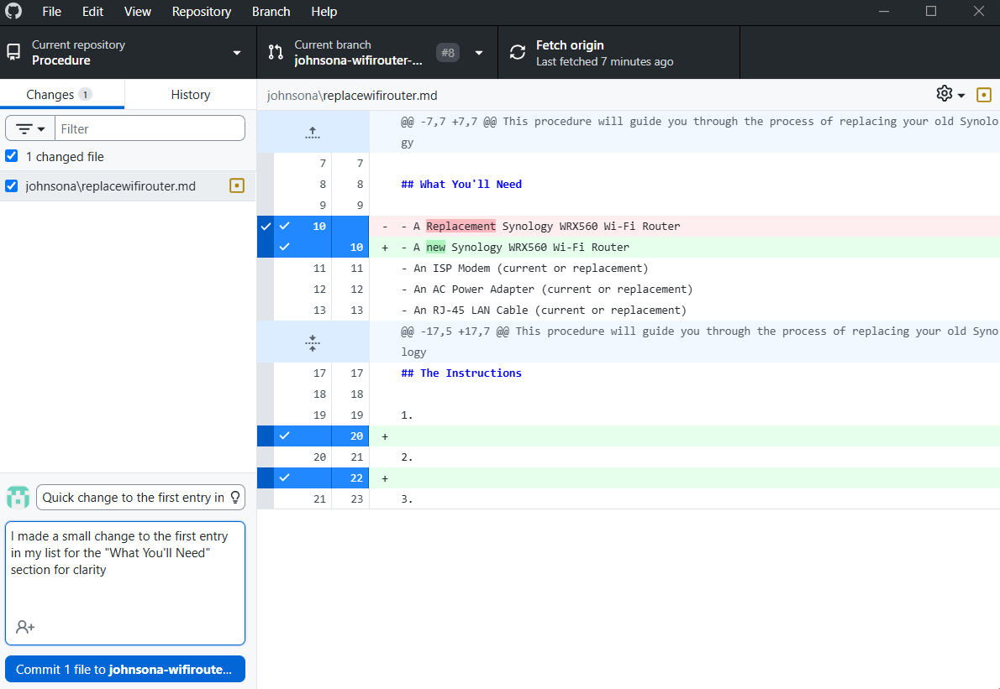
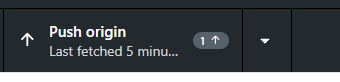
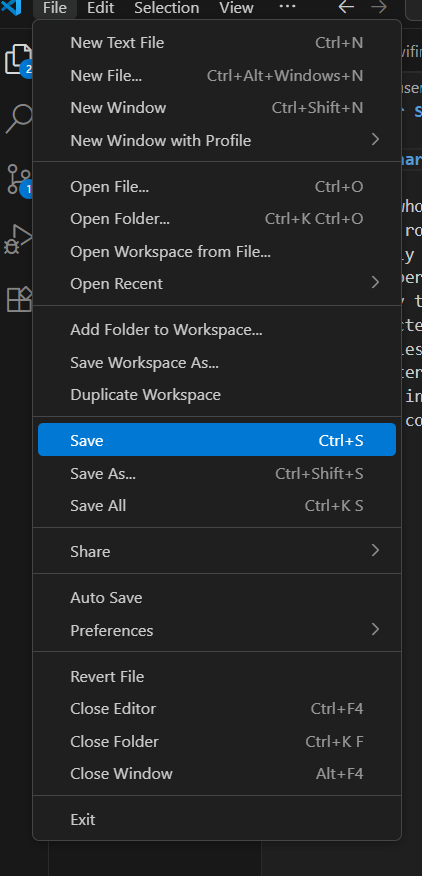
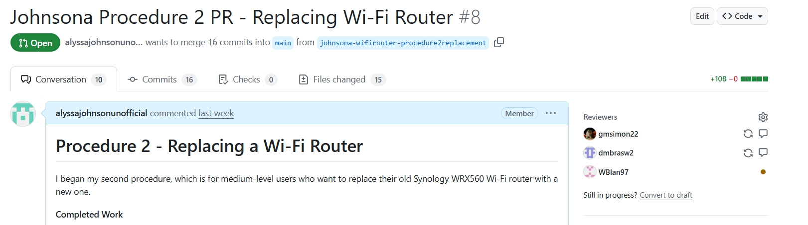
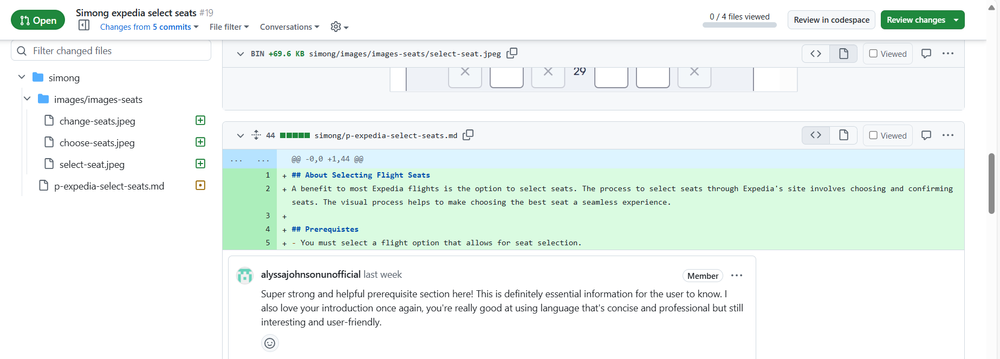
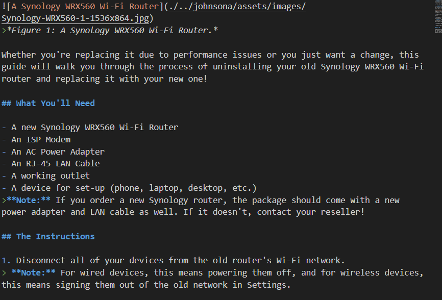

## Alyssa Johnson's Reflection 

For my Unit 1 project, I chose to write three procedures centered around using a Wi-Fi router. The first procedure was for installing the router, the second was for replacing it, and the third was for troubleshooting it. Because I needed to focus on a specific type of router, I narrowed in on the Synology WRX560 and used its [instruction manual](https://kb.synology.com/en-us/HIGs/WRX560_HIG/1) as inspiration for my first procedure. I also drew from what I already knew, my family's advice (since my parents and grandparents were the inspiration for the user scenario's for procedures 2 and 3), and my online research. To ensure I was following the Staging, Coaching and Alerting conventions of WGTA and the 4 procedure components, I consulted the IEEE reading, the Hart-Davidson reading and the SCA Criteria assignent. 

### Incorporating the 4 Procedure Components and SCA

To incorporate the goal component, I considered what each procedure's intended audience would want to gain from the procedure, and I used that to come up with a goal for each user scenario, which I then referenced in each procedure's introduction and wrap-up. For example, in my first procedure, the user's goal is to have a router that is correctly installed and provides internet connection to the user's devices. The introduction states that this is the goal, the steps listed out are meant to lead the user to this goal, and the wrap-up congratulates them for completing this goal. 

To incorporate the prerequisites component, I included "What You'll Need" and "Terms to Know" sections for my procedures as needed. These sections serve to assure the user that they have the required knowledge and materials and are equipt to begin the task of installing, replacing, or troubleshooting their router. 

To incorporate the actions and reactions component, I wrote my steps in a way that prompts the user to complete an action/task, and used my alerts (notes) to indicate the response their router will give them if they complete the action correctly or incorrectly. For example, in my second procedure, my 5th step is for the user to dispose of their old router and hardware, and my alert explains that if they don't dispose of their old power cable, it could cause the router to experience issues. The use of imperative verbs and helpful screenshots also contributed to this component.

To incorporate the unwanted states component, I used my alerts to provide both warnings and problem-solving information. For example, in my third procedure, I included a warning for users to not interrupt the process of installing updated software to their router, as well as a problem-solving note that if their router's indicators were off, it could be a sign that their power outlet wasn't working. 

The Staging convention calls for alignment to your audience and their skill level, the inclusion of meaningful goals, and providing the necessary prerequisites. I adjusted the language and vocabulary of my procedures to match their intended audiences, included my "Terms to Know" and "What You'll Need" sections to provide the necessary prerequisites and accomodate my audience's skill level, and, as stated previously, incorporated the user's goal into my introductions, steps, and wrap-up sections.

The Coaching convention calls for the use of imperative verbs, one-action tasks that aren't featured-focused, concrete steps in a logical and consistent order, and the use of optional steps and/or conditionals. I started all of my steps with an imperative verb, confined each step to a specific task, and placed them in an order that felt logical and timely. I also used markdown to call attention to any steps that were optional (such as in procedure 2), and included "if" statements to indicate when steps or tasks were conditional, especially in procedure 3's methods and steps. 

The Alerting convention asks for clear, visually distinctive warnings, problem-solving explanations, and indications of consequences. I included notes in each of my procedures whenever a step called for a warning, a helpful tip, or a reference to a potential consequence, and I made these notes visually distinctive by using markdown to bold them and put them in a footnote format. For example, in procedure 1, I used a bolded, indented alert to let the user know what they should do if their Synology package is missing an important piece of hardware. 

### Orienting My SCA Moves to the Tasks

For my first procedure, my intended audience was someone completely new to the process of installing a router, and their goal was to successfully install the router and gain Wi-Fi connection. I oriented my SCA moves to this by using beginner-friendly language throughout the procedure, including reassurance in my intro that the guide was for first-time installers, including "Terms to Know" and "What You'll Need" sections, and writing steps that were oriented around a successfull router installation. 

My second procedure was intended for an audience that is familiar with the installation process, but not with the uninstallation process. To orient my SCA moves to this new audience, I ommitted a "Terms to Know" section (since they would already be familiar with the router's terminology), but included a "What You'll Need" section to give them the prerequisites for a task they were unfamiliar with (the uninstallation process). I also made sure my steps used in-depth, beginner-friendly language for the uninstallation part, but not for the installation part they were already familiar with. 

With my third procedure, I needed to orient my SCA moves to an audience that was familiar with the installation process, but not with troubleshooting methods, and that knew terms related to the router itself, but had more trouble with general technological terms. To do this, I included a "Terms to Know" section with a few general tech terms (but not any router-specific terms), turned the "What You'll Need" section into a casual introductory paragraph rather than an unordered list, and seperated each troubleshooting method into its own section, with descriptions and tasks that used beginner-friendly language and offered several alerts and tips. 

### Applying a Docs-As-Code Editorial Workflow

To apply a basic docs-as-code editorial workflow to this assignment, I made a conscious effort to meaningfully save, commit and push changes as I worked, encouraging myself to do it more often than I typically would (Figures 1-3). I saved every change I made right away, committed changes in logical chunks with explanatory titles and descriptions, and pushed these changes to the origin right after I committed them. For example, Figure 1 shows me about to commit a change to procedure 2, with a title and a description written out to show what I committed (changing a word used in the first entry of my "What You'll Need" section). 

I also followed the basic docs-as-code editorial workflow by submitting pull requests for each of my branches and assigning my groupmates to review them (Figure 4), as well as leaving peer review comments on the PRs of my groupmmates (Figure 5). For example,Figure 8 shows a comment I left on one of Gabby's procedures, pointing out what I really liked about her prerequisites section. 

### Applying a Consistent Use of Markdown

Finally, as part of my project, I consistently applied Markdown language to create the general structure of my procedures (Figure 6). This included formatting titles and headers, writing my introductory and conclusive paragraphs, creating ordered lists for my steps and unordered lists for my prerequisites, inserting images and screenshots (With figures and captions), and making bolded or italicized alerts. For example, Figure 6 shows the first half of my second procedure, where I employed all of the previously-mentioned uses of Markdown to properly structure my procedure as a readable user guide. I started with an image of the Synology WRX560 router, included an introductory paragraph about the intended goal of the procedure, listed the hardware and materials they would need to replace their router, included helpful tips and warnings about proper replacement practices, and made my steps as an ordered list. 

### Screenshots to Support My Claims

>*Figure 1: A screenshot of me committing a change to procedure 2.*

>*Figure 2: A screenshot of the 'Push Origin' button in GH Desktop, showing that I had recently pushed my commits to the origin.*

>*Figure 3: A screenshot showing me about to save a change in VS Code.*

>*Figure 4: A screenshot of my submitted PR for Procedure 2, which my groupmates were assigned to review and leave comments on.*

>*Figure 5: A screenshot of one of the peer review comments I left on a groupmate's PR as part of my review.*

>*Figure 6: A screenshot from Procedure 2 that shows my use of Markdown for an image, a paragraph, headers, ordered and unordered lists, and bolded footnotes.*