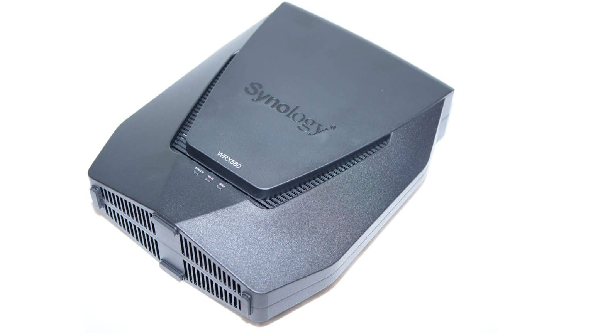

# How To Replace a Synology WRX560 Wi-Fi Router

>*Figure 1: A Synology WRX560 Wi-Fi Router.*

Need to swap out your old Wi-Fi router for a new Synology WRX560 router? Whether you're replacing it due to performance issues or just because you wanted a change, this guide will walk you through the process of uninstalling your old Wi-Fi router and replacing it with your new one!

## What You'll Need

- A new Synology WRX560 Wi-Fi Router
- An ISP Modem 
- An AC Power Adapter 
- An RJ-45 LAN Cable 
- A working outlet 
- A device for set-up (phone, laptop, desktop, etc.)

## The Instructions

1. Disconnect all of your devices from the old router's Wi-Fi network. 
> **Note:** For wired devices, this means powering them off, and for wireless devices, this means signing them out of the old network in Settings. 

2. Turn off your old router and modem. 

3. _**Optional:**_ Take photos of the cable setup for your old router and modem. This can be used as a reference when you install the new router, just in case you forget which ports the cables are plugged into. 

4. Unplug any cables from the old router, including the power adapter and the LAN cable. 

5. Dispose of the old router and any other hardware you're swapping out for the new installation. 
> **Note:** It's recommended that you at least replace your power adapter cable; keeping the old one could lead to performance issues in your new router. 

6. Install the hardware for your new router as normal. 

7. Set up the software for your new router as normal. 

## Wrap Up

You've successfully replaced your old Synology WRX560 router with a new one!
