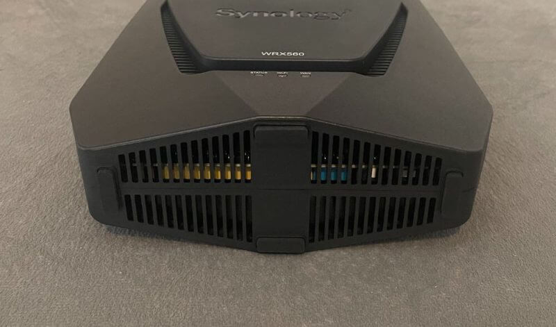

# How to Troubleshoot a Synology WRX560 Wi-Fi Router

This procedure will guide you through the process of troubleshooting your Synology WRX560 Wi-Fi router. 

## What You'll Need

- 
- 
- 

## The Procedure 

1. 
2. 
3. 