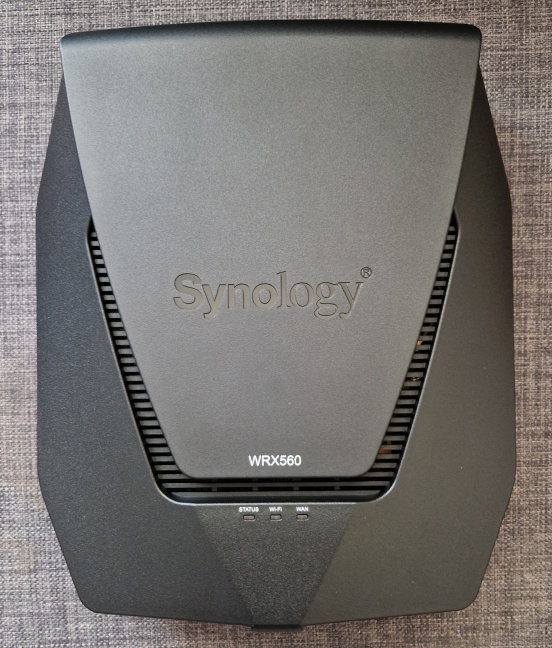
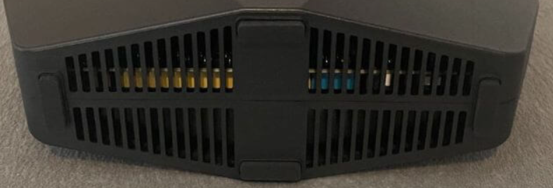

# How to Troubleshoot a Synology WRX560 Wi-Fi Router

>*Figure 1: A Synology WRX560 router.*

If your Synology WRX560 router is acting up and you're not sure how to fix it, this guide is for you! We'll walk you through the various troubleshooting methods and help you quickly fix any issues you're facing with your router. 

What you'll need will depend on which method ends up working for you, but generally speaking, make sure you have a fully-installed router and a device you can access the Internet through. You'll also need to actually be in the room with your router, since some of these methods involve physically checking or moving it. 

## Terms to Know

- **Troubleshooting:**Finding and correcting issues in a device or piece of technology
- **Hardware**: The physical/tangible part of tech, like routers, modems and cables
- **Software**: The digital/intangible part of tech, like websites and computer programs

>*Figure 2: The vents of a Synology WRX560 router, up close.*

## The Troubleshooting Methods

1. 

2. 

3. 