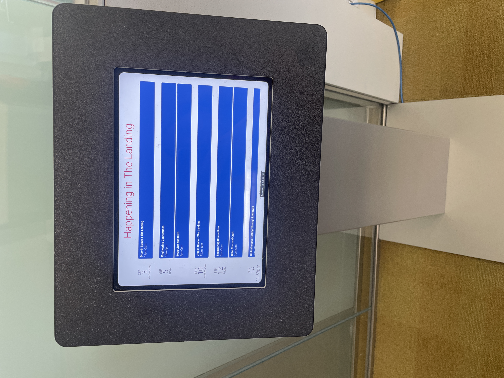
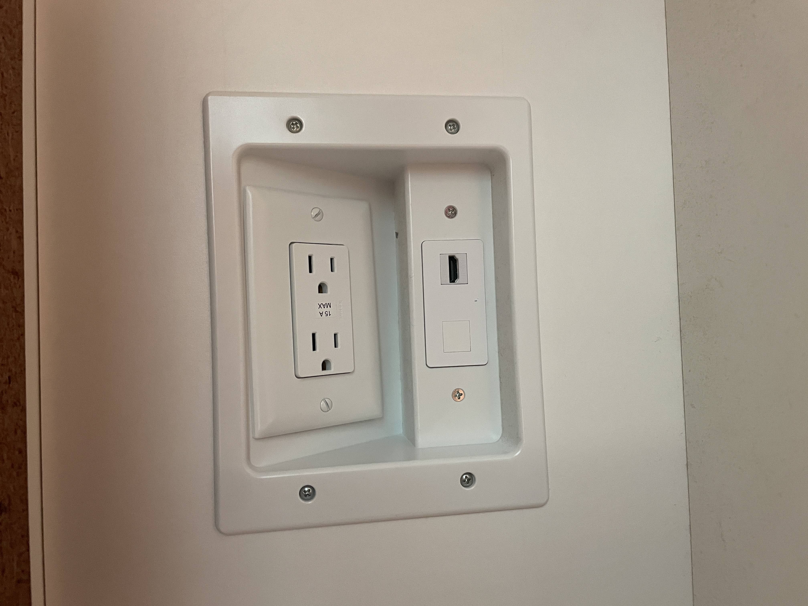
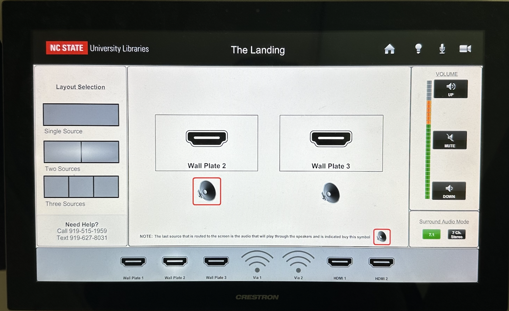

# How to Connect Techology to the OLED Display

<!-- See feedback in reservation procedure and apply where appropriate throughout this file as well. -->

<!-- Noticed that you used a "Purpose: ..." approach in the reservation procedure. Make sure to stay consistent. -->
This guide will teach you how to connect a console to the OLED screen outside of scheduled events. 

A common misconception is the Landing can only be used when it is reserved. This is not true! You are free to use the space to play games, connect to the screen, and relax during your study break! This guide will teach you how to connect consoles to the OLED screen and use the space outside of its reservation times. 

<!-- PREREQS? -->

<!-- Suggestion:
## Verifying Your Reservation

  - Trying to maintain the imperative progressive here, while also consider what the main action is for the user.
  - You could include the "Before you connect" as a verb phrase in your first step: "Before you connect your device, verify your reservation in the Events panel ..."

-->
## Before you Connect
<!-- Suggestion:
  - Notice the change in format. Consider that as a design pattern to use throughout your procedures.
  - I recommend cropping the photo, so the information is legible.
  - Also, "A librarian will enter ..." sounds like a "Note" alerting move, while "Plan to leave 15 ..." seems like another step perhaps.
-->
1. Check the Events panel directly outside the Landing to see if the space is reserved.

    

    > Figure x. Panel displaying reservation calendar.

<!-- Below shows what the panel looks like and how reservations appear on the screen. A librarian will enter the space prior to a reservation time and kindly ask you to leave if you are there during those times. Plan to leave 15 minutes before an event to give yourself and the librarians enough time to tidy up the room.

 -->

2. Find a librarian or someone at the Ask Us deak to log you into the system
<!-- Again, be consistent about how you frame and format your alerting moves. Consider and revise for this issue throughout all of your procedures for consistency and clarity. -->
The library does not share the OLED password with students, so if you would like to use the screen, ask someone to log you in first. 

<!-- Oh! Is all of this suppose to be prereqs? Hmmm, that's a lot of info to be considered a prereq, if so. I'd say materials should be noted at the top in your staging location. You can also suggestion in a prereq list to verify the reservation and gesture to the included subprocedure. -->
## Materials
* HDMI cable
* HDMI adapter (optional)
* Your personal console

Tip: if you don't have something, visit the AskUs desk to rent it for the afternoon. For more information on tech lending options for your needs, please visit [the tech lending portal.](https://www.lib.ncsu.edu/devices)
<!-- Again, be consistent and clear about your major steps. This seems like a sequence at the h2 level, so you should number them accordingly and use consistent casing too. Update and revise throughout. -->
## Connecting your consoles: 

1. Locate HDMI Input 1 underneath the OLED screen

This is what the HDMI inputs look like. Both power outlets connect with the HDMI port. If the wall plate's aren't visible, check behind the games on the shelves, as someone may have covered them. 

2. Insert the HDMI cable into the port.
3. Connect your equipment to the cord.

Your device name should now appear on the OLED interface panel. The image below shows what the interface looks like for connections. If your equipment's inputs do not match your cable, it will not appear. You will need an *HDMI adapter* to fix this as noted in materials.

Your device's screen should now be casting on the OLED display. 

## Troubleshooting Console Device Audio
Sometimes the audio will not automatically play when connected to the screen. There are two reasons why this may happen: 

### 1. Your device audio is muted

1. On the interface panel, turn the speaker volume to 50%.
2. Go to your device settings and check if your console is muted. 

This will look different for different consoles. If you have trouble locating your device's audio settings, please visit the AskUs desk for assistance.

The volume should now output through the speakers. If the try troubleshooting by checking device priority on the speakers. 

### 2. Your device is not recieving priority in the speakers 

If more than one console is connected to the screen, the newest connection will output audio to the screen. All others will not output to the OLED speakers. If a different console should be outputting audio, disconnect the device you want sound for and repear steps 2-4.

**Note:** if your equipment's inputs do not match your cable, you may need an adapter as noted in materials.

## Disconnecting Your Consoles
Before disconnecting your device, make sure your progress is saved on all consoles. 

1. Return to your device's home screen.
2. Power off Device.
3. Remove the HDMI cable from the OLED input.

This should result in a black square appearing on the OLED screen in place if your device screencasting. This means you successfully disconnected your console and it is safe to remove the cord from your device. After 30 seconds, the black screen will disappear on its own. 

4. Remove the HDMI cable from your device.

 **WARNING:** If you disconnect your console from the cord before the HDMI input, your console's homepage will freeze on the screen. If this happens, navigate to the interface panel, and exit the input tab. This will remove the frozen screencast from the OLED and successfully return the screen to its origional backdrop. 

## Resetting the Room
1. Log out of the OLED panel by pressing and holding the top left corner of the screen. 
2. Roll all chairs back under the tables you found them. 
3. Remove all personal items from the space when you leave. 
4. Return checked out materials to the AskUs Desk.