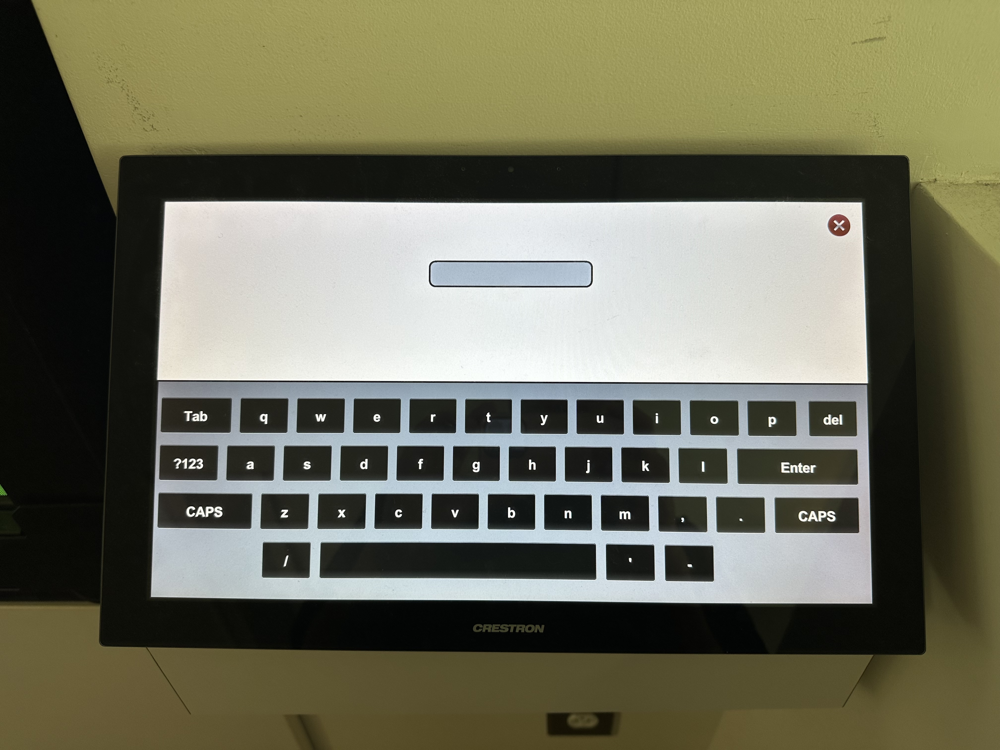

# How to Set Up a Wellness Event in the Landing

<!-- COMMENTS
  - Make sure to rename your files according to the directions in the README.
-->

<!-- Suggestion:
**Purpose**: "Learn how to organize a wellness event in Landing, so you can curate the space for your community's needs!"

- I'd also suggest that you consider integrating some more guidance about how to provide helpful information for library staff to determine the best fit for their needs.
- Also, perhaps that means you could open up your procedure to be about reserving a space in general, wherein the "Wellness" simply becomes a running example for you to help ground each step with more concrete examples for your audience.
-->
**Purpose:** This guide walks you through how to organize a wellness event in Landing, so you can curate the space for your community's needs!

Welcome to the Landing; your place for promoting wellness and connection for students and faculty! We look forward to hosting your wellness events in the space. We recieved feedback on how to organize wellness events that include music playing from the OLED dislays while allowing students to work on card games, puzzles, and assignments. 

<!-- Suggestion: remove the colon for headings.
## Prerequisites
-->
## Prerequisites:

### 1. Reserving a Room
<!-- COMMENTS
  - Small Note: Notice the whitespace at the beginning of this sentence/line.
  - Based on the site, there are 3 options to consider. I know this is for The Landing, but it seems that you could offer some guidance with some aspects of the form, such as:
    - Necessary or helpful information in the brief description; and
    - If you change the procedure to be more about reserving any space, and the "Wellness" event factor is merely a grounded example, then you could also help people determine the best choice to make of the 3 options.
-->
 To reserve the space, please complete the [request form](https://www.lib.ncsu.edu/request-high-tech-space), and a libraries staff member will be in touch with you in 2-3 business days. Please submit the request at least 14 days in advance of the requested date.

### 2. Contact with a Librarian
<!-- Seems like this is part of the reservation process, so I'd add it under #1. Consider how to provide a set of tips to prepare for the call, or something along those lines. -->
Once a librarian reaches out to with from your form, they will be your primary point of contact for updates on the space and your reservation time slot. Once they send you the interface password, you are ready to begin setting up your wellness event. 

<!-- Should this be #3? -->
## Setting Up the OLED Screen 

<!-- Add a goal statement here. -->

<!-- Suggestion:
### 3.1. Logging into the system

Since you are using the progressive imperative, its best to maintain it throughout, rather than starting a new "How to ..." approach to your headings. Be sure to check for this throughout and revise where appropriate.
-->
### How to Log Into the Interface

<!-- Suggestion:
1. Locate the login panel to ...[accomplish what?]
  
  - The Landing: Enter description of location.
  - Teaching Visualization Lab: Enter description of location.
  - ...
-->
1. Locate the panel at the far glass windows opposite the door. 
    <!-- Suggestion: -->
    - Note: The panel begin logging into the interface.
    <!-- It should not need to be turned on or “woken up” to begin logging into the interface. -->
<!-- Suggestion:
2. Log into the system by pressing the top left corner of the panel for a few seconds, until the login screen appears.

    

    ENTER TROUBLESHOOTING: What if it doesn't appear? What action(s) should the user take to resolve the issue?
3. ...
-->
2. Hold a finger on the top left corner of the panel

    After a few seconds, a password login screen will appear. 

<!-- Suggestions:
  - "... once the login window appears" is probably not needed in this case. We can assume the user knows what to do.
  - Consider your verbs carefully, but keep it simple. Consider the following subtle change:

3. Enter the provided password.
-->

<!-- Since this is such as simple process, you can combine them. But, I think you should consider a troubleshooting scenario here. -->
3. Type in the password once the login window appears. The password is XXXXXX, all lowercase.

You have now successfully logged into the interface! You are now ready to *Toggle the Privacy Windows, and Connect phones to the OLED Screen*

### How to Toggle the Privacy Windows

<!-- Seems like images/step results will be very helpful here. -->

1. Navigate to the top left corner by the NC State University Library logo
2. Press and hold your finger in the top left corner. 

    After a few seconds, a new window will appear.

4. Tap the “Display and Glass Control” box
    
    On the right, you will see options for turning on and off the privacy glass.
 

## Connecting your Phone to the OLED display

### Materials 

* Phone or tablet
* HDMI cord
* Optional: HDMI adapter

If you do not have these tools, NC State Libraries offers tech lending for all materials in the list. Walk down to the Ask Us desk on the 2nd floor for assistance in finding your equipment. For more information, please visit [this website.](https://www.lib.ncsu.edu/devices)

1. Plug the HDMI cord into  your device. 
    <!-- Notice the formatting change below. Change this throughout for all notes and similarly for other alerting moves or step examples or results. -->
    - **Note:** This will usually be an HDMI ir USB-C input on your device. if you do not have the correct input, you will need an *HDMI adapter.* These are available to check out at the AskUs Desk.

2. Plug the HMDI cord into the Wall Panel.

Once plugged in, a notification will appear on the interface panel to accept the connection. 

3. Press "accept connection" on the interface panel.

<!-- This seems like a Warning! alert. Label and format it similar to the suggested "Note" above, but prepended with "Warning!" instead. Also, such alerting moves should always explain the potential consequences. -->
**Do not** Begin testing the audio or video from your phone until you hit "accept connection" on the interface panel. 

4. Test the pairing by playing a song from your phone.

If you experience delays in the music, reset your device while connected to the screen. ***DO NOT*** disconnect from the screen before resetting. 

## Resetting the Room 
It is important we maintain the space after events so the Landing remains a community resource 24 hours a day. Once your event concludes, we ask that you tidy up the space so it is ready for students to use it. 

Below is a checklist to help simplify the cleanup process after your event:

* Remove all snacks, drinks, and trash from the area.
* Push all chairs back under the tables.
* Unplug and return all equipment checked out from the library to the AskUs Desk. 

A librarian will check in after your event concludes to make sure the card games make it onto the OLED shelves and check for broken equipment. If we find any forgotten equipment, we will email you with a list and send it to the AskUs desk for you to pick up at a later time. If you forgot anything at the Landing, please message your librarian. For more information, please see the [NC State Libraries Lost and Found Polices.](https://www.lib.ncsu.edu/borrow/lost)

That's it! You have successfully run an event in the Landing. Thank you for choosing NC State Libraries for hosting your wellness experience. We hope to work with you again soon! 