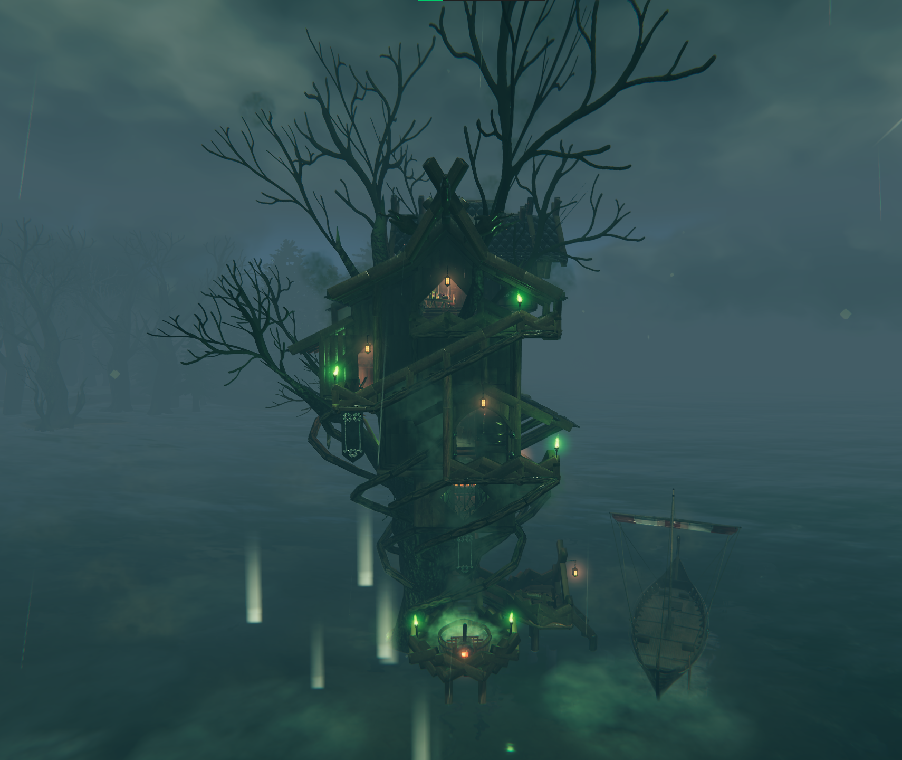
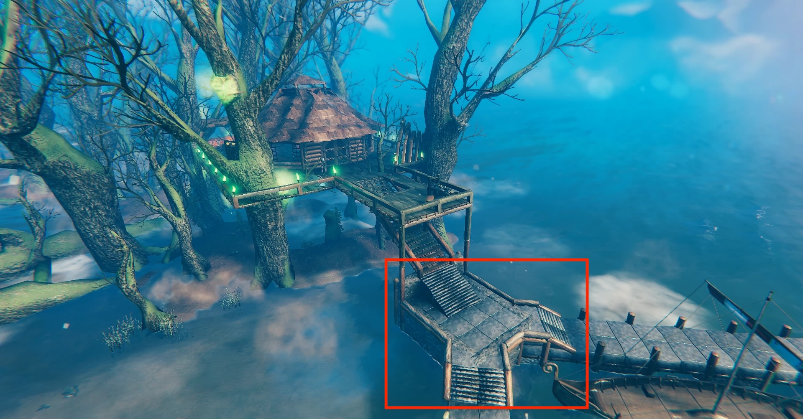
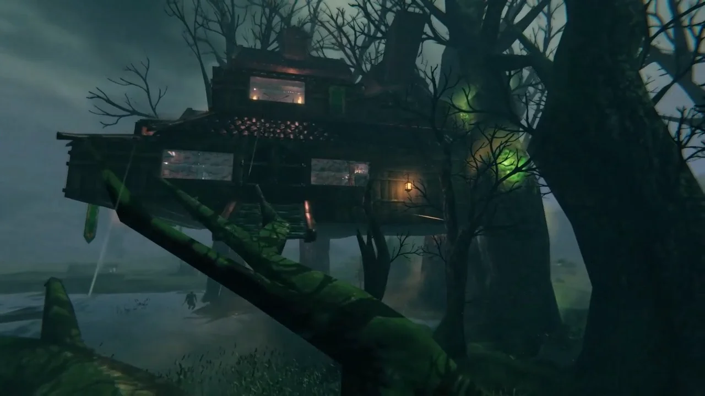

# How to Build a Swamp Treehouse in Valheim

>*An example of a treehouse built in the swamp*

## About Building a Swamp Treehouse

Building a treehouse is a challenging build project in Valheim. The mechanics around building, particularly the support mechanics, make tall structures complicated to balance. Even with these challenges, trees in the swamp are uniquely positioned for building fun, interesting houses.

## Prerequisites

In order to be successful and build a treehouse you're proud of, you should have access to the stonecutter. It would also enhance your experience if you had access to iron materials.

>__If you don't have much experience building structures in Valheim, this would be a difficult first build. Try building different types of buildings in the meadows and black forest before giving this a shot.__

## How to Build a Swamp Treehouse

1. Select a large, indestructible tree in the swamp in an area where you'd want a treehouse.

>Note that you can tell which trees are indestrucible because they will have green guck on their trunks, and hitting them with any weapon will alert you that it is too hard to be cut down.

2. Build a platform at ground level that will serve as a foundation from which to build the structure.

3. Build ladders or stairs from the platform up to where you want to start building your treehouse.

    - You can snap the side of the stairs to the tree to give it ground-level stability, allowing you to build as high up the tree as you want.

4. Place corewood or iron beams as the framework for the floor of your treehouse, branching out from the trunk.

5. Place the floor on top of the beams as desired.

6. Build the walls and roof as you would with other buildings, using the trunk to help with structural support.

7. Decorate to your heart's content.

>*Another swamp treehouse to provide inspiration*

You are now prepared to build the treehouse of your dreams in Valheim. Skål!
