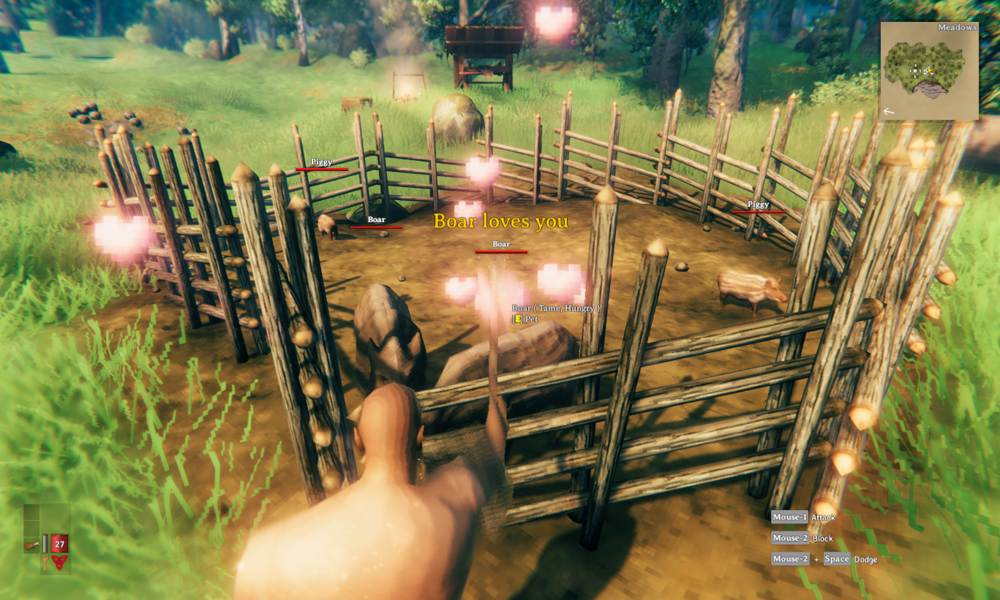

# How to Tame Animals in Valheim

>*Boar and lox, two tameable creatures in Valheim*

## About Taming Creatures in Valheim

In Valheim, several creatures can be tamed to provide a consistent source of meat, hide, and other resources, or just to be fun pets for your base.

## Prerequisites

There are not many material requirements to tame animals in Valheim - being able to tame an animal depends more on being able to survive in the biome of the animal than on having particular skills or resources. The following are basic requirements for each animal:

### Boar

To tame a boar all you need is some wood, a hammer, and some berries or mushrooms.

### Wolf

To tame a wolf, all you need is the ability to survive in the mountains, either a pickaxe or strong building materials like stone or core wood, and raw meat.

### Lox

To tame a lox, you need the ability to survive in the plains, either a pickaxe or strong building materials like stone or core wood, and one of the foods found in the plains.

## Tame Your Animals

In order to tame a boar, a wolf, or a lox, follow these steps:

1. Prepare the enclosure
    - For boar, this can be a simple wooden fence.
    - For lox and wolves, you can use your pickaxe to dig a deep pit that the animal can't climb out of. If you have the materials, you can also build an enclosure that is stronger than a simple wooden fence out of stone or iron.

2. Lure the animal to the enclosure in one of the following ways:
    - Get close enough to make the animal chase you and lead it into the enclosure you made.
    >__All of these animals can hurt you, so be wary and make sure you have enough health in case they get close.__
    - Using an abyssal harpoon, shoot the animal and drag it into the enclosure.
3. Feed the animal
    - For boar, you can use berries, mushrooms, carrots, onions, or turnips.
    - For wolves, you can use any raw meat except wolf meat, deer meat, or lox meat.
    - For lox, you can use barley, cloudberries, or flax.

>***After the animal is enclosed and has food, it takes about 30 minutes for them to be tamed. During this time you need to be close to the animal, but not close enough to alert it. You know that it is being tamed when yellow hearts appear above the animal.***

>*Hearts appear above an animal when it is being tamed*

Now you have a sustainable source of animal resources, or a pet for your base. Skål!
