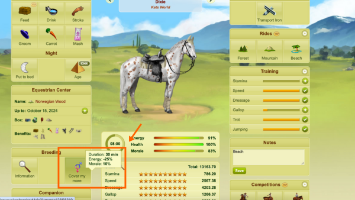
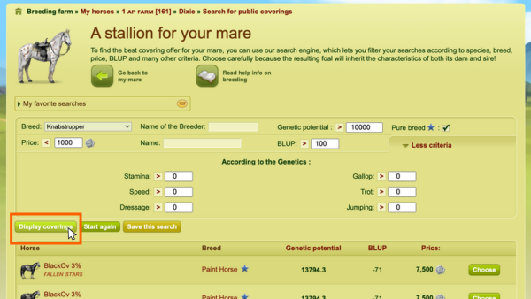
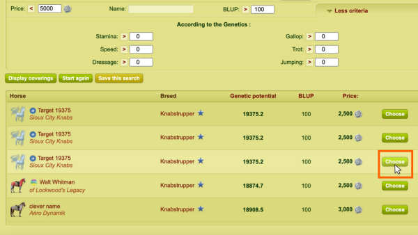
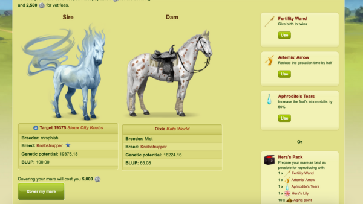

# Covering a mare with a public covering offer

> *Figure 1: The **Breeding** tile can be found on the private page of a horse that is at least 2 years and 6 months of age. If you have a VIP membership on the game, you can position this tile to sit anywhere on your horse's page.*

## About coverings
A covering refers to the breeding of a mare and a stallion. You can choose to accept a public or private covering offer for your mare. Accepting a covering offer allows you to strategically enhance a bloodline by producing foals with superior genetics.

A **public covering offer** is posted by a player on the public coverings page, where it becomes available for any player to accept for their mare.

A **private covering offer** is posted between two specific players in a reserved exchange or is posted by you to use for one of your own mares.

## Prerequisites
Before covering a mare with a public covering offer, you'll want to make sure you have enough Equus (e) in your reserve to afford the costs incurred by the covering.

Each public covering costs **between 500e and 7,500e**; prices are set by the player who posts the public covering offer. In addition to that, you will have to pay **between 100e and 2,500e** in vet costs, proportionately determined by the amount of Equus already in your reserve.

Before accepting a public covering offer, your mare must:
- Be at least 2 years and 6 months of age
- Have aged at least 10 months since the last time she gave birth
- Not be part of a breeding team's lineage

> **Note:** Horses that are part of a breeding team's lineage can only accept private coverings from horses with that team's affix.

## How to cover a mare with a public covering offer
1. Navigate to a mare's private page in your breeding farm.

2. Find the **Breeding** tile on the mare's page, and select **Cover my mare**. The public coverings search page displays.

3. Optional: Use the available filter feature to apply specific criteria to your search. Once you've created the filter, select **Display coverings**.

> *Figure 2: You can use the filter feature on the public coverings page to search for specific kinds of covering offers.*

4. Pick the public covering offer you'd like to accept, and select **Choose**.

> **Note:** Multiple offers may display from the same stallion. This means that the breeder of that stallion chose to offer more than one covering in a sitting. You can only accept one covering for your mare at a time.

> *Figure 3: Selecting **Choose** next to a covering offer brings you to a confirmation page that allows you to preview the genetic details of the stallion before accepting the covering.*

5. Confirm that the genetic details for both the sire and dam you are attempting to breed align with your desired traits before proceeding.

> *Figure 4: The covering confirmation page reviews genetic details of both horses as well as the covering fees you are responsible for paying.*

6. Optional: Add items from the Black Market to enhance the gestation period for your mare or the foals she gives birth to. Items display on the right-hand side of the window. Select **Use** for whichever item(s) you would like to apply to the covering.

> **Note:** Once you accept the public covering offer, you cannot undo it. Be sure to double check the genetic details of the horses you're breeding, and apply all desired Black Market Items to your mare *before* the covering is accepted.

7. Select **Cover my mare**.