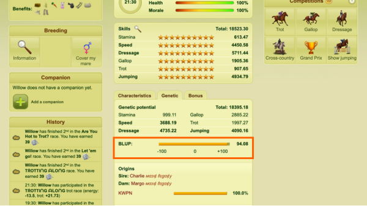
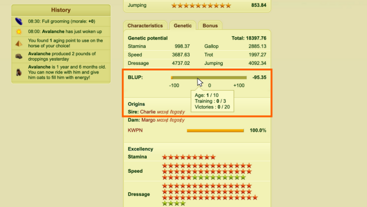
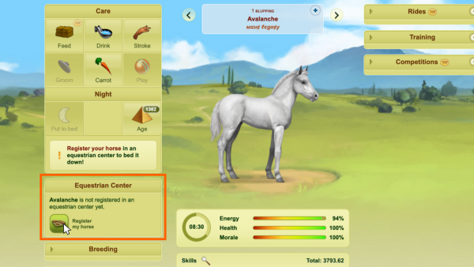
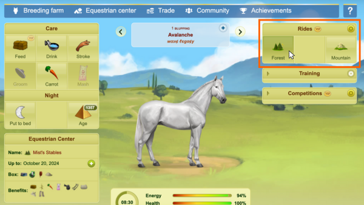
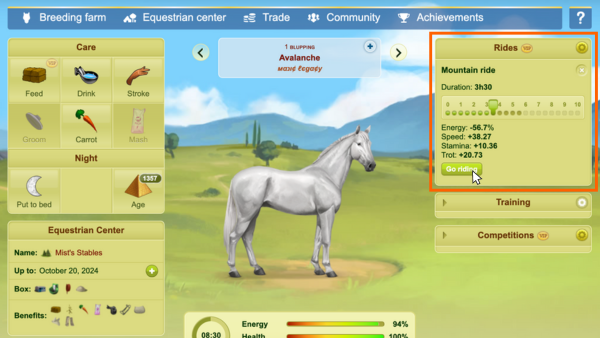
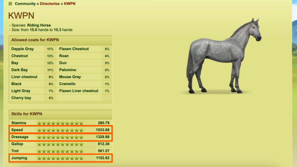
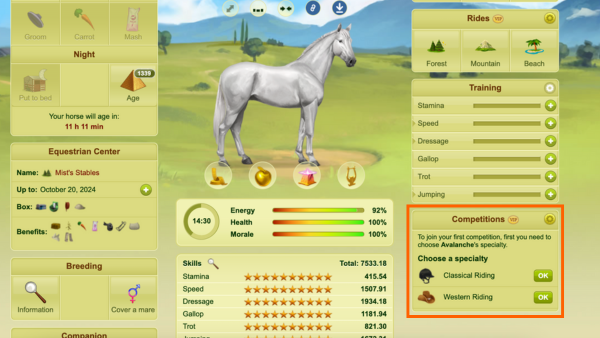
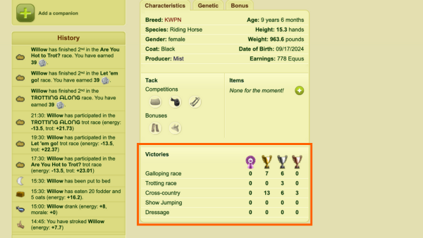

# Maximizing the Best Linear Unbiased Prediction (BLUP) value of a horse

> *Figure 1: You can find the BLUP value of a horse at the bottom of its private page under the **Genetic** tab.*

## About BLUP
The Best Linear Unbiased Prediction value, commonly referred to as BLUP, is a genetic index for horses. BLUP plays an important role in breeding horses because the BLUP values of the parent horses impact a foal's genetic potential and innate skills.

BLUP values for all horses fall within a range between -100 and 100, with -100 being the lowest possible BLUP and 100 being the highest possible BLUP that a horse can reach.

A higher average BLUP of the parents will increase a foal's chance of having higher genetic potential and innate skills. The foal will not have any innate skills if the average BLUP of the parents is below 0.

The following factors influence a horse's BLUP:
- Training level in the best three skills for its breed
- Number of competitions it has won
- Horse's age

BLUP increases with each of these factors.

## Maximizing BLUP

> *Figure 2: When you hover over a horse's BLUP bar, it displays how many requirements that horse has already fulfilled to reach 100 BLUP.*

To achieve a BLUP value of 100 for a single horse, your horse must:
- Obtain the maximium possible skill points in the best three skills for its breed
- Win at least 20 competitions
- Be at least 10 years of age

Maximizing BLUP is colloquially referred to by players as **blupping**.

## Prerequisites
There are no prerequisites that a player must follow before blupping a horse. However, it is strongly advised that players use aging points or Morpheus' Arms to age a horse at will while blupping instead of waiting for it age naturally. This will tremendously speed up the blupping process.

## How to BLUP a horse to 100
1. Access the private page of the horse you intend to BLUP and register it in an equestrian center.

> **Tip:** Select an equestrian center with a **shower** and **water trough** in the box where your horse will stay. These features help your horse conserve energy during care, allowing you to take more daily actions and speed up the blupping process.

> *Figure 3: The **Equestrian center** tile can be found on the private page of a horse that is at least 6 months of age. If you have a VIP membership on the game, you can position this tile to sit anywhere on your horse's page.*

2. Once your horse is at least 1 year and 6 months of age, begin **forest rides**. Maximize the hours your horse goes on forest rides each time it wakes up. Make sure to balance forest rides with daily care, food, and water.

> **Note:** Do not let your horse's daily energy fall below 20% or it could penalize the amount of energy your horse begins with the next time it wakes up.

> *Figure 4: The **Rides** tile can be found on the private page of a horse that is at least 1 year and 6 months of age. If you have a VIP membership on the game, you can position this tile to sit anywhere on your horse's page.*

3. After your horse can no longer gain skill points from forest rides, as displayed in the **Rides** tile on your horse's page, begin **mountain rides**. Maximize the hours your horse goes on mountain rides each time it wakes up. Make sure to balance mountain rides with daily care, food, and water.

> *Figure 5: You'll need to select how many hours your horse spends on each ride. If you have a VIP membership on the game, you can define a preset that preselects the amount of hours your horse spends on that ride.*

4. After your horse can no longer gain skill points from mountain rides, as displayed in the **Rides** tile on your horse's page, identify your horse's best three skills for training:

    - Navigate to the **Characteristics** tab at the bottom of your horse's private page.
    - Select your horse's breed to access the directory page for that breed.
    - On this page, look for the three skills marked with the highest score. These are the best three skills for your horse's breed.

> *Figure 6: There is a page for each breed in the game's directory that displays the breed's available coat colors and genetic potential for each skill.*

5. Once your horse is at least 2 years of age, train it in its best three skills until you have gained the maximum skill points allowed for those skills. Completion of training is indicated by the meters in the **Training** tile on your horse's private page.

6. Once your horse is at least 5 years of age, select its competition specialty and give it the necessary tack to enter competitions.

> *Figure 7: The **Competitions** tile can be found on the private page of a horse that is at least 5 years of age. If you have a VIP membership on the game, you can position this tile to sit anywhere on your horse's page.*

7. Identify the type(s) of competition that target your horse's best three skills. Enter your horse into those competitions until its best three skills have gained the maximum skill points possible.

> *Figure 8: (1) Skills targeted in a Cross Country competition. (2) Skills targeted in a Gallop competition. (3) The duration for a Cross Country competition and the amount of skills your horse will gain from competing in it.*

8. After your horse can no longer gain skill points in its best three skills from entering competitions, continue to enter competitions until your horse has secured 20 first-place wins.

> *Figure 9: You can preview the amount of competitions your horse has placed for by visiting the bottom of the **Characteristics** tab on your horse's private page.*

9. After your horse has won first place in 20 different competitions, age your horse or wait until it turns 10 years of age.

10.  Navigate to the **Genetic** tab at the bottom of your horse's page to check your horse's BLUP. The value should display as 100.