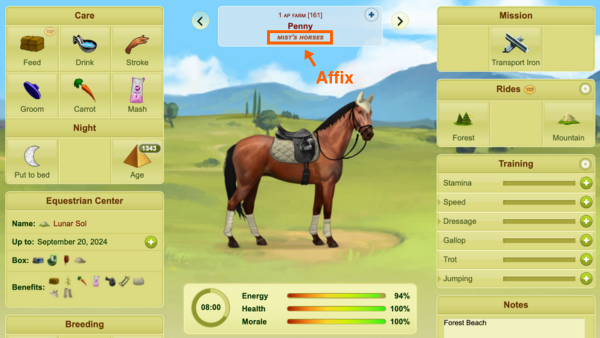

# Reserving and applying an affix to a horse

## About affixes
Affixes are like the surnames of a horse. They appear beneath a horse's name in italics and hyperlink to a page that displays all of the horses that have been assigned that affix. Breeders apply affixes to horses as a way to identify and market different bloodlines in the game.

## Prerequisites
Before reserving and applying an affix to a horse, you'll need at least 30 days of seniority on the game. You may reserve one affix for every 30 days of seniority you have. The number of affixes you are eligible to reserve is cumulative.

> Note: Affixes can only be reserved if the name chosen for the affix is not already in use by another breeder.

Horses that you choose to give an affix to must:
- Be born in your breeding farm
- Not be part of a breeding team's lineage

> Note: A horse can only receive up to **one** affix. If a horse was born in your breeding farm, you may change its affix at any time. If a horse was not born in your breeding farm, you cannot change or remove any affix that has already been assigned to it.