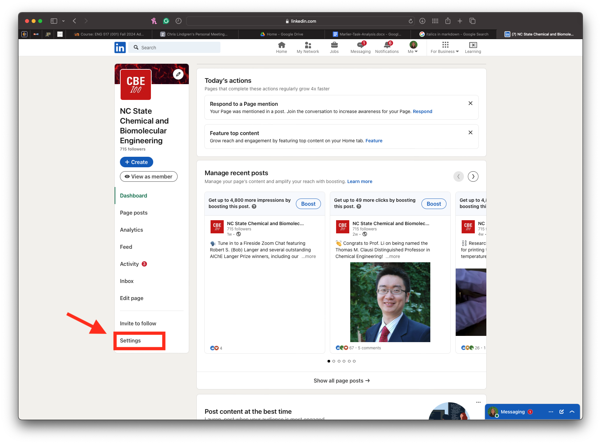
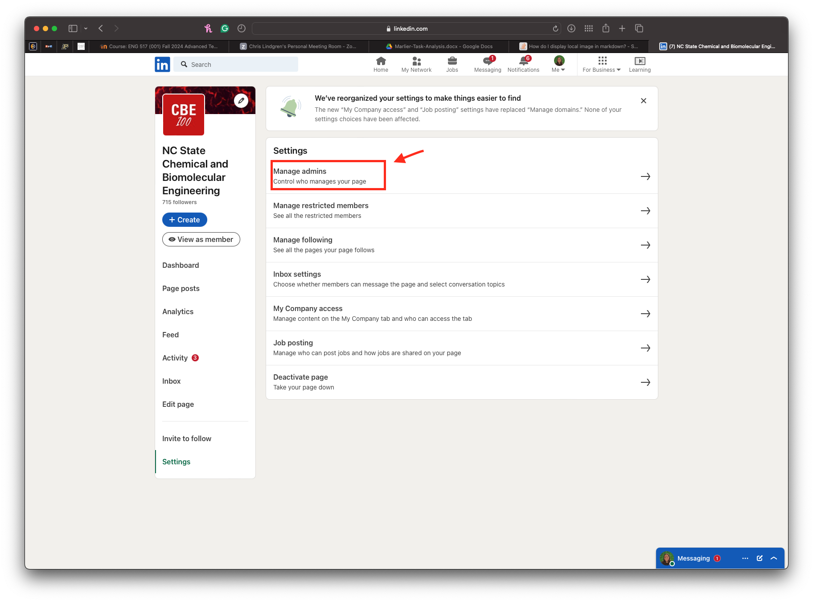
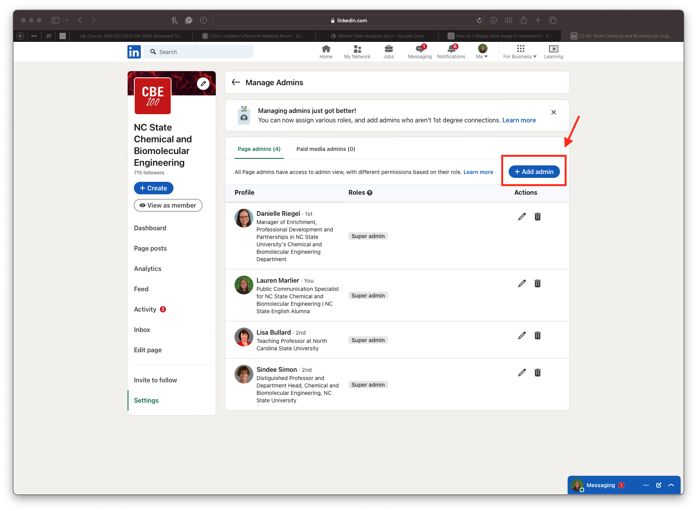
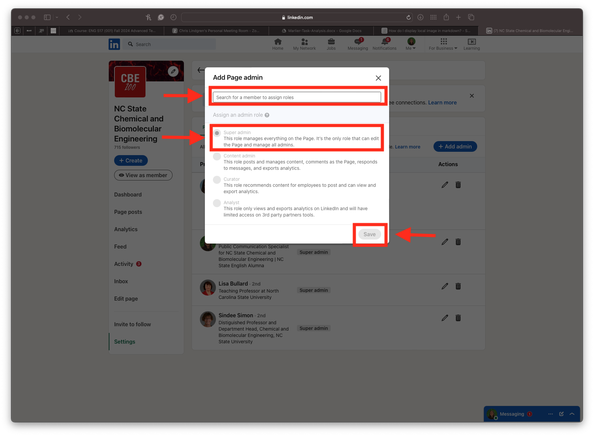
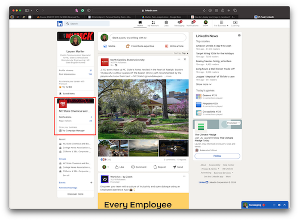

<!--OVERALL COMMENTS
   - "Parts"
   - Headings: Consider how the audience can assume that there will be steps within a tutorial. So, you can instead write your headings with a similar active, imperative mood that describes what each part accomplishes. Additionally, some "Parts" in other procedures only state "Part 1" or "Part 2" etc. In all cases, I'm asking myself "Steps to do what?" or "Parts of what?"
   - Staging and Introductions: Be sure to provide the intro content. Who is this written for? What will they accomplish? Why is this an important tutorial for them?
   - Check your spelling throughout
-->
# How to Become an "Administrator" on a Company LinkedIn Page

_**Waring:** To successfully complete these steps, you need access to a current administrator._
<!-- Prereqs? The warning above and "Part 1" seem more like staging prereqs. -->

## Part 1: Steps you can do on your own
1. Log into your personal LinkedIn account on a laptop or desktop.
2. Search for and connect with the Administrative Specialist (who is already an admin).

## Part 2: Steps for the Administrative Specialist
1. Navigate to the company page and click on "Settings".

2. Click on "Manage Admins".
   
3. Select the blue "Add Admin" button.

<!-- 4. Type in the name of the LinkedIn users you are adding as an administrator. -->
<!-- Help your audience orient themselves quickly with a short "fronted adverbial" phrase. -->
1. In the "**Search**" box, enter the name of the LinkedIn users you are adding as an administrator.
   <!-- I think this moment's worthy of a warning alerting move, since they are about to grant users admin privileges. -->
   * **Warning**: Avoid granting administrative privileges to incorrect users. Before you, assign this new role, verify that the list of users is correct. 
   
<!-- - _Assign their role as "Super admin" and then press save._ -->
<!-- This is a separate, subsequent step, so it should be written in that vein of a coaching step. Also, try to be consistent, when you apply a bolded/emphasis on user interface features like the Save button and "Super admin" parameter. -->
1. Assign the selected users' role as "**Super admin**" and then press "**Save**".
  
<!-- Question: What does this Part/Step accomplish?
   I'm not sure I understand the importance of this part, and it only includes a single step. Consider how to elaborate the goal of this part and provide more coaching through a better defined goal.
-->
## Part 3: Steps for the new "Super admin"
1. Open LinkedIn on a web browser. Your homepage should now include access to the company page on the left hand side.
