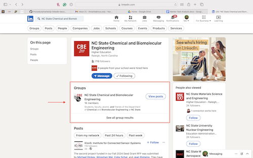
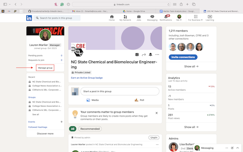

# How to Manage a LinkedIn Company Group Page

_**Warning:** To successfully complete this task, you need to have "Super Admin" access to the company LinkedIn page._

## Part 1
  1. Log in to your personal LinkedIn account
  2. Type the name of the company group page into the search bar.

## Part 2
1. Click on the group page from the search results.

2. Select "Manage group".

3. Select "Requests".
   