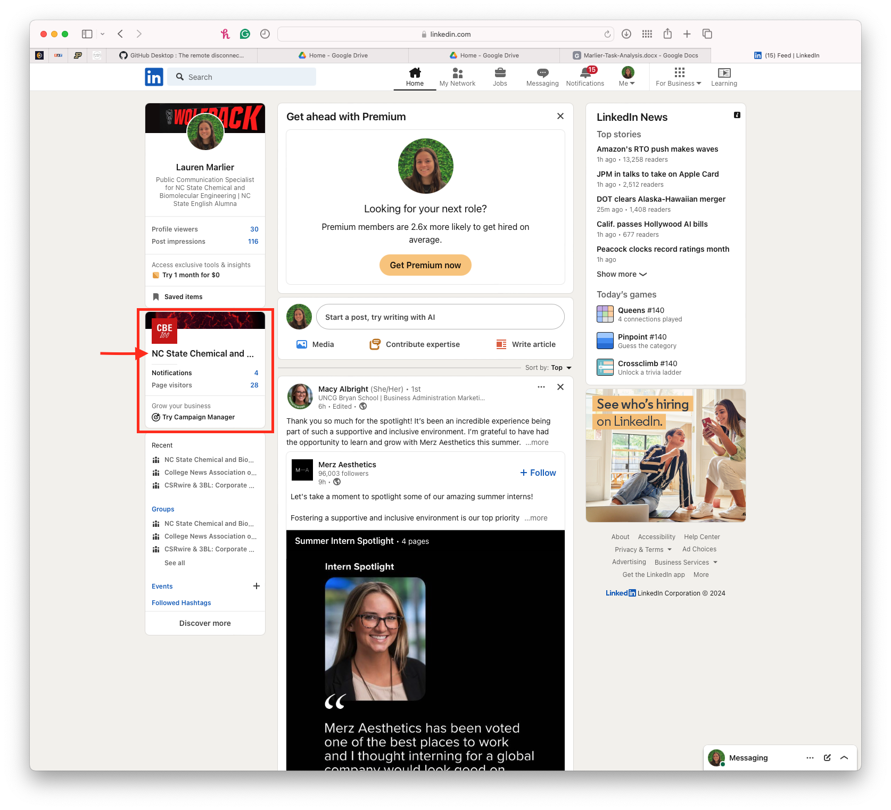
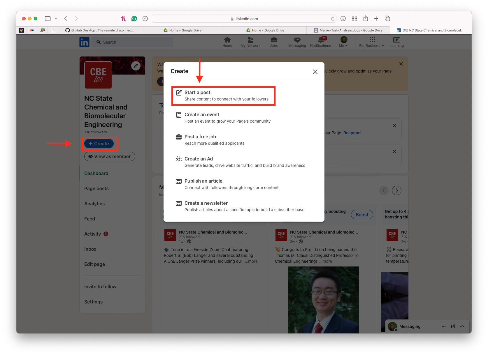

# How to Write A Welcome Post

_To successfully write and publish a welcome post on LinkedIn, you will need to have a computer, stable internet connection, your job description, and a digital copy of your headshot_

## Getting Started
1. Log into your personal LinkedIn account.
2. Navigate to your homepage.
3. Locate the company page on the left hand side. Click on the name.

4. Click the blue "+ Create" button and then select "Start a post".

## Drafting Your Post