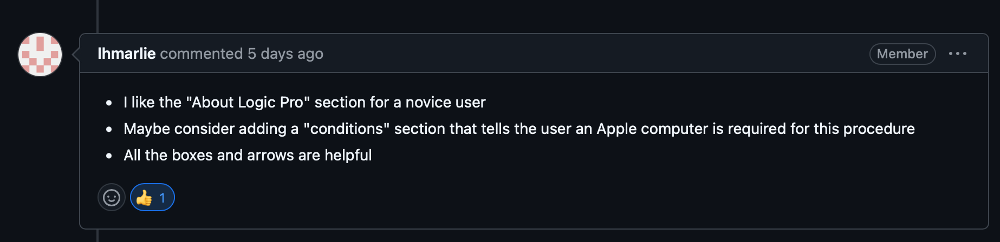

# Procedure Assignment Reflection - Brayden Marsh

Write a short analysis (~500 words) in which you explain what you did to meet the assignment's criteria. Use the criteria as headings to structure your reflection.

## How do your procedures address the needs of a "reading to learn to do audience"? Provide some specific examples that connect back to Redish's noted features of such an audience.
As stated within Janice C. Redish's, "Reading to Learn to Do," a tutorial should help users, **"gain a basic understanding of the concepts and structures of the program, become comfortable with the program so that they will want to continue to user it and be satisfied with it, be able to perform basic, relevant tasks with the program after using the tutorial, and transfer what they have learned from the examples in the tutorial to other situations that were not directly covered in the tutorial."** Through my three procedures teaching users how to create and explore audio tracks in Logic Pro, I have satisfied all four of Redish's criteria for tutorials. 

In [Procedure One](../../marsh-logic-create-audio-track.md) I help users **gain a basic understanding of the structures within Logic Pro** by utuilisizing screenshots and colorful boxes to highlight the areas of the program that are relevant to their learning.

In [Procedure Two](../../marsh-logic-vocal-presets-t2.md), I help the user **perform basic, relevant tasks within the program after using the tutorial** by leading them step-by-step through how to utilize vocal presets. This is a feature that will help the user utilize the program with ease.

In [Procedure Three](../../marsh-logic-add-effects-T3.md), I help the user **transfer what they have learned from the examples in the tutorial to other situations that were not directly covered in the tutorial** by giving them information about various vocal effects that they can experiment with in the future.

All procedures succeed at helping the user to **become comfortable with the program so that they will want to continue to user it and be satisfied with it.** Once the user understands the basic structures, relevant tasks, and creative capabilities of the program, they are able to leave the tutorial and begin creating on their own. 

## How do your procedures follow the WTGA Staging, Coaching, and Alerting stylistic conventions? Provide some specific examples that connect back to the criteria from Hart-Davidson.

### Staging

In all procedures, I included a **conditions** section that satisfies the WTGA staging requirement by informing the user of the materials they will need to complete their task. 

### Coaching

In all procedures I begin steps with imperative words like *select* or *click* so that the user will understand what they need to do step-by-step to succeed in their task.

I utilize screenshots to provide the user with a step-by-step process through the task.

### Alerting

Throughout all procedures I utilize "Notes" to alert the user to important information and cautions within the task. I used block quotes for this because they stand out amongst the typical format that I use to write the tasks. The block quotes include useful information or actions that could potentially inhibit the user from completing the task.

## How do your procedures follow your task orientation work? In other words, based on your audience and their goals, discuss how you oriented your SCA moves to the tasks.

[Procedure One](../../marsh-logic-create-audio-track.md) is for the most novice audience. Creating an audio track is an essential task for using Logic Pro, so I used the most plain language when creating this procedure. I used more detailed graphics within the procedure because novice user will not be familiar with Logic Pro's user interface. For alerting moves, I made sure that the user understood to select the correct input for their track. More experienced users will understand that this is an essential part of using Logic Pro.

[Procedure Two](../../marsh-logic-vocal-presets-t2.md) is meant for an mid-level experienced user. I add a brief link to my first procedure to ensure that the user understands what they need to know before beginning the tutorial. The steps within the task are less rudimentary and rely upon insignificant prior information (i.e. how to create a Logic Pro file, etc.). My alerting boxes are more for extra information that the user might find useful but is not necessary to the task at hand. 

[Procedure Three](../../marsh-logic-add-effects-T3.md) is for an experienced user of Logic Pro who is interested in learning how to experiment with the tools offered within the program. The tutorial is very basic and only describes how to access the panel where effects can be found. After the tutorial, there is a significant section that provides the user with information about effects within Logic Pro. This information is meant to provide the user a better understanding of how they migth want to incorporate effects to their vocal tracks. 

## How did you apply a basic docs-as-code editorial workflow to your assignment? Please provide specific cases with screenshots and/or links that can support your claims.

Lauren gave me feedback and I gave lauren feedback. She suggested that I create the **conditions** section of my document. I believe that this section is incredibly important to my work. Without it, the user would not know what materials are needed for the procedure. She made a suggestion through Github and I employed her suggestion. 

Example: 

## How did you apply a consistent use of the Markdown language throughout your project? Please provide specific cases with screenshots and/or links that can support your claims.

- All of my titles are heading One

- All of my step-by-step instructions are heading three and numbered (unless as a conclusion or during teaching steps)
Examples:
1. 
2. 

- All of my alerting steps have a bolded **Note:** and are italicized for increased awareness from the user. 
> Please refer to figures #1 and #2 for examples.
