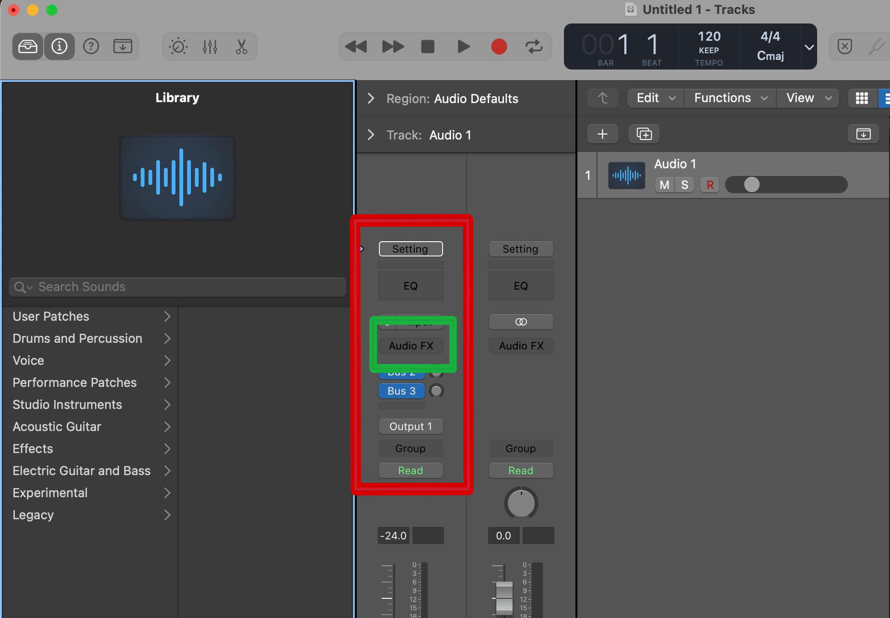
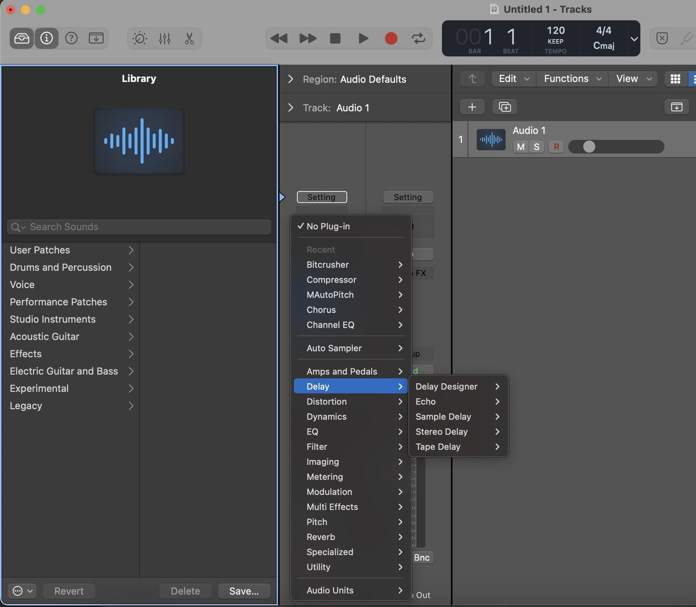

# How to Explore Vocal Effects in Logic Pro
#### Logic Pro contains many vocal effects such as delay, reverb, chorus, phasers, and many more. Learn how to use vocal effects in Logic Pro through this tutorial.

If you wish to explore _**vocal presets**_, click [here](marsh-logic-vocal-presets-t2.md) for a tutorial.

## Prerequisites
#### Before you begin, here is what you need.
- Logic Pro X basic audio effects
## Vocal Effects in Logic Pro

### 1. Create an Audio Track within Logic Pro
 
- Click [here](marsh-logic-create-audio-track.md) for a tutorial on how to create an audio track.

### 2. Find the Audio FX Box
- Select the **_circled i_** icon in the top left corner to open the track information window.
- The Audio FX is a grey box that is included within your track information window. Click on the Audio FX box.

> **Note:** *The audio track control panel contains many tools for processing a vocal track. Be sure to be precise when selecting from the control panel.*

### 3. Select the Vocal Effects You Want to Use
- Click anywhere within the audio FX box.
- When selected, the audio FX box will open a drop down menu that includes all audio effects that Logic Pro offers. 
- Select an effect from the drop down menu.

>1. **Note:** *When other effects are already initiated, click below or above prior effects to insert new effects within the order you want them to be.*

> 2. **Note:** *If you wish to remove an effect from your track, select the effect and click "No Plug-in" to remove the effect.* 
# An Overview of Vocal Effects/Chains in Logic Pro
#### Logic Pro is home to many vocal effects. Here is what you should know about vocal effects before expirementing.

### Basic Vocal Effects

#### Compression
- Compression controls the dynamics of a vocal track by reducing the distance between the loudest and quietest part of the signal. This makes vocals sound more consistent in volume and more present in the mix.

#### Equalizer
- The Equalizer (EQ) removes unwanted resonances or reduces the volume of certain areas within the frequency range.

#### Reverb
- Reverb mimics the way sound waves reflect off surfaces in space, creating a sustained sound that gradually fades away.

#### Delay
- Delay is an audio processing technique that records an input signal and then plays it back after a set amount of time. This creates an echo-like effect.

#### Chorus
- Chorus  is an audio effect that creates a richer, fuller sound by making copies of a signal, slightly altering their pitch and timing, and then blending them back with the original. The result is a sound that simulates multiple instruments or voices playing in unison, adding depth and texture to the audio.

#### Auto-tune/pitch
- Auto-Tune/Pitch is a vocal processing technique that produces a robotic or blocky sound by shifting a singer's pitch to the nearest semitone. This is typically used to assist the intonation of a singers voice.

### Most Common Vocal Chains

#### What is a Vocal Chain?
A vocal chain is a series of processors that modify a microphone's raw audio to make it sound better for mixing into a final piece of music. The processors work like links in a chain, with the voice passing through each one in order. This means that prior effects will affect the effect coming after them. The order of effects can greatly impact the way a vocal is produced.

#### Common Vocal Chain Order
1. Clean Vocal Track
2. EQ
3. Compression
4. Autotune
5. Chorus
6. Delay
7. Reverb

