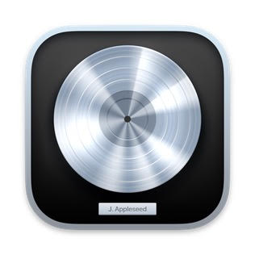
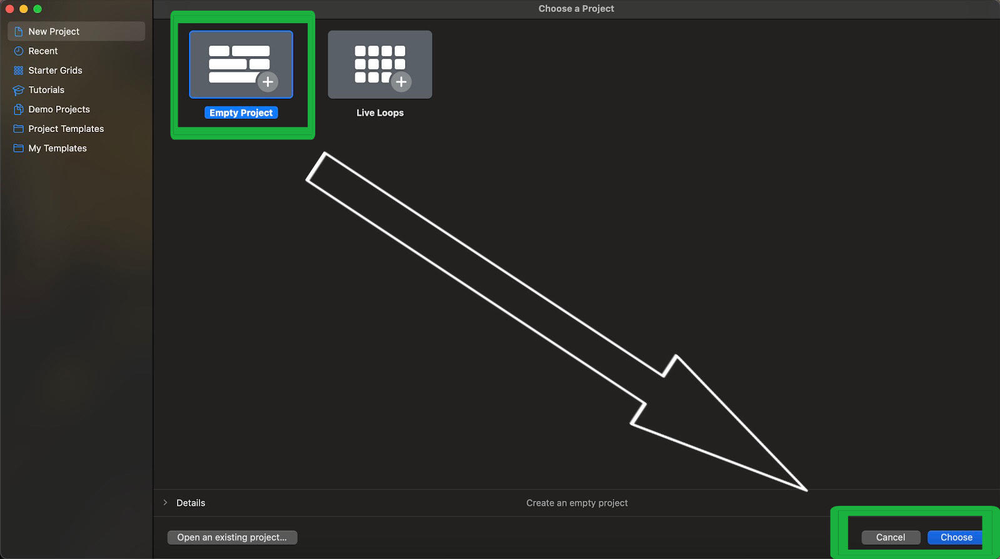
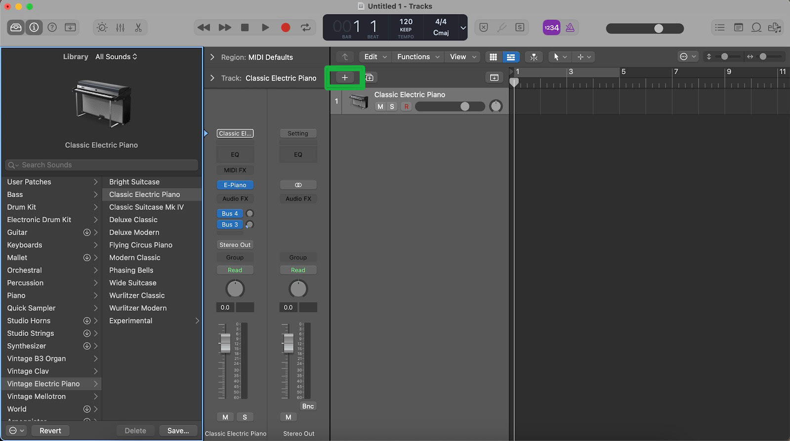
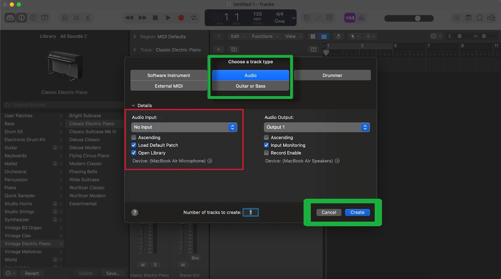
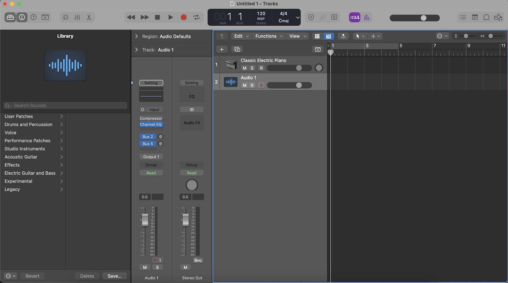

  # How to Explore Vocal Track Features in Logic Pro
#### Learn to create a vocal track with Logic Pro and explore the many features within the program.

## About Logic Pro

Logic Pro is a **digital audio workstation (DAW)** owned by Apple inc. Apple acquired the software from Emagic in 2002. Logic Pro is the professional version of the free DAW software *Garageband* that is included with all Apple products. Logic Pro is incompatible with any operating systems outside of the Apple ecosytem.

## Conditions
#### Before you begin, here is what you need.
1. Own a Apple Macbook Pro, Macbook Air, Mini Mac, or iMac.
2. Purchase Logic Pro from the application store.

## Create an Audio Track

1. ### Power on your Apple computer and Open Logic Pro

- The Logic Pro application can be found within the finder folder in your Apple computer.

 

 > *Logic Pro icon*

2. ### Select **_Empty Project_** and press **_Choose_**
- When first openning Logic Pro, you will be presented a screen that says *Empty Project*. Select *Empty Project* to create a Logic Pro file. 

 

3. ### Press the + button to **_create a new track_**
- The **+ button** in the middle of the Logic Pro workspace allows you to create a variety of different track options: Software Instrument, Audio, Drummer, External MIDI, and Guitar or Bass.

4. ### Select **_Audio_** from the menu and press **_Create_**
- Select *Audio* from the menu to create an audio track.

> **Note:** *Be certain that you are using the correct input for your microphone when creating an audio track*

### Check Your Progression

- After you have completed these steps you should have an audio track as seen below

