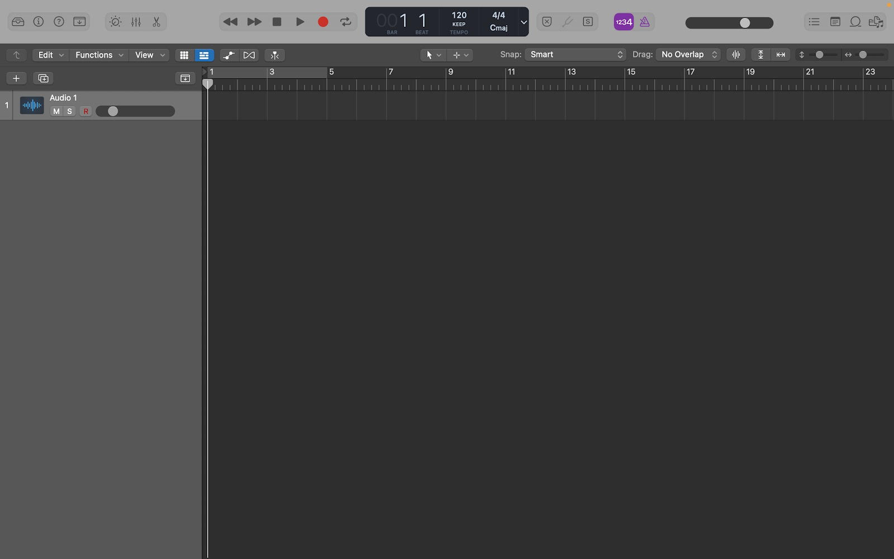
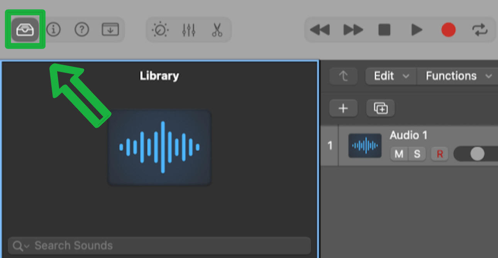
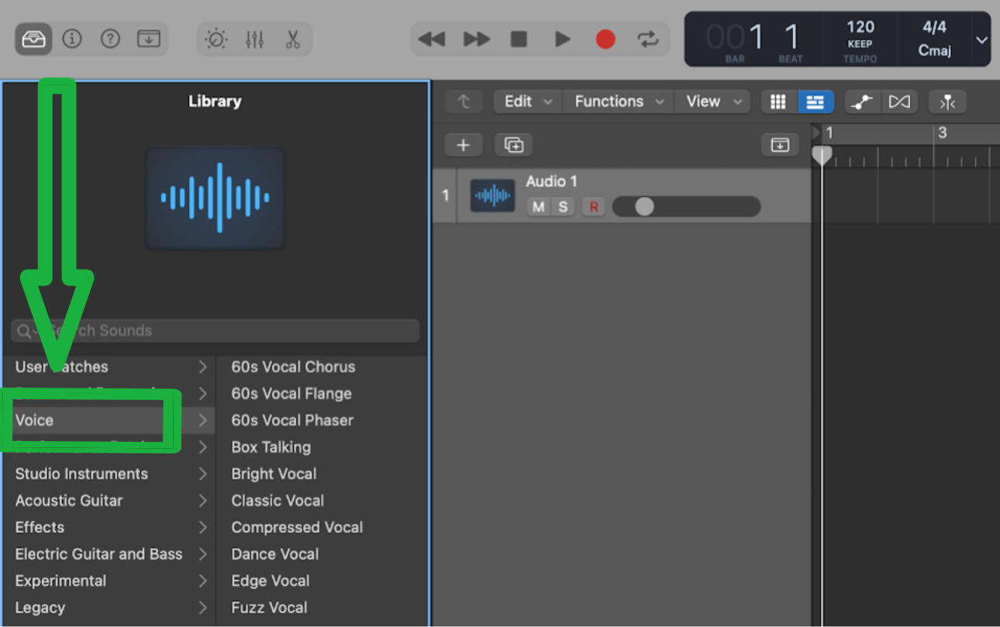
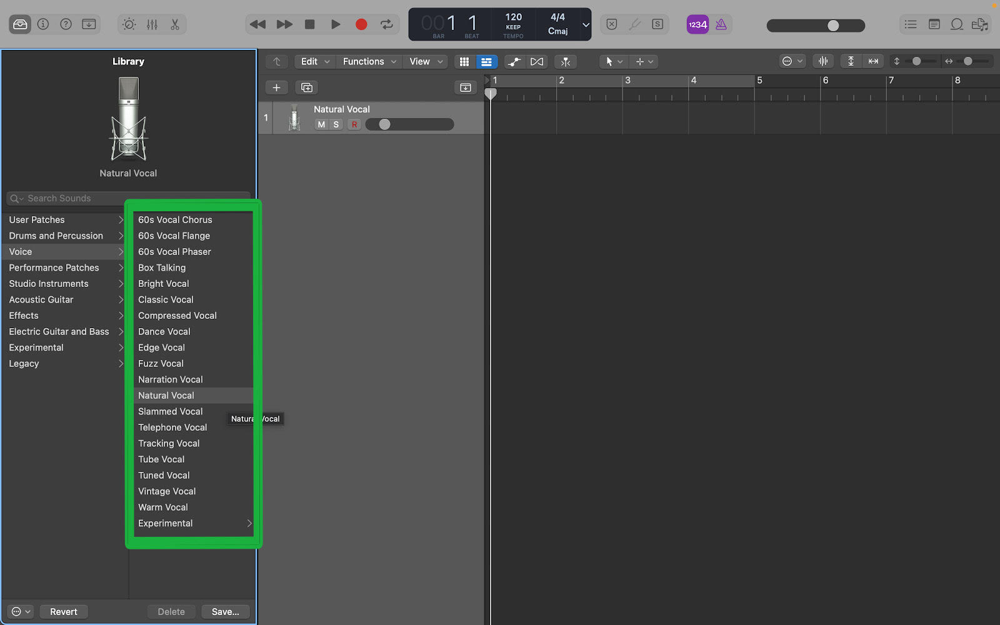

# Locating Vocal Presets Within Logic Pro

 Logic Pro is home to a wide variety of vocal presets for new users to utilise and experiment with while using the Digital Audio Workstation (DAW). By the end of this tutorial, you will be able to locate and utilise all vocal presets Logic Pro has to offer. 

## Conditions
#### Before you begin, here is what you need.
1. Own a Apple Macbook Pro, Macbook Air, Mini Mac, or iMac.
2. Purchase Logic Pro from the application store.

## How to Locate Vocal Presets in Logic Pro

### 1. Create an Audio Track

- Learn how to create an [audio track](marsh-logic-create-audio-track.md)

### 2. Open Logic Pro's preset library

- In the top left corner of the screen, locate the **library** icon to access Logic Pro's sound library

> **Note:** Logic Pro's library is home to MIDI keyboards, guitar presets, and AI drummers as well.

### 3. Locate the *voice* option within the menu

- Directly below the library icon in Logic Pro's sound library, voice will be the third option from the top. 

### 4. Explore Logic Pro's vocal presets

- Logic has a variety of vocal presets that range from mimicking the 1960s to expiremental delay
- Once you select a vocal preset, the settings will be applied to your vocal track

> Logic comes with stock vocal presets, but more vocal presets can be downloaded from third party websites