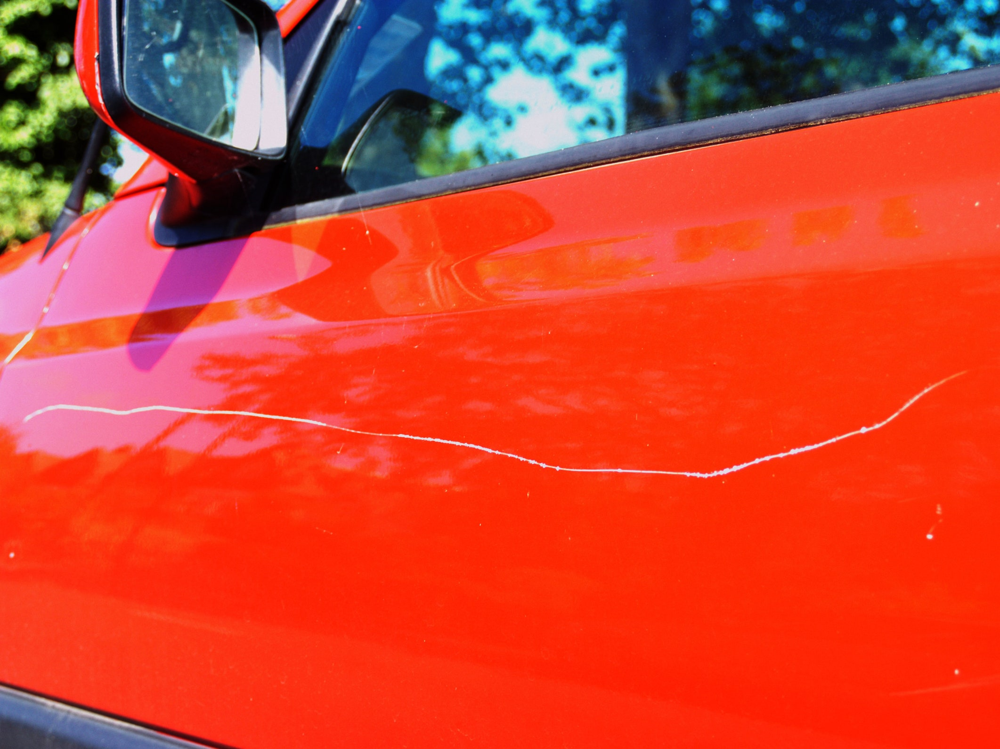
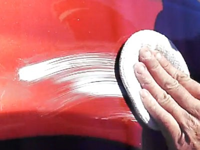

# How to Repair a Body Scratch
Finding a scratch on the body of your car doesn't have to be a costly repair. With a few tools and a little time, you can remove a minor scratch at home.

## Repair a Shallow-Medium Scratch
Before beginning your repairs, determine the depth of the damage. If the scratch reveals the metal of the autobody underneath, it may be more convenient to visit a repair shop. If the damage appears to be on the surface of the paint, follow the instructions below. 

### Tools Needed
* [Scratch repair kit](https://www.caranddriver.com/shopping-advice/g41032488/best-car-scratch-removers-tested/), available online or at a local automotive shop. An average kit contains:
  * Scratch remover liquid
  * Soft buffing pad
* Microfiber cloth

### Steps
1. Wash the affected area with gentle water pressure from a hose or spray bottle.
   * Optional: Wipe the area with rubbing alcohol on a microfiber cloth for an alternative cleaning method.
2. Pat the area dry with a microfiber cloth.
   * **Caution:** If you begin polishing a scratch without first cleaning the area, dirt and dust particles may deepen the scratch.
3. Apply a small amount of scratch remover to the buffing pad.
4. Polish the damaged area with the scratch remover in small circular motions until most of the remover has disappeared. The scratch remover will smooth the rough areas of the scratch and minimize the appearance of damage.
   * **Caution:** Don't polish the scratch too roughly or for too long, which can damage the car's paint job.
  

5. Wipe away excess polish with a microfiber cloth.
6. Observe the polished scratch.
   * If the scratch is still visible, the damage may be too deep for a simple at-home repair. Repeat the above steps or contact an auto shop about touching up the paint.
     * **Caution:** If you decide to polish the scratch again, be mindful that the scratch remover strips the top layer of the paint.