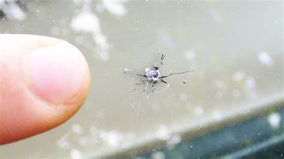
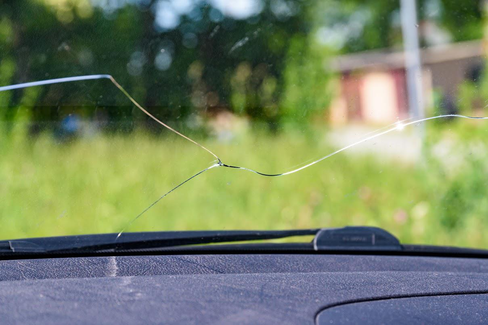

# How to Repair a Chip in Your Car Windshield
Car windshields can be damaged by a variety of sources: rocks kicked up by other cars, debris, or slight collision. Although the damage can seem minor, repairing a chip in the windshield by filling the area will prevent the crack from spreading.

## Assess the Damage
Before beginning, measure the size of the damage. A small chip or crack, ranging between the size of a quarter and up to 3 inches, can be easily repaired at home with the following instructions. See the following images to determine if the damage to your car is suitable for this guide.

Small chip/crack - can be fixed at home:

Large crack-- **cannot be fixed at home**:

## Tools Needed
* [Windshield repair kit](https://www.autoguide.com/10-best-windshield-repair-kits), available online or at an automotive repair store.
  * **Note:** There are two main types of crack repair kits available, suction-adhesive and syringe-adhesive. Both kits fill the crack with different methods.
    * Suction-adhesive kits use an applicator that suctions to the windshield to inject a crack with an epoxy formula. Durable and can be reused.
    * Syringe-adhesive kits only use a syringe to inject the epoxy formula. Good for hard-to-reach places.
* Window cleaner
* Microfiber cloth
* Needle or thumbtack
* Razor blade

## Steps
1. Clean the affected area of the windshield with window cleaner and a microfiber cloth.
   * **Caution:** Do not spray window cleaner into the crack/chip, which can prevent the epoxy formula from drying and interfere with the repair.
2. Gently scrape out any debris from the crack with the needle or thumbtack.
3. Allow the affected area to dry completely.
5. Insert the adhesive formula into the syringe and apply to the crack. Let dry.
   * Optional: If using a suction-adhesive kit, place the included patch or suction over the damaged area before injecting the adhesive. The suction provides a tight seal and removes air from the crack.
   * Optional: If using a kit that requires the adhesive formula to be mixed before application, carefully mix the epoxy and hardener to create the adhesive formula before injection.
6. Scrape away excess adhesive with a razor blade.
