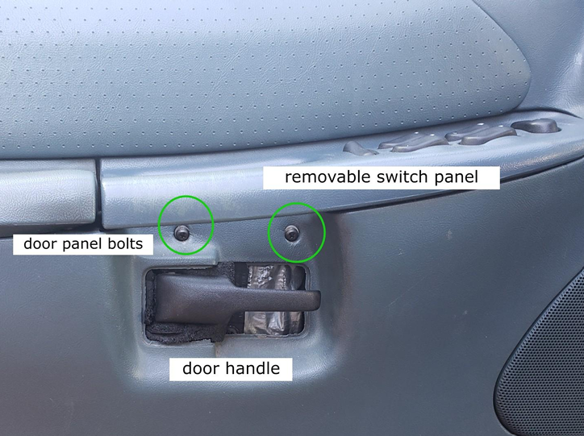
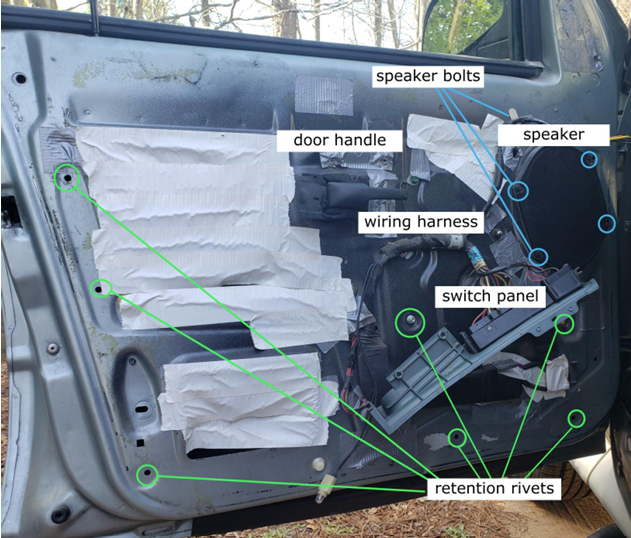

# Window Replacement in 1996 Ford Explorer XL
This is a guide to replacing a broken or damaged side window pane in a 1996 Ford Explorer XL. After reading, you will know how to safely remove and replace a damaged side window pane.

## Hazards
* Risk of electrical shock
* Damage to vehicle
* Self-injury

## Necessary Tools
* Screwdriver
* Wrench set of various sizes, including between 4-8 mm
* Safety glasses/eye protection
* Work gloves
* Box cutter
* Replacement window pane
* Optional: shop vacuum (if glass is shattered or broken)

## Prerequisites
Before getting started:
1. Get a replacement window pane
   * Order a replacement window pane on your own through an [online auto parts store](https://www.1aauto.com/), in-person at an automotive repair center, or through your local repair shop.
2. Roll the affected window panel down all the way.
3. Turn off the car and disconnect the negative battery cable to reduce risk of electrical shock.  

## Steps
### Window removal
1. If the affected window pane is damaged or shattered, use a shop vacuum to remove the shards of glass.
2. Unscrew and remove the screws that secure the door panel.
   * **Note:** Do not discard the screws as you will need them to install the new window.
  

3. Release the door pins and separate the panel from the frame.
   * If necessary to access other bolts, rivets, or screws, disconnect the wiring harness.
4. Remove and set aside the switch panel which holds the door handle and window buttons.
5. Remove the four bolts around the speaker.
   * If disconnecting the wiring harness, be sure to detach the wiring connected to the speaker.
6. Use the boxcutter to carefully remove the plastic window trim from the top of the door frame. Set trim aside for installation.
7. Drill out the retention rivets around the door frame to access the glass bracket and window track.
8. Use a screwdriver to gently flatten the small metal tabs securing the glass panel.
   * These tabs are located on the bottom of the door frame on either side of the glass bracket.
   * **Note:** If window is shattered, carefully remove the broken glass from the window track.
9.  Lift up and remove the glass panel from the window track.
10. Discard the faulty window panel.
    

### Window installation
1. If necessary, adjust the arms of the glass bracket to widen the window track for easy installation.
2. Lower the new window panel through the doorframe into the window track.
3. Reattach and reassemble the door.
   * Turn the metal tabs outward with the screwdriver.
   * Replace and secure the retention rivets.
   * Replace the speaker with the rejoined wiring, secure the surrounding bolts. 
   * Reconnect the wiring harness.
   * Pop the window trim back into place.
   * Replace the switch panel.
   * Place the door panel back on the frame and secure the bolts.
4. Reconnect the negative battery cable and turn the car on.
5. Check that there are no gaps in the window and that the panel moves up and down properly.

## Troubleshooting
If the newly-installed window doesn't move properly, or if there are gaps in the window frame, there is likely an issue with the panel's fit in the window track.
* Open the door panel again and adjust the positioning of the panel in the glass bracketing.
* Ensure that the arms of the glass bracket fit smoothly into the window track.
  * **Note:** The small metal tabs on either side of the glass bracket should be facing out, not flattened, or the panel will not fit correctly.
* Check the the window trim, speaker, and wiring harness aren't interfering with the window's movement.
* Check the connection of the wiring harness to the switch panel to see if any wires are loose or disconnected, which may affect the window's movement.
* Tighten the retention rivets of the door frame and other bolts around the door panel.