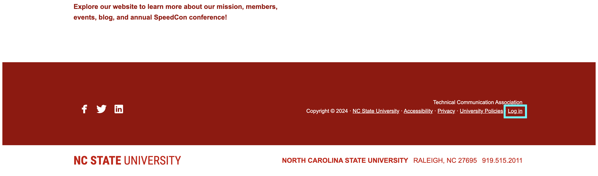
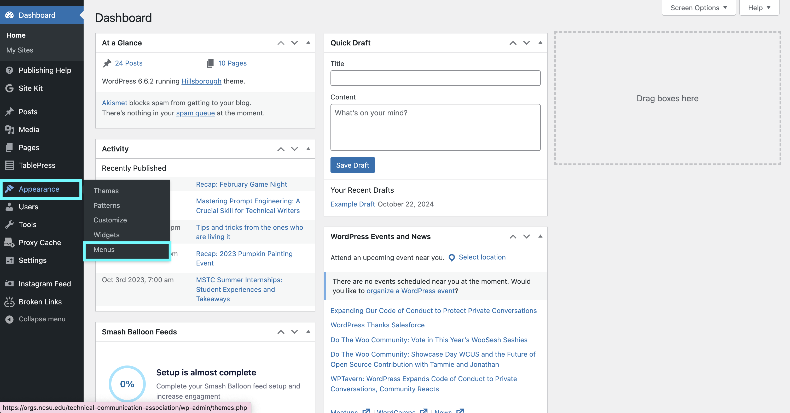
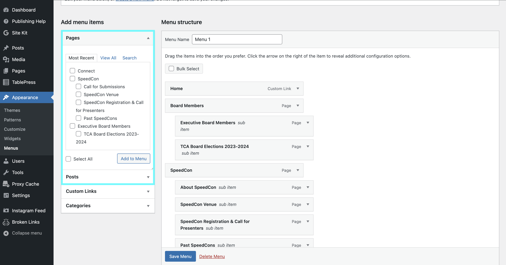
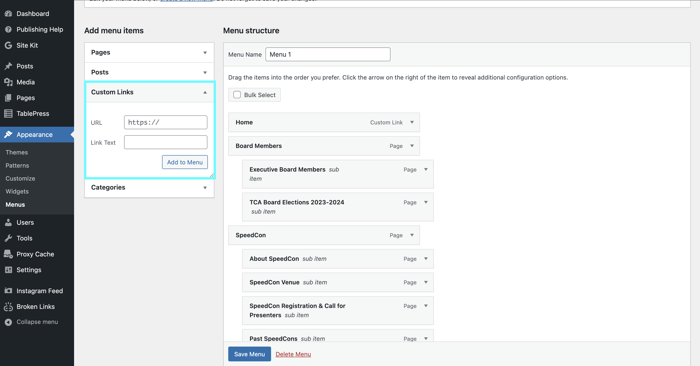
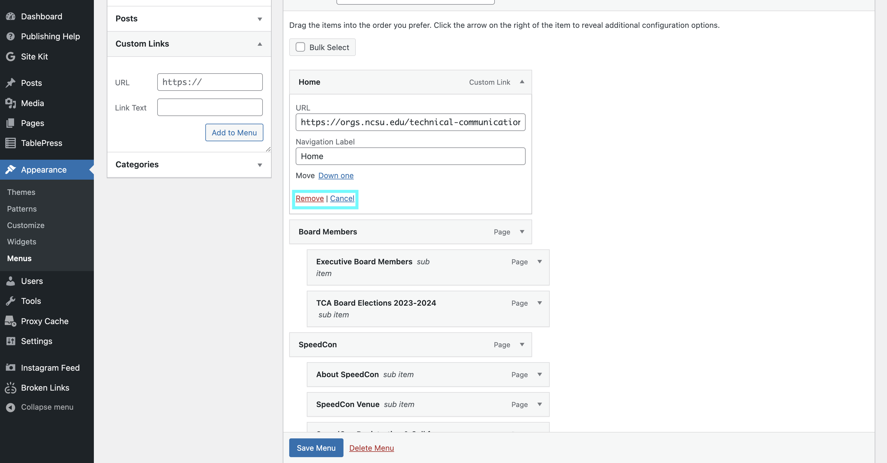
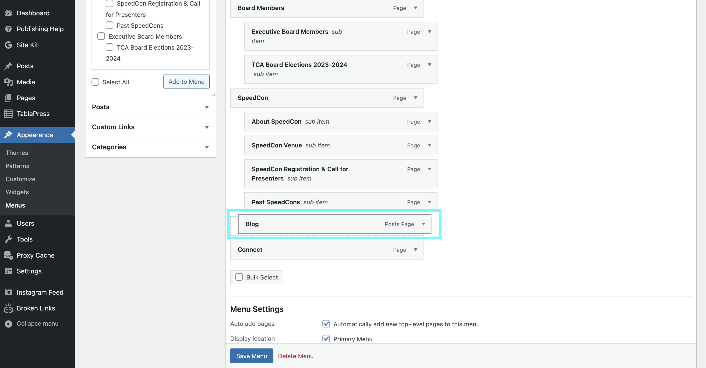

# Editing the TCA Website Menu

Website menus allow users to successfully navigate a website and find the information they need. The N.C. State Technical Communication Association (TCA) aims to provide website users with a seamless experience. To provide said experience, occasionally the TCA website menu is reorganized - changing the page order, deleting pages, and adding pages - at the TCA president’s discretion. Please confirm with the acting TCA president and other executive board members before editing the website’s menu.

## Prerequisites

Before editing the TCA website menu, you must:

- Obtain permission from the acting TCA president and other executive board members to edit the website menu. 

- Confirm you have been added as an administrator to the Technical Communication Association website.

- Have access to your NCSU Unity ID and Duo App.

> **Note:** If you do not have administrator access to the Technical Communication Association website, request access from the acting TCA president or association faculty advisor.

## How to Edit the TCA Website Menu

1. Open your preferred website browser.

2. Search: **[https://orgs.ncsu.edu/technical-communication-association/](https://orgs.ncsu.edu/technical-communication-association/).**

3. Scroll to the bottom of the page and select **Log In.**

> *Figure 1: The **Log in** button is located on the bottom of the TCA website.*

4. Type in your NCSU Unity ID.

> **Note:** Your Unity ID is the letter and number combination used for your NCSU email address, not your student ID number.

5. Complete NCSU Duo authentication.

6. **Hover** over **Appearance** in left sidebar. **>** **Select** **Menus.**

> *Figure 2: Click the **Menus** button under the **Apperance** menu.*

### To Add Menu Items

1. **Confirm** if you are adding a page, post, or custom link. **>** **Select** corresponding option on left sidebar.

2. If the menu item is a page or post, click the proper checkbox and **Add to Menu.**

> *Figure 3: Click the drop-down link next to the relevant catagory.*

3. If the menu item is a custom link, copy and paste link URL, add preferred hyperlink text in **Link Text**, and **Add to Menu.**

> *Figure 4: Click the drop-down link next to **Custom Links** to add a custom link to the TCA menu.*

4. Save menu.

> **Note:** The hypertext written will be how your link is displayed on the live website menu.

### To Remove Menu Items

1. Identify the menu item you would like to delete.

2. Click the down arrow next to the menu item title.

3. Select the red and underlined **Remove** text.

> *Figure 5: Click the **Remove** red underlined text to remove a menu item.*

4. Save Menu.

### To Move Menu Items

1. Identify the menu item you would like to move.

2. Hover over the menu item.

3. Click and hold the menu item to drag and drop it to your desired position. 

> *Figure 6: Move menu item to the desired position.*

4. Save Menu.