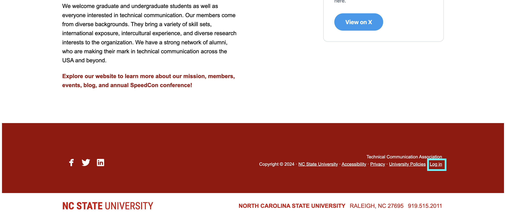
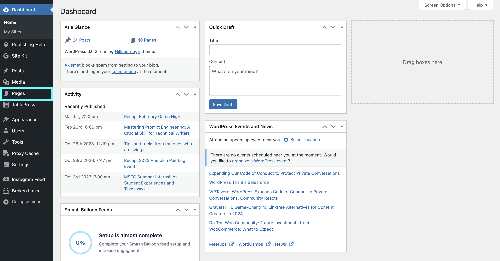
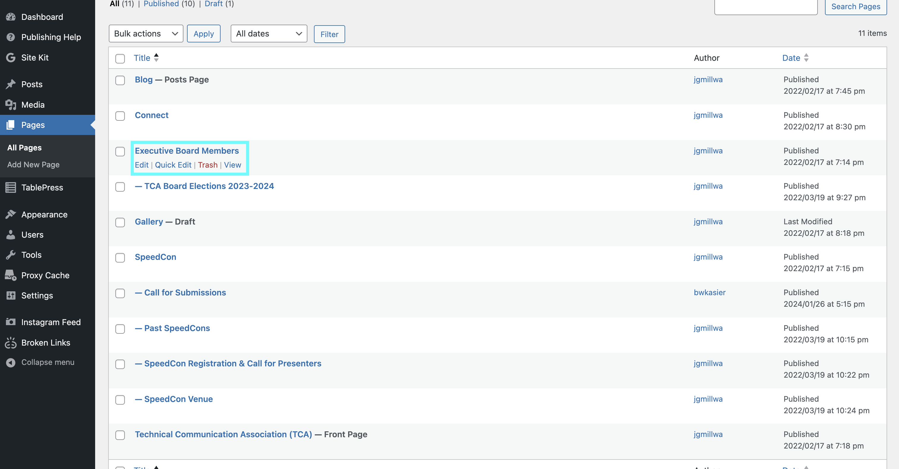
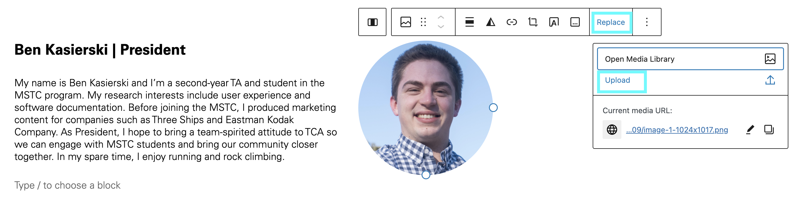
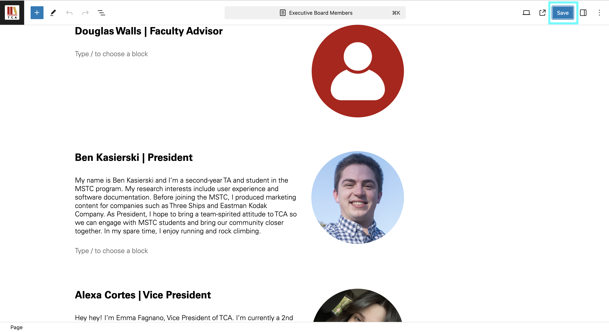

# Updating TCA Executive Board Member Profile Picture

## About
As the secretary of N.C. State University’s Technical Communication Association (TCA), you are responsible for ensuring TCA’s website is up-to-date with accurate information and content. 

Due to the short nature of the Masters of Science in Technical Communication (MSTC) program, TCA board members change each year. At the beginning of the fall semester of your acting term, you are responsible for updating the **Executive Board Members** page of the TCA website with the headshots of your year’s TCA board. Further headshot updates may be required at the TCA president’s discretion.

## Prerequisites
Before beginning the process of updating executive board member profile pictures:

- Confirm you have been added as an administrator to the Technical Communication Association website.

- Have access to your NCSU Unity ID and Duo App.

- Download all TCA executive board member profile pictures; .png or .jpg images are preferred for quality and ease of uploading.

> **Note:** If you do not have administrator access to the Technical Communication Association website, request access from the acting TCA president or association faculty advisor.

## How to Update TCA Executive Board Member Profile Pictures
1. Open your preferred website browser.
   
2. Search: **[https://orgs.ncsu.edu/technical-communication-association/](https://orgs.ncsu.edu/technical-communication-association/)**

3. Scroll to the bottom of the page and select **Log in**.

> *Figure 1: The **Log in** button is located at the bottom of the TCA website homepage.*

4. Type in your NCSU Unity ID.
   
> **Note:** Your Unity ID is the letter and number combination used for your NCSU email address, not your student ID number.

5. Complete NCSU Duo authentication.

6. Click **Pages** located in the left-hand sidebar of your WordPress Dashboard.

> *Figure 2: The **Pages** option can be found in the menu on the left side of your browser.*

7. Select **Executive Board Members** page title. This will allow you to edit the selected webpage.

> *Figure 3: Locate and click the **Executive Board Members** page title to edit the webpage.*
   
8. Click the profile image you need to update.
   
> **Example:** If you want to update the TCA president profile picture, click the photo next to **[Acting-TCA-President-Name] | President.** 

> **Note:** Please see additional documentation to update webpage copy. 

Select **Replace > Upload**.

> *Figure 4: Click **Replace > Upload** to upload the new profile image.*

9. Upload TCA executive board member photo.
   
10. Select **Select** in the lower left corner.

> **Note:** For consistency, all photos should be 1080 x 1080 pixels.

11. Press **Save** in the upper right corner. 

> *Figure 5: Always save your webpage after completing any edits.*

> **Note:** Unless changing website design, do not change the dimensions of image containers. Our website aims for a professional and consistent design.