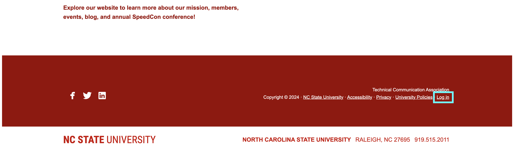
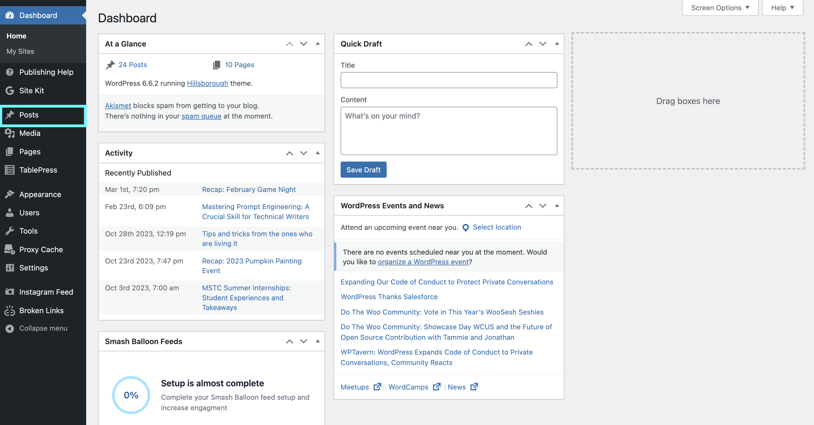
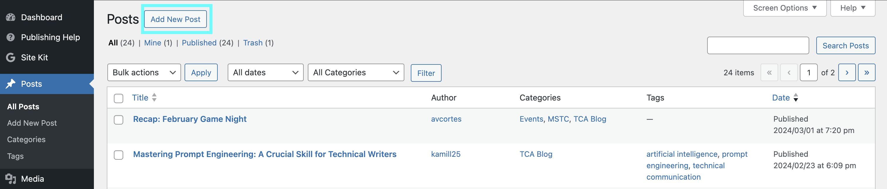
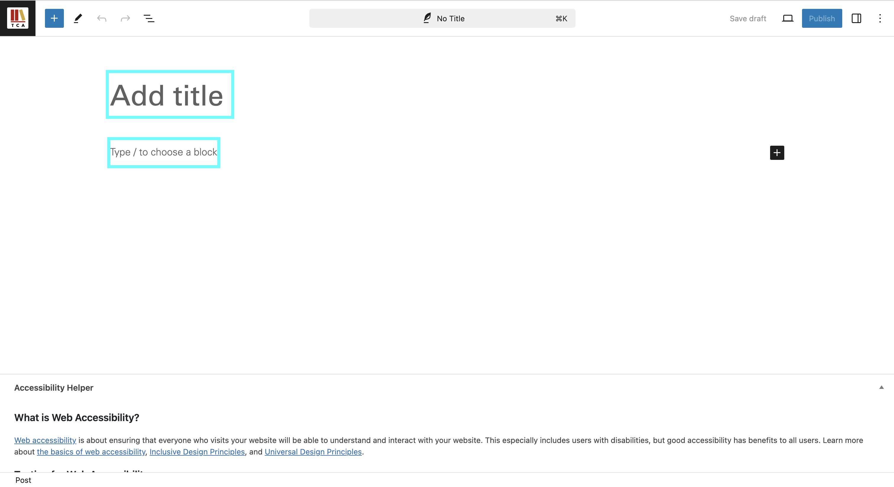
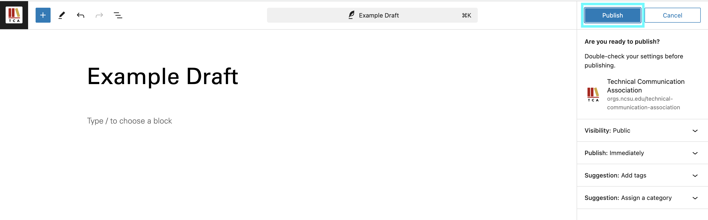
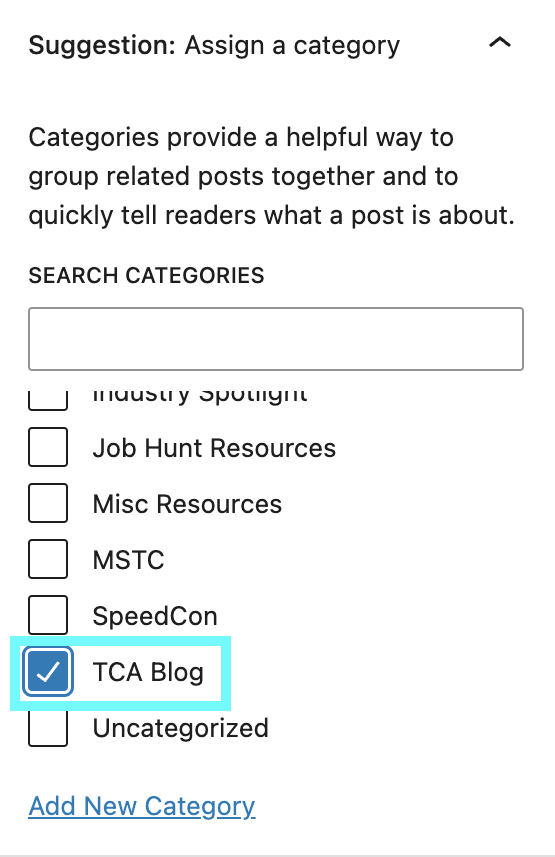

# Uploading Blog Posts to the TCA Website

## About
As an executive member of N.C State’s Technical Communication Association (TCA), it is your responsibility to upload blog posts to the TCA website that have been assigned and agreed upon by you and the TCA team. 

TCA’s blog is one of the ways our association brings our community up-to-date information on events taking place within TCA and the technical communication field at large. If you have questions about appropriate blog post topics, please contact your acting TCA president for further instructions.

## Prerequisites
You need the following to upload your blog post to the TCA website:

- Administrative access to the TCA website.

- Your NCSU Unity ID and Duo App.

- Blog post copy approved by your fellow team members for website posting. Copy approval takes place during scheduled weekly team meetings. 

> **Note:** If you do not have administrator access to the Technical Communication Association website, request access from the acting TCA president or association faculty advisor.

## How to Upload a Blog Post to the TCA Website
1. Open your preferred website browser.

2. Search: **[https://orgs.ncsu.edu/technical-communication-association/](https://orgs.ncsu.edu/technical-communication-association/)**

3. Scroll to the bottom of the page and select **Log in.**

> *Figure 1: The **Log in** button is located at the bottom of the TCA website.*

4. Type in your NCSU Unity ID.

> **Note:** Your Unity ID is the letter and number combination used for your NCSU email address, not your student ID number.

5. Complete NCSU Duo authentication.

6. Select **Posts** located in the left side bar menu on the Wordpress dashboard.

> *Figure 2: The **Posts** button can be found in the left side menu on the TCA WordPress dashboard.*

7. Click **Add New Post** in the upper left corner.

> *Figure 3: In this section of the TCA WordPress dashboard, you can manage preexisiting posts and make new posts.*

8. Copy and paste your blog post’s title in the **Add title** section. 

9. Copy and paste the blog’s copy in the **Type / to choose a block** section.

> *Figure 4: Add your blog title and copy to their respective boxes.*

> **Note:** Choosing a block via the plus box on the right hand side of your screen allows you to add additional features to your post. These features are not applicable for current standards surrounding the TCA blog post uploading process.

10. Press the **Publish** button in the upper right corner.

> *Figure 5: Press the **Publish** button to access additional blog post settings or confirm your publish.*

> **Optional:** To set a blog image, click **Settings** next to the **Publish** button and set your featured image.

11.  Review blog settings and assign **TCA Blog** category. If applicable, you may add tags and assign additional categories.

> *Figure 6: Click the **TCA Blog** catagory before making your **Publish**.*

12.  Confirm **Publish.**