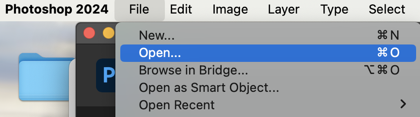
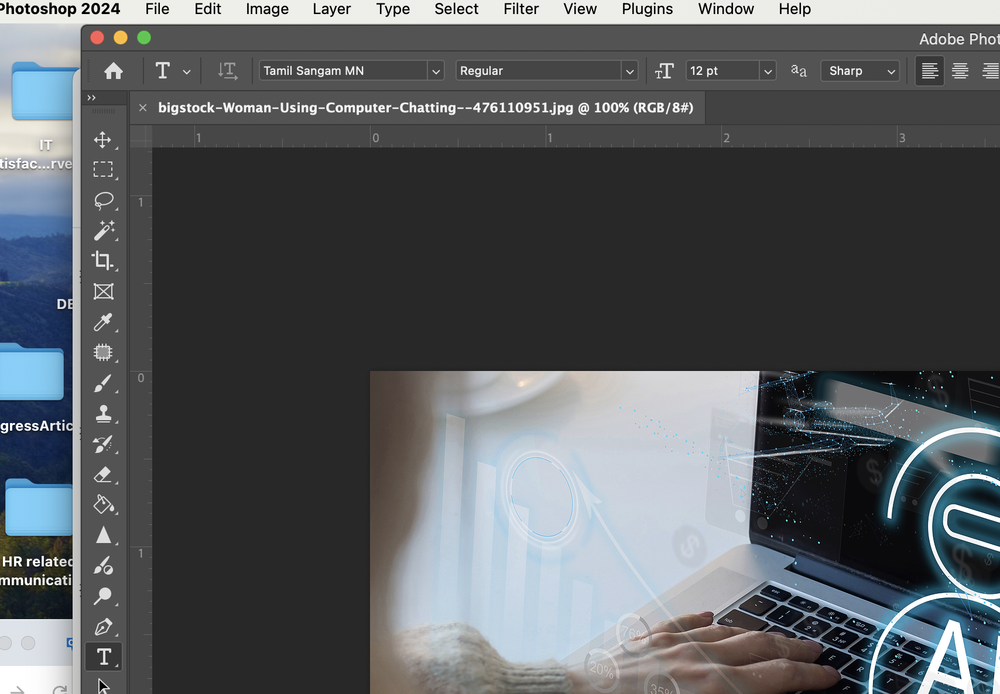

# Using the crop tool in Adobe Photoshop

Digital images may need editing for various reasons including enhancement, removing distractions or even restoring the image. One common digital editing tool is using the crop tool in a digital image editing software. Our focus in this procedure is using the crop tool in Adobe Photoshop. 

**Note** Adobe Photoshop is one of many digital image editing software that allows the user photo editing capabilities, a canvas to create art or design graphics, digital draw and paint.

Adobe Photoshop works with the following file formats:
- RAW
- PDF
- PNG
- Gif
- Jpg
- Tiff
- PSD

**Prerequisites**

To utilize Adobe Photoshop you will need an account that you can log in to access the tools. 

No account? Get started here. 

You will need a digital image to work with that can be opened from your account and computer. 

## Process Steps

1. Open Adobe Photoshop software on a computer.
   
2. Open image in the software by clicking File > Open> find your digital image and click Open.

   
3. Click the crop tool icon.

   
4. Use the guide that appears on your photo to crop the photo.
This is a movable square that can be moved or resized to fit your crop needs.

5.  When satisfied with what you have in the highlighted crop section of your digital image, go to Edit > Crop.

6. Save your results. Go to File> Save As.

7. Update the file name in the Save As name box.
   
**Note:** Check the file format you are saving- example JPEG or PNG.

Save as original file format. Change the format by using the Save As option and choose the new file format to save the digital image.

8. Click Save. 
   

