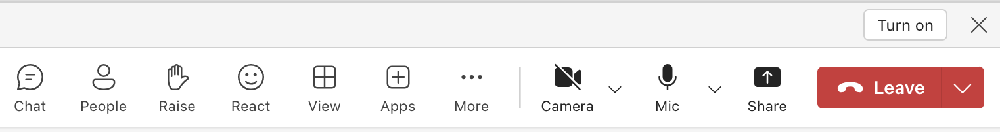
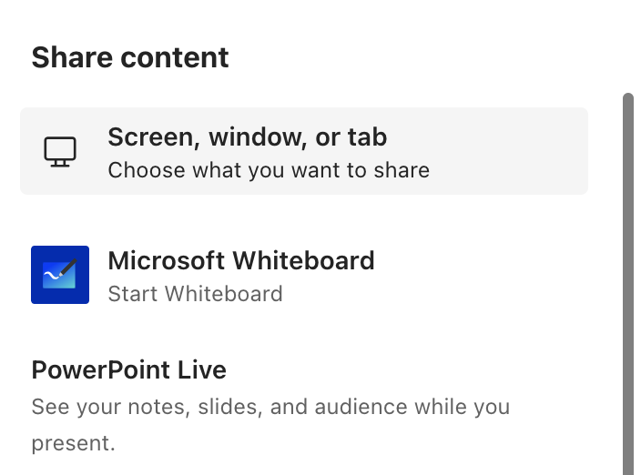
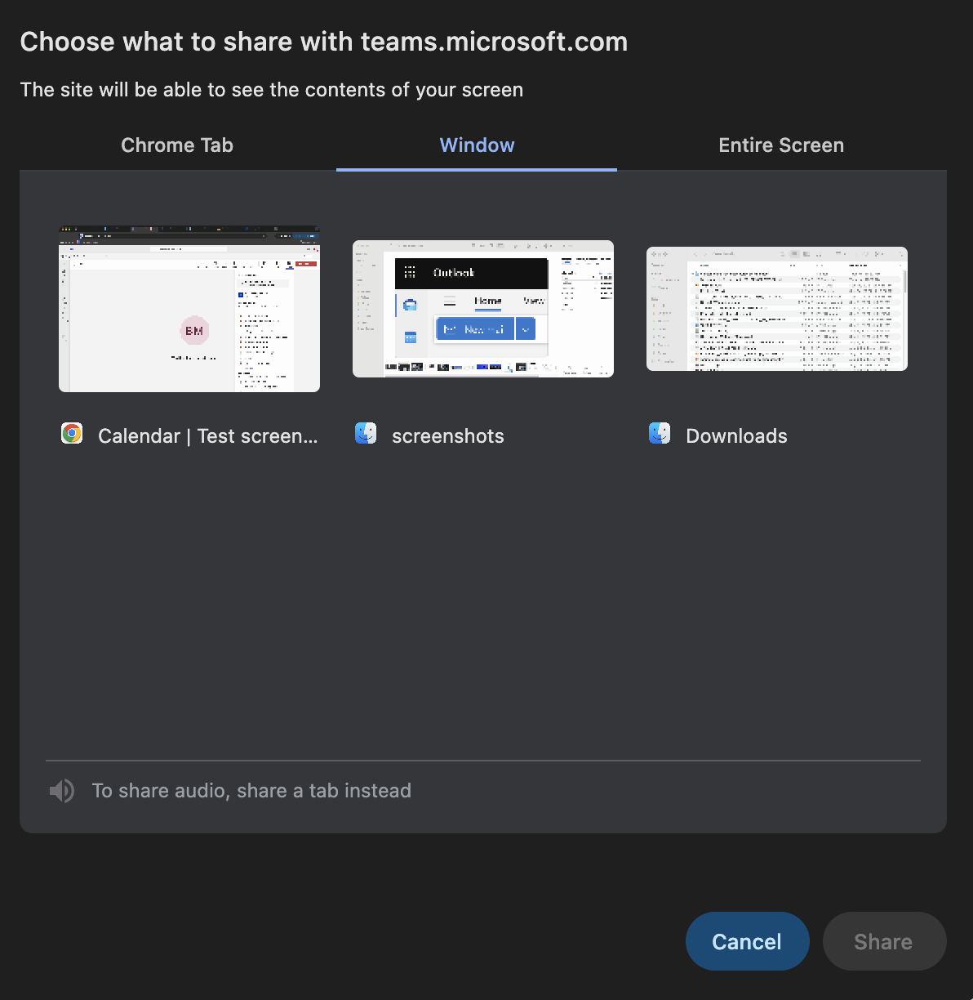

# Sharing your screen during a Microsoft Teams meeting

Microsoft Teams a workspace for real-time collaboration and communication, meetings, file and app sharing, all in one place. In a Microsoft Teams meeting you can present content by sharing your screen (tab), your entire desktop or PowerPoint slides.

**Prerequisites**

Microsoft Teams login (account)

**Note:** You may do this in the online version, the app version on your desktop or on a mobile device. For this process it is recommended that you use your desktop. 

## Process Steps
1. Log into Microsoft Teams 
   
2. Open an existing meeting link or create a Teams meeting 

**Note:** To create a Teams meeting to test this process:
Open your Microsoft Outlook Calendar and select New meeting.

3. Once the meeting is active, find the button located at the right hand side of the screen that shows a square with an upward facing arrow.

 
   
4. Click the button.
   
5. Click on share screen, window or tab option.

6. Click on the Window option to share your entire screen.

   
7. You should see a red outline around your screen indicating you are sharing with those on the Teams meeting. 
   
8. Use the Stop Sharing red button in the tools to stop sharing your screen.

**Note:** You can also share sound from your computer while sharing your screen. To share sound:

Select the Audio sharing button from the presenter toolbar. 

The presenter toolbar is where the user controls are housed. The presenter toolbar is only visible to the person presenting.

Before you start sharing, select Share Share screen button in your meeting controls and turn on the Include sound toggle.

