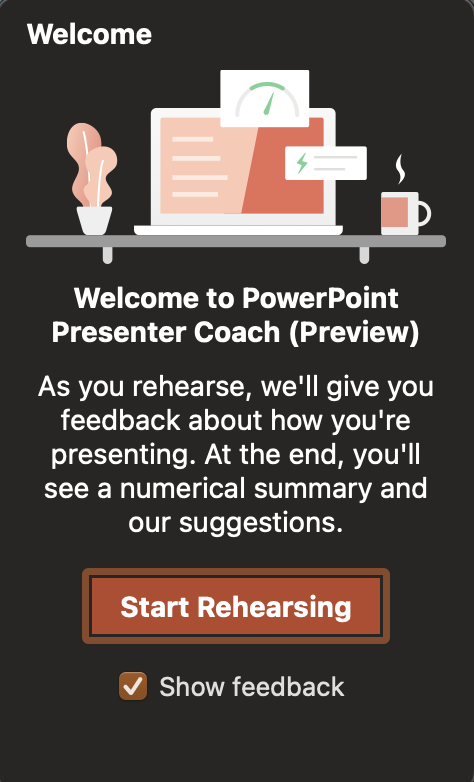
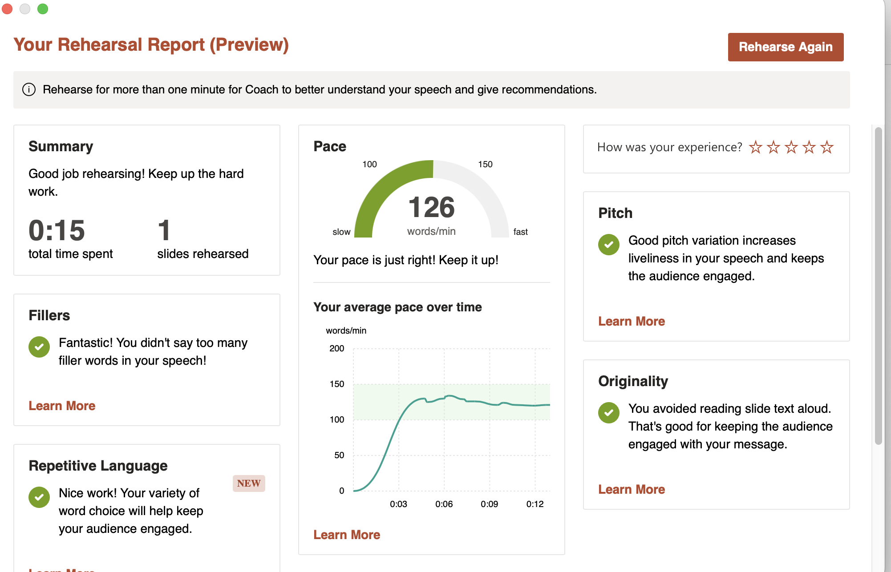

# Using Microsoft PowerPoint Speaker Coach Tool

Microsoft PowerPoint is a well known presentation slide creator. Tools have been developed to not only make presentations more visually appealing but also to help users improve their presentation skills. One tool we will focus on is Speaker Coach. 

Speaker Coach helps users by evaluating the presenter’s pacing, pitch, use of filler words or informal speech, culturally sensitive terms, detects wordiness or if you are reading you slide word for word via a recording of the presentation. 

**Prerequisites**

Speaker Coach needs permission to share the screen and microphone to work.

To use Speaker Coach you must have Microsoft Edge version 15 or later, Chrome version 52 or later, and Firefox version 52 or later on your computer.

Speaker Coach can only work with English at this time. 

## Process steps

1. Log into Microsoft PowerPoint.
   
2. Open a presentation slide show file that you want to practice with.
  
3. Click on the Slide Show tab.
   
    
5. Check to make sure that you are on the first (start) slide in the presentation slideshow.
   ![PowerPoint Start Slide](
   
7. Make sure you are sharing your microphone. 
   
8. Click on Rehearse with Coach button.

   
1. Complete your presentation by speaking out loud and going through your slides.
   
2. Click the ESC button on your keyboard to exit Speaker Coach.
   
3.  Your Rehersal Report will be generated.

    
**NOTE:** If you want to keep your rehersal report, you will need to take a sceenshot. PowerPoint does not save your report.

