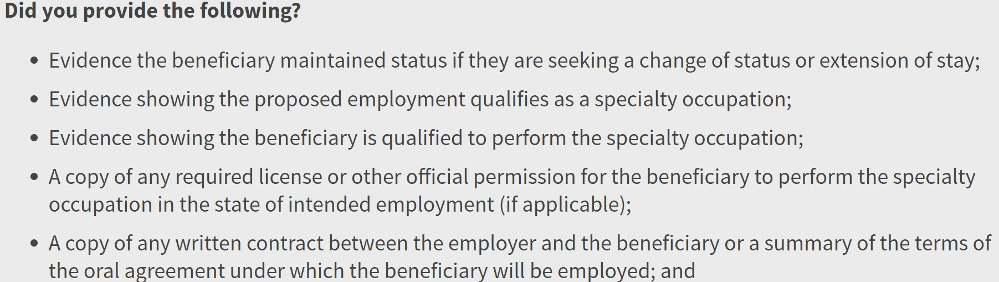
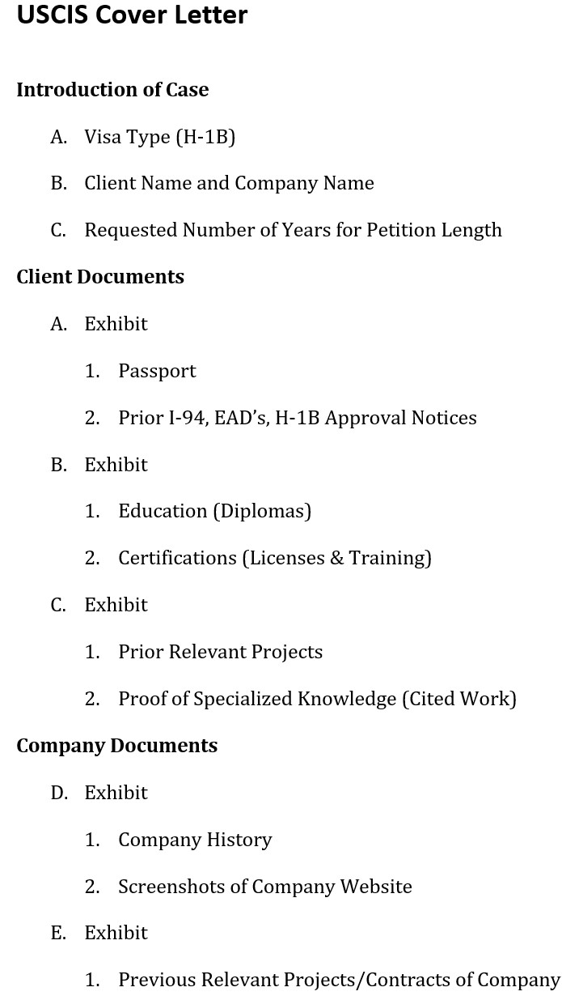

# Procedure Guide for Creating a H-1B Petiton

## Introduction to Procedure

A H-1B is a type of visa that aims to enable foreign nationals who have specialized knowledge to enter the U.S. for a period of three years with the possibility of extending that time an additional three years for a total of six years within the U.S. This visa is part of the larger petition it falls under, the I-129 petition. The H-1B visa is just one of many visa types that falls under this petition and it can be a complex process from the time of starting the visa application to filing it with the USCIS. This guide aims to help you do the following: 

* Compile the Required Documents for the Visa Application
* Draft a Company Support Letter for the Sponsoring Company
* Draft a USCIS cover letter to better help USCIS navigate your petition
* Organize the Petition Appropriately to Aid the Reviewing Attorney

By the end of this guide you should possess the knowledge to produce an exceptional first draft for a H-1B petition. By following the core concepts of these steps, your reviewing attorney should have a quick turn around between revising your draft and filing the petition on their own. 

**NOTE**: The H-1B visa is a temporary, non-immigrant visa, the client will only be allowed to stay on this visa status for a maximum of **six** years.

**Assumed Knowledge:** 
* Brief knowledge of the [USCIS](https://www.uscis.gov/) website
* Working knowledge of how to operate a computer, word processor, and email software. 
* Knowledge of low level legal terms for H-1B (Beneficiary, I-94, EAD, etc.)

### Compiling Required Documents 

Since a H-1B visa is employment-based the documents you will be collecting will be from both the client and the company who is sponsoring the client. Take a look at this USCIS guide that will help you know what the documents you collect need to cover.

#### **Specific Documents for Client Include:**                
* Passport
* Previous I-94 Entry Card
* Previous Employment Authorization Card (EAD)
* Previous H-1B Visa Approvals
* Current Address
#### **Specific Documents for Sponsoring Company Include:** 
* Offer Letter of Position
* Current Address of Company 
* Proposed Duties of Client
* Proposed Salary of Client 
* Proposed Job Title of Client 
* Proposed Employment Dates of Client
* Information About History of Company

**NOTE**: Visit this [link](https://www.uscis.gov/working-in-the-united-states/h-1b-specialty-occupations) for a more exhaustive guide to the required documents.

### Constructing the Petition
Once you have collected these documents through emailing or physically mailing a letter of official request to your client and their respective HR representative, you can begin building your petition. The following steps will all require you to reference information from your collected documents.

#### **Drafting a Support Letter for Sponsoring Company** 
1. Use a word processor to format a letter template
2. Highlight history of company and service they provide
3. Include impressive achievements, projects, and accolades of company
4. Introduce client and highlight their job duties
5. Include impressive achievements, project, and accolades of client
6. Details how client's experience matches the companies job requirements
7. Finalize  letter with proposed salary and range of proposed employment

**NOTE**: You can alter the order of topics within your letter, visit this [link](https://www.bu.edu/isso/administrators/forms/h-1b-support-letter/) for an example of other details you can provide in your support letter.

#### **Creating a USCIS Cover Letter**
This cover letter should act as an outline for your petition. 
1. Use a word processor to format a letter template
2. Start with outlining visa type, names of client and company, and requested amount of years for the petition
3. Detail included documents for client
4. Detail included documents for company

**NOTE**: This is a initial template to use, your needs may require editing this template accordingly

#### **Organizing the Petition**
The final step in this procedure is organizing the petition for your reviewing attorney.
1. Organize your compiled documents and exhibits into the order that your USCIS cover letter mandates
   * (i.e.  **A Exhibit**: Passport and Prior I-94, EAD's, H-1B Approval Notices)
   2. Place your Support Letter on top of the compiled exhibits
   3. Place your USCIS Cover Letter on top of the Support Letter
   4. Review for any spelling, grammatical, or regulatory errors
   5. Deliver draft to reviewing attorney 

**NOTE**: This guide hopefully has provided you with a foundational basis for your future H-1B petitions. Please know that your petition work as a legal assistant should always be reviewed by a practitioner of law who has passed the BAR exam in your state.  

