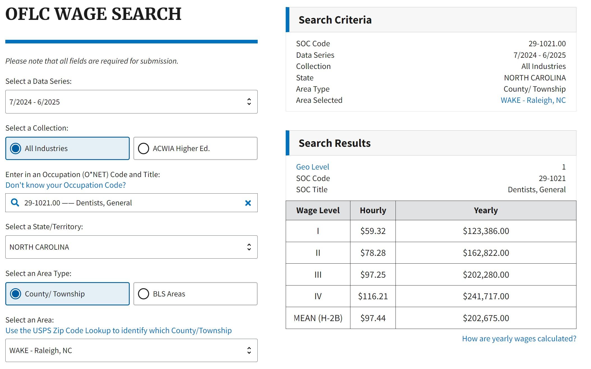
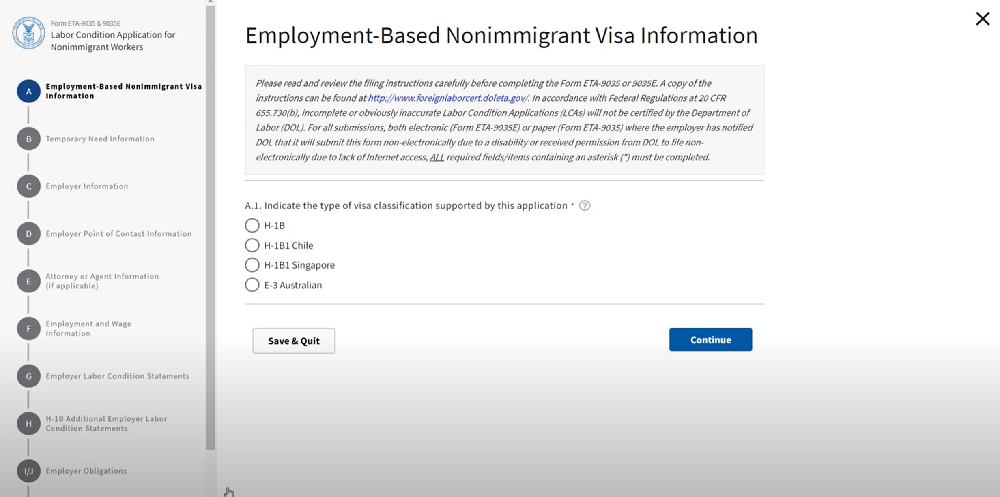

## Creating a Labor Condition Application (LCA)
A Labor Condition Application is an application that is often filed concurrently with employment-based petitions to USCIS. It establishes an appropriate wage amount and wage level for a foreign client being sponsored by a company to come work in the U.S. It functions as a safeguard against financial injustices potentially being committed by companies exploiting foreign labor. It is also a useful resource to help sponsoring companies realize the cost of fully sponsoring an employee before committing to other costs such as filing fees. This guide will provide the necessary steps and resources to enable you to find the LCA application and create a draft ready for review by a reviewing attorney. 

**Assumed Knowledge**: Ability to Operate a Computer, Ability to Use Email Software, Knowledge of USCIS website, Knowledge of Employment-Based Petitions Requirements

#### **Required Documents for Labor Condition Application (LCA)**
The documents you will need for this application are: 
* Current Name, Address, HR Representative, and Proposed Work Location of Client's Sponsored Company
* Proposed Wage, Job Title, and Job Description of Client

**Note**: If the client will be working at a secondary work location in addition to the first proposed work location, be sure to include that address as well in the application. 

### **Calculating Wage Data**
Calculating the wage data enables you to have the necessary information to complete the Labor Condition Application
1. Go to the Department of Labor Website located [here](https://flag.dol.gov/programs/LCA)
2. Navigate to the **Wage Data** tab
3. Click **OFLC Wage Search**
4. Fill out the fields with the information from your collected required documents
   
   
   
*    **NOTE:**: Select **All Industries** as your collection unless the sponsoring company is in the field of higher education (ACWIA)
*    **NOTE**: If unsure about the O-Net occupation code, search within the O-Net occupation code search bar to find a job title/code matching the proposed job title of client
    
5. Once you have a range of wage levels, give a copy of this data to your reviewing attorney or paralegal who will then advise you on which wage level is appropriate for your specific case
6. Prepare to implement the wage data just collected into the official LCA application
 

### **Locating the Labor Condition Application (LCA)** 
1. The Labor Condition Application is located on the Department of Labor website [here](https://flag.dol.gov/programs/LCA) 
2. Click the **Sign In** button in the top right corner
   
3. Enter your Credentials and Select Form ETA-9035
4. Select what type of visa you are completing and continue to fill out the form with the client's information  

*  **NOTE**: In step F, you will be required to recalculate the wage level and salary previously completed in section "Calculating Wage Data"
1. **WARNING**: Upon filling out the form entirely, do not submit the form, simply click **save & quit** then click **save as initiated**
*   **NOTE**: Submission of the form is only recommended after a attorney has approved the LCA or will submit the LCA themselves. 

**Additional Resources:** This [video](https://www.youtube.com/watch?v=mk3a37qEtE8) by the Department of Labor provides a step by step walkthrough if needed.

